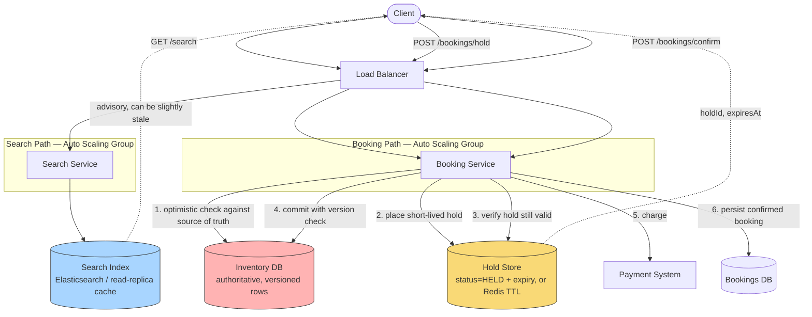

# Design a Hotel Booking System (Inventory & Reservation Management)

> **The one hard problem this really tests:** preventing **overbooking** — two customers successfully booking the same room for the same night — under concurrent requests, which is a direct, concrete application of the [CAP Theorem](../../01-foundations/cap-theorem/README.md) CP-vs-AP decision and of distributed locking/optimistic concurrency control.

---

## 1. Requirements

### Functional
- Search for available rooms by location, date range, and filters (price, amenities).
- Book a room for a specific date range.
- Cancel a booking (with a cancellation policy).
- Hotels manage their own room inventory and pricing.

### Non-Functional
- **No overbooking, ever** — this is the one correctness invariant the entire system exists to protect; unlike almost every other requirement in this vault, this is close to a hard constraint, not a "nice to have."
- **Search is read-heavy and can tolerate slight staleness** — showing a room as available that was booked by someone else 200ms ago is an acceptable, recoverable UX hiccup (handled at actual booking time); showing a room as unavailable when it's actually free is a lost sale but not a correctness bug.
- **Booking itself must be strongly consistent** — the moment a customer commits to booking, the system must guarantee that exact room-night is exclusively theirs, or clearly reject the booking.

---

## 2. Back-of-Envelope Estimation

- Assume 500,000 hotels, averaging 100 rooms each, over a searchable window of, say, 365 days → `500,000 × 100 × 365 ≈ 18.25 billion` room-night inventory records in the naive case — this number alone tells you inventory can't be represented as one row per room per night without real thought given to indexing/partitioning, though it's still well within reach of a well-sharded relational store, not requiring an exotic data model.
- Search volume vastly exceeds booking volume (browsing/comparing far more often than actually committing to book) — this is the same **read:write skew** pattern seen in [URL Shortener](../url-shortener/README.md#2-back-of-envelope-estimation) and elsewhere, reinforcing that search should be served from a cache/read-optimized store, while the actual booking transaction hits the strongly-consistent source of truth directly.

---

## 3. High-Level Design



**Take this as the reference shape of the whole system** — the diagram is deliberately drawn with two paths that share almost nothing except the Inventory DB, because that separation *is* the design: search can be wrong-but-fast, booking must be right-even-if-slower, and the only place those two philosophies have to reconcile is the moment a hold is placed against the authoritative inventory.

**Search path, step by step:** a client's search query is served entirely from the **Search Index** — a denormalized, read-optimized store (Elasticsearch-like, or cache-backed read replicas) that can lag the true source of truth by seconds without any correctness harm, because nothing here is ever treated as a final answer (§2).

**Booking path, step by step — this is where the actual hard problem lives:**
1. When a customer selects a room, the **Booking Service** first checks the **Inventory DB** (the authoritative source, never the search index) and, if available, places a **short-lived hold** in the **Hold Store** — this is Strategy C from §4, giving the customer a fixed window to complete payment without another customer simultaneously claiming the same room-night.
2. The customer proceeds to payment; once ready, `POST /bookings/confirm` re-verifies the hold hasn't expired, then performs the **actual commit** against the Inventory DB using the optimistic-concurrency version check (Strategy B from §4) — this is the single moment in the entire system where a race condition could otherwise cause overbooking, and it's guarded by the version-column check, not by trusting the earlier hold alone.
3. On success, the **Payment System** is charged and the confirmed booking is persisted to the **Bookings DB**. On a version-check failure (someone else's confirm won the race in between), the customer is told the room is no longer available rather than silently double-booking it.

---

## 4. Component Deep Dive: Preventing Overbooking (the actual hard problem)

Two customers viewing the same last-available room, both clicking "book" within milliseconds of each other, must not both succeed. There are several legitimate strategies, and a strong interview answer compares them rather than picking one by reflex:

### Strategy A: Pessimistic Locking (Database Row Lock)
`SELECT ... FOR UPDATE` on the specific room-night inventory row before checking availability and inserting the booking, all within a single database transaction — this is exactly the `PESSIMISTIC_WRITE` pattern shown in the [CAP Theorem](../../01-foundations/cap-theorem/README.md#6-spring-boot-example-modeling-a-cp-decision-vs-an-ap-decision-in-the-same-application) Spring Boot example for inventory reservation.
- **Pros:** simple to reason about, strong guarantee, no possibility of a race condition slipping through.
- **Cons:** the locked row briefly blocks other transactions trying to touch the *same* room-night (acceptable — contention on the literal same room-night is rare and brief), but pessimistic locking doesn't scale well if held for a long duration (e.g., across a slow external payment call) — the lock should be held only for the brief inventory-check-and-reserve step, with actual payment happening in a subsequent, separate step against an already-reserved (but not yet fully confirmed) booking.

### Strategy B: Optimistic Concurrency Control (Version Column)
Read the current inventory row (including a `version` number) without locking; attempt to update it with a `WHERE version = <the version you read>` clause; if zero rows were affected (because someone else updated it first, incrementing the version), the booking attempt fails and can be retried against fresh data.
- **Pros:** no locks held at all, better throughput under low-to-moderate contention.
- **Cons:** under genuinely high contention on the exact same room-night (rare, but possible for a single very popular remaining room), this can result in repeated failed retries — generally still an acceptable trade for the throughput benefit in the common case.

### Strategy C: A Short-Lived Reservation "Hold" (common in real booking UX)
When a customer proceeds to checkout (before completing payment), place a **short-lived hold** on the room-night (e.g., a 10-minute reservation, implemented as a row with a status of `HELD` and an expiry timestamp, or a Redis key with a TTL). This gives the customer a window to complete payment without another customer simultaneously grabbing the same room, while automatically releasing the hold (returning the room to available inventory) if the customer abandons checkout or the hold simply expires.
- This is directly analogous to the short-lived distributed lock used in [Uber's](../uber/README.md#5-component-deep-dive-preventing-a-driver-from-being-double-matched) driver-matching design to prevent double-matching — the same underlying pattern (a temporary, auto-expiring claim on a contended resource) reapplied to a different domain.

**Senior-level answer:** the strongest real-world design **combines B and C** — an optimistic-concurrency-controlled inventory decrement for the actual, final commit (fast, no long-held locks), preceded by a short-lived hold during the checkout/payment flow (so the customer isn't racing against the payment provider's own latency), which is genuinely how most production booking systems (hotels, flights, event ticketing) are built.

---

## 5. Components Used — What Each Piece Is and Why It's Here

| Component | Role in This Design | Why This Choice, Here Specifically | Deep Dive |
|---|---|---|---|
| **Load Balancer** | Fronts both the Search Service and Booking Service | Two very different consistency requirements (§1) sharing one entry tier — the load balancer itself is agnostic to that distinction; it's purely an L7 routing concern | [Load Balancers](../../02-building-blocks/load-balancers/README.md) |
| **Auto Scaling Group (Search Tier)** | Runs the Search Service, serving the overwhelming majority of read traffic | Search volume vastly exceeds booking volume (§2) and tolerates staleness, so this tier can scale aggressively and independently without touching the strongly-consistent booking path | [Scalability](../../01-foundations/scalability/README.md) |
| **Search Index** | A denormalized, read-optimized store of advisory room availability | Deliberately allowed to lag the source of truth — re-verifying every result against it would defeat the point of caching, and correctness is enforced later, at hold/confirm time | [Caching](../../02-building-blocks/caching/README.md) |
| **Auto Scaling Group (Booking Tier)** | Runs the Booking Service, handling holds and confirmations | Lower volume than search but each request does correctness-critical work (a versioned check-and-write) — scaled and reasoned about independently from the read-heavy search tier | [Scalability](../../01-foundations/scalability/README.md) |
| **Inventory DB** | The single authoritative source of truth for room-night availability, with a version column per row | This is the one component in the whole design that must be **CP**, not AP (§1) — a stale or incorrect read here directly causes the overbooking bug the entire system exists to prevent | [CAP Theorem](../../01-foundations/cap-theorem/README.md) |
| **Hold Store** | Temporarily reserves a room-night for a customer mid-checkout, auto-expiring if payment isn't completed | Gives the customer a fixed window to pay without a long-lived lock on the Inventory DB itself — the same short-lived-claim pattern used for [Uber's](../uber/README.md#5-component-deep-dive-preventing-a-driver-from-being-double-matched) driver matching | [Sharding](../../02-building-blocks/databases/sharding/README.md) |
| **Payment System** | Charges the customer once a hold is confirmed | A separate, dedicated system (see [Payment System](../payment-system/README.md)) — payment has its own idempotency and correctness requirements that shouldn't be tangled into inventory logic | [Payment System](../payment-system/README.md) |

---

## 6. Data Model

```sql
-- Room-night inventory: the actual contended resource. One row per room per
-- night is a reasonable, simple model at the estimated scale (see estimation above).
CREATE TABLE room_inventory (
    hotel_id      BIGINT NOT NULL,
    room_id       BIGINT NOT NULL,
    stay_date     DATE NOT NULL,
    status        ENUM('AVAILABLE','HELD','BOOKED'),
    held_until    TIMESTAMP NULL,   -- NULL unless status = HELD
    version       INT NOT NULL DEFAULT 0,   -- optimistic concurrency control
    PRIMARY KEY (hotel_id, room_id, stay_date)
);

CREATE TABLE bookings (
    booking_id     BIGINT PRIMARY KEY,
    customer_id    BIGINT NOT NULL,
    hotel_id       BIGINT NOT NULL,
    room_id        BIGINT NOT NULL,
    check_in_date  DATE NOT NULL,
    check_out_date DATE NOT NULL,
    status         ENUM('HELD','CONFIRMED','CANCELLED'),
    created_at     TIMESTAMP
);
```

A booking spanning multiple nights requires acquiring holds/updates across **multiple room-night rows atomically** (all nights of the stay, or none) — this is a multi-row transaction within a single database, which is straightforward as long as the inventory isn't sharded in a way that splits a single room's date range across different shards (a real design constraint worth naming: if sharding this table for scale, shard by `hotel_id` or `room_id`, never by `stay_date` alone, so that a single booking's date range always resolves to rows on the same shard — directly applying the shard-key selection guidance from [Sharding](../../02-building-blocks/databases/sharding/README.md#3-choosing-a-shard-key--the-single-most-consequential-decision)).

---

## 7. API Design

```
GET /api/v1/search?location=...&checkIn=...&checkOut=...&guests=2
  Response: { "hotels": [ { "hotelId": "...", "availableRooms": [...], "price": ... } ] }
  -- Served from a read-optimized search index; availability shown here is
  -- advisory, re-verified atomically at hold/booking time.

POST /api/v1/bookings/hold
  Request: { "hotelId": "...", "roomId": "...", "checkIn": "...", "checkOut": "..." }
  Response: { "holdId": "...", "expiresAt": "..." }
  -- Places a short-lived hold (Strategy C); customer proceeds to payment
  -- with this holdId within the expiry window.

POST /api/v1/bookings/confirm
  Request: { "holdId": "...", "paymentToken": "..." }
  Response: { "bookingId": "...", "status": "CONFIRMED" }
  -- Finalizes the hold into a confirmed booking; this call is where the
  -- Optimistic Concurrency Control commit actually happens.
```

---

## 8. Trade-offs & Follow-Up Questions to Anticipate

| Follow-up | Strong answer direction |
|---|---|
| "What if a customer's payment takes longer than the hold's expiry window?" | The hold expires and the room is released — the confirm step should re-check hold validity before finalizing, and if expired, gracefully inform the customer to retry rather than silently confirming a booking against inventory that's no longer actually reserved for them. |
| "How do you handle a hotel updating its own inventory (e.g., taking a room offline for maintenance) concurrently with customer bookings?" | Same optimistic-concurrency version-column mechanism applies uniformly — a hotel's inventory update and a customer's booking attempt are just two concurrent writers to the same row, resolved the same way regardless of who initiated the write. |
| "How would you handle overbooking as a deliberate BUSINESSdecision (like airlines do)?" | A distinct, explicit business policy — allowing a small, configured percentage of intentional overbooking with a defined compensation/rebooking process for the rare conflict — worth naming as a real-world nuance, but clearly distinct from the accidental-overbooking bug this design otherwise prevents. |
| "How does search staleness interact with a sudden spike in demand for one hotel (e.g., a major local event)?" | The search index may show more "available" rooms than actually remain once a demand spike causes many near-simultaneous booking attempts — this is fine, since the authoritative check happens at hold/confirm time regardless of what the (slightly stale, cache-style) search results showed; the system should gracefully communicate "sorry, no longer available" rather than treating this as an error condition. |

---

## 9. 60-Second Interview Answer

> "The one invariant this whole system exists to protect is no overbooking, so I'd treat search and booking as two very differently-consistent paths. Search is read-heavy and can be served from a cache or search index that's allowed to be slightly stale, since actual availability is always re-verified at booking time regardless of what search showed. For the booking path itself, I'd use optimistic concurrency control — a version column on each room-night inventory row — for the final commit, since it doesn't hold long-lived locks and performs well under normal contention, combined with a short-lived reservation hold during the checkout and payment flow specifically, so a customer isn't racing against a slow payment provider while another customer could otherwise grab the same room. If sharding the inventory table for scale, I'd shard by room or hotel ID, never by date alone, so a single multi-night booking's rows always land on the same shard and can be updated atomically in one transaction."

**Related:** [CAP Theorem](../../01-foundations/cap-theorem/README.md) · [Database Sharding](../../02-building-blocks/databases/sharding/README.md) · [Uber](../uber/README.md) · [Payment System](../payment-system/README.md)
