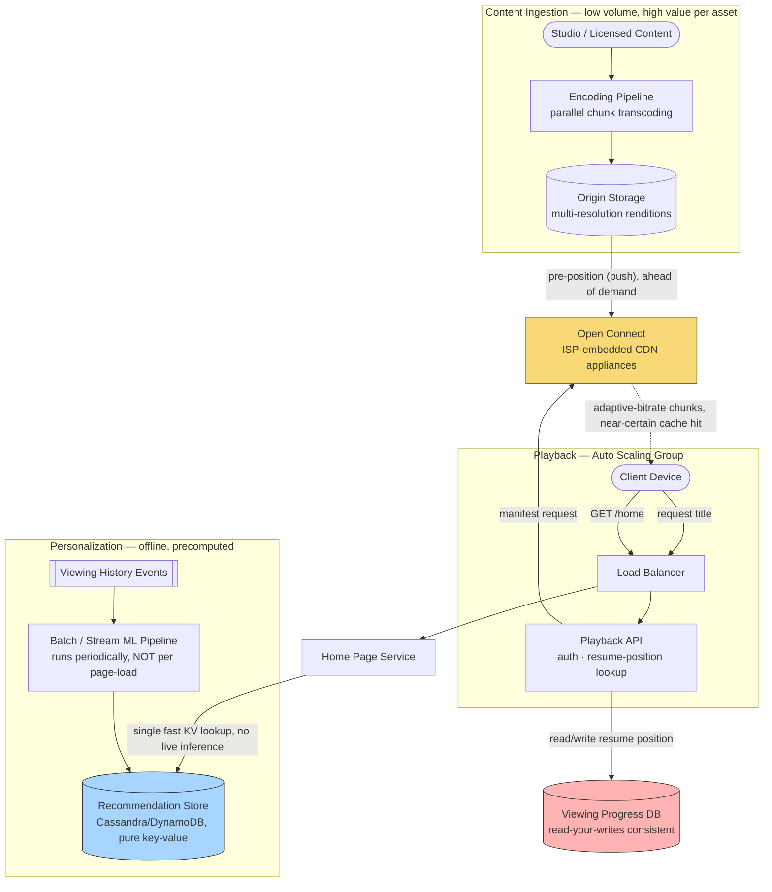

# Design Netflix (Global Video Streaming Platform)

> **The one hard problem this really tests:** delivering a consistent, low-buffering viewing experience to a globally distributed audience, on a fixed catalog of content (unlike YouTube's constant-firehose-of-new-uploads problem) — which shifts the hard problem toward **pre-computation, global content distribution, and personalization at read time**, rather than a live ingestion pipeline.

---

## 1. Requirements

### Functional
- Users browse a catalog and stream video with adaptive quality.
- Personalized recommendations/home-page rows per user.
- Resume playback from where a user left off, across devices.
- Multiple profiles per account, each with independent viewing history/recommendations.

### Non-Functional
- **Extreme read scale, essentially static catalog** — unlike YouTube, content is uploaded by Netflix itself in relatively low volume (professionally produced/licensed content, not constant user uploads), so the *ingestion* pipeline is a much smaller-scale, less time-pressured problem — but the *serving* scale (tens of millions of concurrent streams globally) is enormous.
- **Global low-latency delivery** — buffering is one of the most directly revenue-correlated metrics a streaming company tracks; sub-second start times and near-zero rebuffering are core requirements.
- **Personalization at scale** — every user's home page is different, computed from viewing history/ML models, and must be fast to render despite being unique per user (unlike a cacheable, shared static page).

---

## 2. Back-of-Envelope Estimation

- Assume 250 million subscribers, with a significant fraction streaming concurrently during peak evening hours in a given region — publicly, streaming traffic has historically been cited as representing a very large share of total downstream internet traffic in some regions during peak hours, which tells you the CDN/delivery layer is operating at a scale comparable to a meaningful fraction of an entire country's internet backbone capacity during peak windows.
- Content catalog itself is comparatively small (tens of thousands of titles) relative to subscriber count and stream volume — this is the opposite shape from YouTube (huge, ever-growing catalog from millions of independent uploaders) — meaning **pre-computation and pre-positioning of content at the edge is far more feasible and valuable** here than it would be for an unpredictable, ever-growing catalog.
- Personalized home-page rendering: 250 million users, each needing a computed, ranked set of recommendation rows — this is not a workload a single database query per page-load can satisfy; it strongly implies **offline/batch precomputation** of recommendations, refreshed periodically, rather than real-time computation on every page view.

---

## 3. High-Level Design



**Take this diagram as the base for the whole system** — notice it's really three loosely-coupled subsystems that share almost no infrastructure with each other: ingestion feeds Open Connect asynchronously and out-of-band from any live request; playback reads from Open Connect and the Progress DB; personalization runs entirely offline and only meets the live path at one single, cheap key-value read. That separation is deliberate and is the main architectural idea worth narrating.

**Ingestion flow (rare, high-value, not latency-sensitive):**
1. Licensed/studio content enters the **Encoding Pipeline**, which transcodes it into multiple resolution/codec renditions in parallel (the same chunked-transcoding pattern used in [YouTube](../youtube/README.md)) and writes the results to **Origin Storage**.
2. Because the catalog is comparatively small and demand is predictable, Netflix **proactively pushes** anticipated-popular renditions to **Open Connect** appliances embedded inside ISP networks *ahead of demand*, typically during off-peak hours — see §5 for why this push model is economically justified here specifically.

**Playback flow (the latency-critical path):**
1. A client requests a title; the **Playback API** (behind the Load Balancer, running in an Auto Scaling Group) authenticates the request and looks up the user's resume position in the **Progress DB**.
2. It returns a manifest pointing at chunk URLs served from **Open Connect** — because of the pre-positioning in the ingestion flow, this is a near-certain cache hit close to the user, often on hardware physically inside their own ISP.
3. The client streams adaptive-bitrate chunks directly from Open Connect, continuously adjusting requested quality based on measured throughput (see [Latency vs Throughput](../../01-foundations/latency-vs-throughput/README.md)) — the Playback API is out of this loop entirely once the manifest is handed over, which is exactly why it can stay cheap and stateless.

**Personalization flow (fully decoupled from any live request):**
1. Viewing history events stream continuously into a **batch/near-real-time ML pipeline**, which periodically recomputes each profile's ranked recommendation rows.
2. Results are written to a pure key-value **Recommendation Store**, keyed by profile and row category — never a live database query, never live model inference.
3. When a client loads the home page, the **Home Page Service** does exactly one fast key-value lookup — the entire, expensive computation happened long before this request existed (§4).

---

## 4. Component Deep Dive: Precomputation as the Core Personalization Strategy

The single most important architectural insight for this system: **personalized recommendations are computed offline/asynchronously, not synchronously on every page load.** Running a full recommendation model inference for every single home-page view, at hundreds of millions of daily active users, would be prohibitively expensive and slow if done live, in the request path.

Instead:
- A **batch or near-real-time stream processing pipeline** consumes viewing history/interaction events and periodically (e.g., every few hours, or incrementally as new signal arrives) recomputes each user's personalized recommendation rows.
- The **result** of that computation — not the model itself — is what's stored and served: a simple, fast key-value lookup (`recommendations:{userId}` → ranked list of title IDs per row/category) is all the read path needs to do.
- This is precisely the [Caching](../../02-building-blocks/caching/README.md) principle taken to its logical extreme: rather than caching a database query's result, an entire **expensive computation's result** is precomputed and cached, because the read frequency (every home-page load) vastly exceeds any reasonable recompute frequency, and staleness of a few hours in recommendations is completely invisible/acceptable to the user (an eventual consistency trade-off per [Consistency Models](../../01-foundations/consistency-models/README.md) that costs nothing in perceived quality).

---

## 5. Component Deep Dive: Open Connect — Netflix's Own CDN

Netflix's publicly documented approach goes a step further than using a third-party CDN alone: they built and operate their **own purpose-built CDN, "Open Connect"** — dedicated storage appliances that Netflix provides to ISPs to install directly within the ISP's own network, specifically to cache Netflix content as close to end users as physically possible (inside the ISP's network, not just at a generic third-party edge PoP).

- Because the content catalog is comparatively small and demand is predictable (new releases, popular titles), Netflix can **proactively push (pre-position) content updates to these appliances during off-peak hours** (e.g., overnight), so that by the time viewers in that region want to watch, the content is already sitting on hardware physically inside their own ISP's network — minimizing hops, latency, and the ISP's own backbone transit costs (a mutually beneficial arrangement, which is part of why ISPs are often willing to host this hardware).
- This is the **push-CDN pattern** from [CDN](../../02-building-blocks/cdn/README.md#2-push-vs-pull-cdns) applied at the most extreme, purpose-built scale — rather than "pre-warming a generic third-party CDN for a big predictable event," Netflix has built dedicated, owned infrastructure specifically because their catalog/demand predictability makes the push model's upfront cost worth paying continuously, not just for occasional big events.

**The lesson:** at a certain scale and predictability profile, building your own specialized CDN — rather than only relying on a generic third-party one — becomes economically justified, precisely because generic CDN pricing/behavior is optimized for the "unpredictable long tail" case that doesn't describe Netflix's actual catalog and demand shape.

---

## 6. Components Used — What Each Piece Is and Why It's Here

| Component | Role in This Design | Why This Choice, Here Specifically | Deep Dive |
|---|---|---|---|
| **Load Balancer** | Distributes Playback API and Home Page Service traffic across stateless instances | Both services are simple stateless HTTP behind health-checked L7 routing; no special protocol needs since the heavy chunk delivery is entirely offloaded to Open Connect, not proxied through here | [Load Balancers](../../02-building-blocks/load-balancers/README.md) |
| **Auto Scaling Group (Playback & Home Page Tiers)** | Runs the Playback API and Home Page Service, scaling with concurrent viewer count through the day's viewing curve | Both services do lightweight work per request (an auth check, a resume-position lookup, or a single KV read) — the expensive work happens elsewhere (encoding, ML), so this tier scales cheaply and horizontally with pure request volume | [Scalability](../../01-foundations/scalability/README.md) |
| **Open Connect (Netflix's own CDN)** | Stores pre-positioned video renditions physically inside ISP networks and serves the actual adaptive-bitrate chunk stream directly to clients | A generic third-party CDN's pull-based, reactive caching model is a worse fit than a **push**-based, purpose-built one once catalog size and demand predictability make pre-positioning cost-effective (§5) | [CDN](../../02-building-blocks/cdn/README.md) |
| **Encoding Pipeline** | Transcodes ingested content into the full set of resolution/codec renditions needed for adaptive bitrate streaming | A batch, parallelizable, non-latency-sensitive workload — ingestion volume is low and value-per-asset is high, the opposite traffic shape from the playback path | [YouTube](../youtube/README.md) (same transcoding pattern) |
| **Viewing Progress DB** | Stores per-profile resume position, read and written on nearly every playback session | Needs a **read-your-writes** consistency guarantee specifically (§6) — a stale resume position is immediately, jarringly visible to the user in a way almost nothing else in this system is | [Consistency Models](../../01-foundations/consistency-models/README.md) |
| **Batch/Stream ML Pipeline** | Periodically recomputes each profile's ranked recommendation rows from viewing history events | Deliberately decoupled from the read path entirely — running this per-page-load at hundreds of millions of DAU would be prohibitively expensive; a periodic refresh trades some staleness (invisible to users) for enormous cost savings | [Caching](../../02-building-blocks/caching/README.md) (computation-result caching) |
| **Recommendation Store (KV)** | Serves the Home Page Service's single lookup per page load — precomputed rows, no query logic at read time | A pure key-value shape is chosen deliberately over a relational store, since the read pattern is always an exact-match lookup by profile ID with no joins or filtering needed | [SQL vs NoSQL](../../02-building-blocks/databases/sql-vs-nosql/README.md) |

---

## 7. Data Model

```sql
-- Catalog metadata: comparatively small, relatively static, cacheable aggressively
CREATE TABLE titles (
    title_id      BIGINT PRIMARY KEY,
    name          VARCHAR(200),
    genres        VARCHAR[],
    release_year  INT,
    manifest_url  TEXT   -- points to adaptive-bitrate manifest, same shape as YouTube
);

-- Viewing progress: needs to be read-your-writes consistent per user (per
-- Consistency Models) -- if you pause on your phone, resuming on your TV a
-- moment later must reflect that exact position, not a stale one.
CREATE TABLE viewing_progress (
    profile_id    BIGINT NOT NULL,
    title_id      BIGINT NOT NULL,
    position_sec  INT,
    updated_at    TIMESTAMP,
    PRIMARY KEY (profile_id, title_id)
);

-- Precomputed recommendations: a pure key-value shape, NOT relational --
-- the whole point is a single fast lookup, no joins, no real-time computation.
-- recommendations:{profileId}:{rowCategory} -> ordered list of title_ids
```

**Why viewing progress needs stronger consistency than recommendations:** this is a great concrete illustration of the [Consistency Models](../../01-foundations/consistency-models/README.md) principle that consistency requirements differ *per field*, within the very same product — recommendation staleness of hours is invisible; resume-position staleness of even a few seconds (paused on your phone, immediately picked up on your TV, and it's slightly behind) is a jarring, directly-noticed user experience failure. This field would reasonably use a read-your-writes strategy (route the user's own subsequent reads to a source guaranteed to reflect their own most recent write), the exact pattern demonstrated in the Consistency Models Spring Boot example.

---

## 8. API Design

```
GET /api/v1/home?profileId={id}
  Response: { "rows": [ { "category": "Trending Now", "titles": [...] }, ... ] }
  -- Backed entirely by a precomputed key-value lookup; no live ML inference here.

GET /api/v1/titles/{titleId}/manifest
  -- Same shape as YouTube's manifest endpoint -- adaptive bitrate chunk URLs.

PUT /api/v1/profiles/{profileId}/progress
  Request: { "titleId": "...", "positionSec": ... }
  -- Frequent, low-latency writes; must be read-your-writes consistent across devices.
```

---

## 9. Trade-offs & Follow-Up Questions to Anticipate

| Follow-up | Strong answer direction |
|---|---|
| "How do you handle a brand-new release with no viewing history yet (cold start)?" | Fall back to non-personalized signals for new/cold-start content — genre popularity, editorial curation, or similarity to titles the user has already watched — a common, explicitly-scoped-out ML concern, fine to mention briefly without designing the model itself. |
| "How would you A/B test a new recommendation algorithm?" | Compute recommendations from multiple candidate algorithms in the offline pipeline, store variant results, and assign users to variants at read time — the precomputation architecture makes this relatively cheap, since it's still just picking which precomputed result to serve, not live inference. |
| "What if Open Connect-style pre-positioning guesses wrong and a title isn't actually popular in a region?" | Fall back to pull-CDN behavior (fetch from a further-upstream cache/origin on a miss) — push-CDN pre-positioning is an optimization for the *common* case, not a hard requirement; the pull path still exists as a correctness fallback. |
| "How is this different from YouTube's architecture?" | Netflix's smaller, more predictable, professionally-curated catalog favors precomputation and aggressive push-CDN pre-positioning; YouTube's unbounded, constantly-growing, long-tail catalog from millions of independent uploaders favors a more reactive, pull-based, on-demand transcoding and delivery pipeline. Same building blocks, different weighting, driven by different catalog/demand shapes. |

---

## 10. 60-Second Interview Answer

> "Netflix's catalog is comparatively small and predictable compared to something like YouTube, which shifts the hard problem away from ingestion and toward global delivery and personalization at read time. Recommendations are precomputed offline by a batch or streaming pipeline and stored as a simple key-value lookup per user profile, because running live ML inference on every home-page load at hundreds of millions of users isn't feasible — this is the caching principle taken to an extreme, caching a computation's result rather than a query's result. For delivery, because the catalog and demand are predictable, Netflix can afford to proactively push content to edge and even ISP-embedded storage ahead of demand rather than only reacting to cache misses, which is exactly why they built their own purpose-built CDN, Open Connect, rather than relying solely on a generic third-party one. I'd also flag that viewing-progress data needs a much stronger consistency guarantee than recommendations — read-your-writes across devices — since resume-position staleness is immediately obvious to a user in a way recommendation staleness never is."

**Related:** [CDN](../../02-building-blocks/cdn/README.md) · [Caching](../../02-building-blocks/caching/README.md) · [Consistency Models](../../01-foundations/consistency-models/README.md) · [Latency vs Throughput](../../01-foundations/latency-vs-throughput/README.md) · [YouTube](../youtube/README.md)
