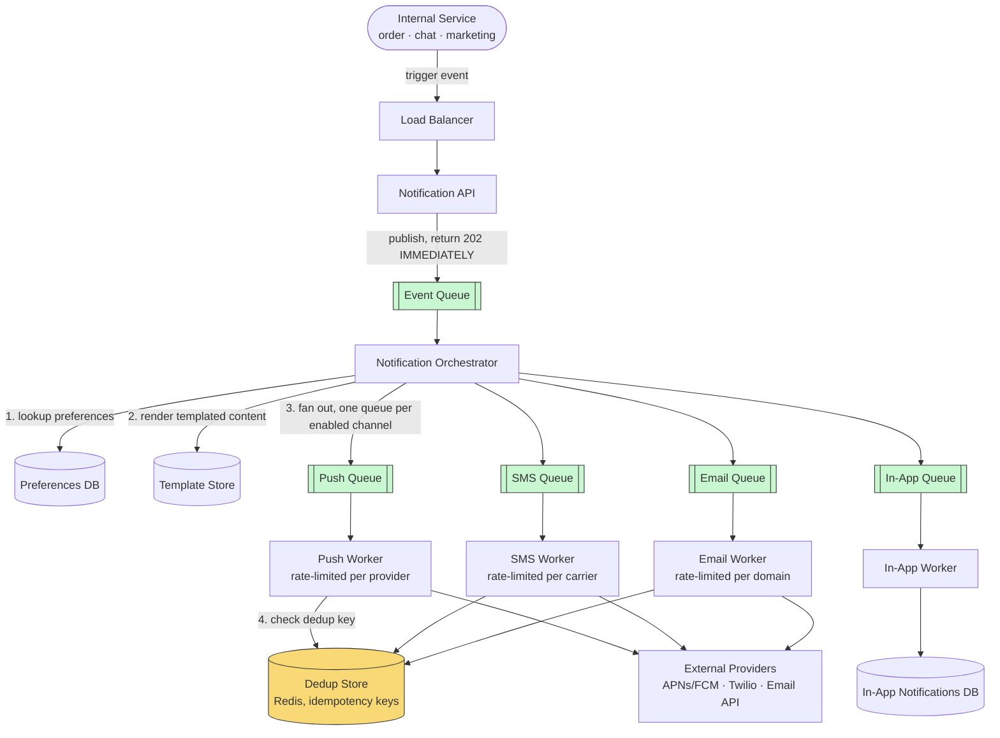

# Design a Notification System (Multi-Channel Fan-Out)

> **The one hard problem this really tests:** reliably fanning out a single logical event (e.g., "your order shipped") to multiple delivery channels (push, SMS, email, in-app) at massive scale, respecting per-user preferences and avoiding duplicate/spam notifications — all while gracefully handling the fact that every downstream channel provider (APNs, FCM, Twilio, an email provider) has its own rate limits, latency, and failure modes.

---

## 1. Requirements

### Functional
- Any internal service can trigger a notification for a user (e.g., order service, chat service, marketing service).
- Deliver via multiple channels: push notification (mobile), SMS, email, in-app notification center.
- Respect user preferences (e.g., "email me for orders, but never SMS me for marketing").
- Support templated notifications (consistent formatting per notification type, localized per user's language).

### Non-Functional
- **High throughput, bursty** — a single event (e.g., a major platform-wide announcement, or a viral post generating many "X liked your post" events) can trigger a massive, sudden fan-out.
- **At-least-once delivery, with a real cost to over-delivery** — unlike some systems where a duplicate is a minor annoyance, a duplicate SMS costs real money per message, and a duplicate push notification is a genuinely bad user experience (see [Message Queues](../../02-building-blocks/message-queues/README.md#2-delivery-guarantees--the-precise-definitions)) — idempotency matters more here than in many other systems.
- **Must not become a single point of failure that blocks the triggering service** — an order service creating an order should never fail or slow down because a downstream notification channel is having issues.
- **Different channels have wildly different latency/throughput/cost profiles** — push is near-instant and cheap; SMS has per-message cost and carrier-imposed rate limits; email has its own deliverability/reputation concerns.

---

## 2. Back-of-Envelope Estimation

- Assume 500 million users, with an average of 5 notification-triggering events/user/day → 2.5 billion events/day → ~29,000 events/sec average, bursty far higher during mass-fan-out events (e.g., a platform-wide announcement to all 500M users at once, which alone could be a burst of hundreds of millions of notification jobs queued within a short window).
- Each single logical event can expand into **multiple physical deliveries** (a user might have push notifications enabled AND email enabled for the same event type) — the actual outbound delivery volume across all channels is a multiple of the raw event count, not equal to it.
- **The architectural implication:** this system needs to absorb enormous, unpredictable bursts (a queue-based buffer, not a synchronous call chain) and needs per-channel-aware throttling, since a channel provider's own rate limits (e.g., a carrier SMS gateway) can become the binding constraint regardless of how much internal capacity you have.

---

## 3. High-Level Design



**Take this diagram as the base for the whole system** — notice there are **two separate fan-out stages**, not one: the Orchestrator fans a single event out across channels (one queue per channel type), and each channel's own worker pool independently dispatches to potentially many recipients — this two-stage separation is exactly what lets each channel be rate-limited, scaled, and reasoned about completely independently (§4).

**The critical design decision, step by step:** the triggering service calls `POST /notifications/trigger`, and the **Notification API** publishes an abstract event to the **Event Queue**, returning `202 Accepted` **immediately** — the order service (or chat, or marketing service) never learns or cares whether APNs is currently slow. The **Notification Orchestrator** then, asynchronously and entirely decoupled from that original request:
1. Looks up the user's channel preferences for this specific notification type in the **Preferences DB**.
2. Renders the notification content from the **Template Store**, localized to the user's language.
3. Fans the event out into **separate queues, one per enabled channel** — this is the moment a single logical event becomes multiple physical delivery jobs.

Each channel's dedicated **worker pool** then, independently of every other channel: dequeues its jobs, checks the **Dedup Store** for an idempotency-key hit before doing anything externally visible (§5), and calls its specific **external provider** (APNs/FCM for push, a carrier gateway for SMS, an email API for email) — or, for in-app notifications, simply writes a row to the **In-App Notifications DB** that the app's notification center later reads directly, with no external provider involved at all.

---

## 4. Component Deep Dive: Per-Channel Queues and Independent Rate Limiting

Different channels have wildly different failure modes and external constraints, which is exactly why fan-out happens into **separate queues per channel**, each with its own independently-tuned worker pool and rate limiter (see [Rate Limiting](../../02-building-blocks/rate-limiting/README.md)), rather than one shared worker pool trying to handle all channel types generically:

- **Push (APNs/FCM):** relatively high throughput tolerance, but a burst can still overwhelm the provider's own rate limits or your allocated quota — token-bucket rate limiting per provider account, with a queue absorbing bursts above the sustained rate.
- **SMS:** carriers impose strict rate limits (messages/sec per sender ID) and per-message cost is real money — a burst that could be handled instantly by push might need to be deliberately spread out (a leaky-bucket-style, smoothed dispatch rate, per [Rate Limiting](../../02-building-blocks/rate-limiting/README.md#1-the-core-algorithms--precisely-compared)) over many seconds or minutes for SMS specifically, which is exactly why SMS needs its **own** queue and dispatch rate, decoupled from how fast push notifications are being sent.
- **Email:** deliverability/reputation concerns mean sending too fast from a single sending domain can get you flagged as spam by receiving mail servers — again, its own independently-tuned dispatch rate.

**If all channels shared one worker pool and one rate limit, the slowest/most constrained channel (typically SMS, due to carrier limits) would end up throttling the fastest channel (push) unnecessarily** — this is precisely the kind of "different bottleneck per component" reasoning [Scalability](../../01-foundations/scalability/README.md#2-what-actually-limits-scalability) calls for, applied here to outbound channel dispatch instead of a shared backend resource.

---

## 5. Component Deep Dive: Idempotency and Deduplication

Given at-least-once delivery guarantees throughout the pipeline (a worker crash after calling the SMS provider but before acknowledging the queue message could cause a redelivery and a genuine duplicate SMS if not handled), every worker needs an explicit idempotency mechanism:

- Each notification job carries a unique **idempotency key** (e.g., a hash of `{userId, notificationType, eventId}`).
- Before actually dispatching to the external provider, the worker checks a fast deduplication store (Redis, with a TTL matching the maximum realistic redelivery window) for whether this exact idempotency key has already been dispatched recently. If so, skip — this is the same [at-least-once + idempotent consumer](../../02-building-blocks/message-queues/README.md#2-delivery-guarantees--the-precise-definitions) pattern used throughout this vault, applied here specifically because a duplicate has a real dollar cost (SMS) or a real user-experience cost (duplicate push), unlike some other systems where a duplicate is comparatively harmless.

---

## 6. Components Used — What Each Piece Is and Why It's Here

| Component | Role in This Design | Why This Choice, Here Specifically | Deep Dive |
|---|---|---|---|
| **Load Balancer** | Fronts the Notification API, receiving trigger requests from internal services | Simple stateless L7 routing; the interesting design decisions all happen after this point, not at it | [Load Balancers](../../02-building-blocks/load-balancers/README.md) |
| **Event Queue** | Decouples the triggering service from all downstream processing entirely | This is what lets `POST /notifications/trigger` return in milliseconds regardless of how backed up any specific channel currently is — the single most important component for the "must not become a single point of failure" requirement (§1) | [Message Queues](../../02-building-blocks/message-queues/README.md) |
| **Notification Orchestrator** | Consumes raw events, resolves preferences and templates, and performs the first fan-out into per-channel queues | A dedicated stage between "an event happened" and "channel-specific dispatch jobs exist" keeps preference/template logic in exactly one place rather than duplicated per channel worker | [Scalability](../../01-foundations/scalability/README.md) |
| **Per-Channel Queues (Push/SMS/Email/In-App)** | Buffer channel-specific dispatch jobs independently of one another | This is the mechanism that prevents one constrained channel (typically SMS, due to carrier limits) from throttling a faster one (push) — each queue can back up or drain at its own channel's sustainable rate (§4) | [Message Queues](../../02-building-blocks/message-queues/README.md) |
| **Per-Channel Rate Limiters** | Cap outbound dispatch rate to match each provider's own imposed limits | SMS carriers and email domains have hard external constraints that have nothing to do with your own infrastructure's capacity — the limiter has to be tuned per provider, not globally | [Rate Limiting](../../02-building-blocks/rate-limiting/README.md) |
| **Dedup Store (Redis)** | Lets each worker check whether a given idempotency key has already been dispatched before calling the external provider | A fast, TTL-based key-value check fits perfectly here — the check needs to be cheap and low-latency since it sits directly in front of every single external dispatch call | [Caching](../../02-building-blocks/caching/README.md) |
| **In-App Notifications DB** | Durable, queryable store the app's notification center reads directly | Unlike push/SMS/email, which are fire-and-forget once dispatched, in-app notifications need to be browsable/queryable later, so this is the one channel needing its own persistent, indexed store rather than just a dispatch-and-forget call | [SQL vs NoSQL](../../02-building-blocks/databases/sql-vs-nosql/README.md) |

---

## 7. Data Model

```sql
CREATE TABLE notification_preferences (
    user_id            BIGINT NOT NULL,
    notification_type  VARCHAR(50) NOT NULL,  -- e.g., 'ORDER_UPDATE', 'MARKETING', 'CHAT_MESSAGE'
    channel             VARCHAR(20) NOT NULL,  -- 'PUSH', 'SMS', 'EMAIL', 'IN_APP'
    enabled             BOOLEAN NOT NULL DEFAULT TRUE,
    PRIMARY KEY (user_id, notification_type, channel)
);

CREATE TABLE notification_templates (
    notification_type  VARCHAR(50) NOT NULL,
    channel             VARCHAR(20) NOT NULL,
    locale              VARCHAR(10) NOT NULL,
    template_body       TEXT NOT NULL,
    PRIMARY KEY (notification_type, channel, locale)
);

-- In-app notifications need their own durable, queryable store, since users
-- browse a notification history/center, unlike push/SMS/email which are
-- fire-and-forget once dispatched.
CREATE TABLE in_app_notifications (
    notification_id  BIGINT PRIMARY KEY,
    user_id          BIGINT NOT NULL,
    content          TEXT,
    is_read          BOOLEAN DEFAULT FALSE,
    created_at       TIMESTAMP
);
CREATE INDEX idx_user_unread ON in_app_notifications (user_id, is_read, created_at DESC);
```

---

## 8. API Design

```
POST /api/v1/notifications/trigger   (internal, service-to-service only)
  Request: { "userId": "...", "notificationType": "ORDER_SHIPPED",
             "templateData": { "orderId": "...", "trackingUrl": "..." },
             "idempotencyKey": "..." }
  Response: 202 Accepted   -- returns IMMEDIATELY; actual delivery is async

PUT /api/v1/users/{userId}/notification-preferences
  Request: { "notificationType": "MARKETING", "channel": "SMS", "enabled": false }
```

---

## 9. Trade-offs & Follow-Up Questions to Anticipate

| Follow-up | Strong answer direction |
|---|---|
| "How do you handle a mass fan-out to all 500M users (e.g., a platform-wide alert)?" | Enqueue in controllable batches rather than all at once, with the per-channel workers naturally rate-limiting the actual dispatch pace — the queue absorbs the burst; the dispatch rate stays bounded by each channel's sustainable throughput regardless of how large the initial enqueue burst is. |
| "What if a user has push notifications disabled but the notification type is critical (e.g., a security alert)?" | A reasonable, commonly-implemented override: certain notification types (security, critical account actions) may bypass user channel preferences for at least one channel, an explicit business rule layered on top of the general preference-lookup logic, worth calling out as a deliberate exception rather than a bug. |
| "How do you avoid a slow email provider blocking push notifications for the same event?" | Exactly the separate-queue-per-channel design above — since fan-out happens into independent queues immediately after preference lookup, a slow or degraded email worker pool has zero effect on the push queue's throughput. |
| "How would you retry a failed delivery?" | Bounded exponential backoff retries per channel worker, with a dead-letter queue (see [Message Queues](../../02-building-blocks/message-queues/README.md#3-dead-letter-queues-dlq)) for deliveries that exhaust retries — inspected for provider outages or genuinely invalid destinations (e.g., a bounced/invalid email address) rather than retried forever. |

---

## 10. 60-Second Interview Answer

> "The triggering service should never wait on actual delivery — it publishes an abstract notification event and returns immediately, fully decoupled via a message queue. An orchestrator consumes that event, looks up the user's per-channel preferences, renders the content, and fans out into separate queues per channel — push, SMS, email, in-app — each with its own independently-tuned worker pool and rate limiter, because these channels have very different throughput, cost, and failure characteristics; sharing one worker pool across channels would let the slowest, most rate-constrained channel, usually SMS due to carrier limits, throttle the fastest one unnecessarily. Since delivery is at-least-once end to end, every worker needs an explicit idempotency check via a deduplication key before actually calling the external provider, because a duplicate SMS has a real dollar cost and a duplicate push is a real user-experience regression, unlike systems where a duplicate is comparatively harmless."

**Related:** [Message Queues](../../02-building-blocks/message-queues/README.md) · [Rate Limiting](../../02-building-blocks/rate-limiting/README.md) · [Scalability](../../01-foundations/scalability/README.md) · [WhatsApp](../whatsapp/README.md)
