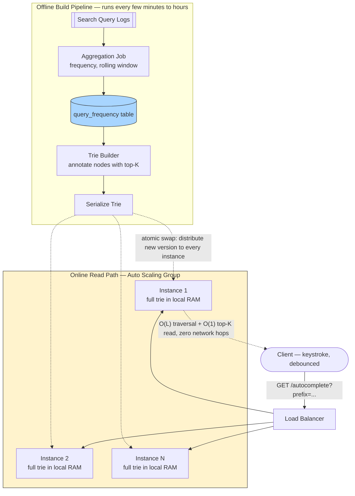

# Design Search Autocomplete (Typeahead Suggestions)

> **The one hard problem this really tests:** serving ranked prefix-match suggestions with **extremely tight latency budgets** (sub-100ms, ideally sub-50ms, because it fires on every keystroke) at massive query volume — which forces precomputation of a specialized in-memory data structure (a trie) rather than any kind of live database query per keystroke.

---

## 1. Requirements

### Functional
- As a user types a query prefix, return the top-K most relevant completed suggestions.
- Suggestions should reflect actual popularity/relevance (e.g., trending or frequently-searched completions), not just alphabetical order.
- Suggestions should update over time to reflect changing trends (yesterday's top suggestion for "world cup" shouldn't necessarily still be #1 next year).

### Non-Functional
- **Extremely low latency** — this fires on nearly every keystroke; anything above roughly 100ms feels janky and defeats the purpose of "instant" suggestions.
- **Very high read (query) volume** — every keystroke from every user, which is an order of magnitude more request volume than the underlying full search itself.
- **Ranking/relevance data can be stale by hours** — updating global trending data in real time to the millisecond is not required; a periodic refresh (e.g., every few minutes to hours) is entirely acceptable.

---

## 2. Back-of-Envelope Estimation

- If a search product handles, say, 100,000 full searches/sec, and an average query is ~20 characters typed with suggestions requested on most keystrokes, the **autocomplete request volume can easily be 10-20x the full-search request volume** — this single ratio is the reason autocomplete needs its own dramatically optimized, separate serving path rather than reusing the full search infrastructure directly.
- Given the sub-100ms latency requirement and this request volume, **a live database query per keystroke (even a well-indexed one) is not fast enough at this combined volume/latency requirement** — this pushes the design firmly toward an **in-memory, precomputed data structure** served directly from RAM, not disk-backed storage.

---

## 3. Component Deep Dive: The Trie (Prefix Tree) — the Core Data Structure

A **trie** is a tree where each node represents a single character, and a path from the root to a node spells out a prefix. All words sharing a common prefix share the same path down to the point where they diverge.

```
              (root)
             /   |   \
            c    d    ...
           /|         
          a a         
         /   \        
        t     r       
       /|      \       
      s  ...    ...     
     (cats)
```

- **Why a trie, and not just a database `LIKE 'prefix%'` query?** A trie lookup for a prefix of length `L` is `O(L)` — proportional only to the length of what's typed, completely independent of how many total words/suggestions exist in the entire dataset. A `LIKE 'prefix%'` query, even with an index, generally doesn't scale as cleanly or predictably at this volume/latency combination, and definitely can't live purely in a request-local in-memory structure the way a trie naturally can.
- **Storing ranked suggestions at each node:** rather than just marking "is this a complete word," each trie node (or each node along a prefix path) additionally stores its **top-K most popular completions** for that prefix, precomputed ahead of time — so a query for a given prefix is a **single O(L) traversal followed by an O(1) read of an already-sorted top-K list**, not a traversal-then-sort-on-the-fly operation. This precomputation is what makes read-time latency so predictably low.
- **Memory footprint concern:** storing every possible prefix's own top-K list at every single node can be memory-expensive for very deep/wide vocabularies — a common mitigation is only precomputing/caching top-K lists at nodes above a certain popularity/query-frequency threshold, falling back to a live (still fast, but slightly more expensive) computation for extremely rare, long-tail prefixes that don't justify the memory cost of precomputation.

---

## 4. High-Level Design



**Take this as the reference shape of the whole system** — the diagram is drawn to make one fact visually unmistakable: the **online read path never touches a database, a cache service, or even a network call to fetch trie data** — every Autocomplete instance already holds the entire trie in its own local memory, and the only thing arriving from the offline pipeline is a periodic, fully-built replacement copy.

**Offline build pipeline, step by step (runs continuously in the background, never on the request path):**
1. Raw search query logs feed an **Aggregation Job**, which counts query frequency per term over a recent rolling time window — deliberately a *rolling* window, not all-time-ever counts, so trending terms reflect current, not historical, popularity (§5).
2. The **Trie Builder** consumes this aggregated frequency data and constructs the trie, annotating each relevant node with its precomputed, already-sorted top-K completions (§3) — all of the ranking work happens here, once, rather than on every single request.
3. The finished trie is serialized into a compact, loadable format and **distributed to every Autocomplete Service instance**, each of which loads the *entire* trie into its own local memory and performs an **atomic swap** from its old copy to the new one — reads in flight during the swap simply finish against whichever version they started with; nothing ever sees a half-built trie.

**Online read path, step by step (the latency-critical path, optimized to the point of having almost nothing left to optimize):**
1. A (client-side debounced) keystroke fires `GET /autocomplete?prefix=...` through the **Load Balancer** to any Autocomplete instance — since every instance holds an identical full trie copy, request routing is a pure load-spreading decision with no data-locality constraint at all.
2. The instance performs an `O(L)` trie traversal down to the prefix's node, then an `O(1)` read of that node's precomputed top-K list — no live sorting, no query, no cache lookup, no network hop beyond the load balancer itself.
3. The response is returned entirely from local RAM — this is what makes the sub-100ms, ideally sub-50ms latency budget (§1) actually achievable at this request volume.

---

## 5. Ranking: Beyond Raw Frequency

Pure query-frequency-based ranking has real weaknesses worth naming: it favors already-popular terms (a rich-get-richer effect that can make legitimately new but rising trends slow to surface) and doesn't personalize per user. A more complete system (worth mentioning, not necessarily fully designing unless pushed) would blend:
- **Recency-weighted frequency** — a rolling/decaying window so that "yesterday's news" naturally fades from top rankings over time without needing an explicit manual reset.
- **Personalization** — boosting a user's own recent/frequent searches specifically for them, layered on top of the shared global trie (often implemented as a small personal override list checked first, falling back to the shared global trie for anything not in the user's own history).
- **Business/editorial boosting** — manually promoting certain suggestions (e.g., for moderation, safety, or business reasons) — a real, pragmatic override mechanism worth mentioning as it commonly exists in production systems.

---

## 6. Components Used — What Each Piece Is and Why It's Here

| Component | Role in This Design | Why This Choice, Here Specifically | Deep Dive |
|---|---|---|---|
| **Load Balancer** | Distributes keystroke requests across Autocomplete instances | Pure load-spreading with no data-locality concern at all, since every instance holds an identical full trie — any instance can answer any request equally well | [Load Balancers](../../02-building-blocks/load-balancers/README.md) |
| **Auto Scaling Group (Autocomplete Tier)** | Runs many instances, each holding a complete in-memory trie copy | Scales purely with request volume, not data size per instance — adding an instance means adding another full trie copy, not partitioning anything | [Scalability](../../01-foundations/scalability/README.md) |
| **In-Memory Trie (per instance)** | Answers every request with an O(L) traversal plus O(1) precomputed top-K read | This is deliberately **not** a shared remote cache — eliminating the network hop entirely from the hottest path in the system is the single biggest latency decision in this whole design (§4) | [Caching](../../02-building-blocks/caching/README.md) |
| **Aggregation Job** | Periodically computes rolling query-frequency counts from raw search logs | Decoupled entirely from the read path — this can run on whatever schedule keeps trends fresh enough (minutes to hours) without any pressure to be real-time | [Message Queues](../../02-building-blocks/message-queues/README.md) |
| **Trie Builder / Serializer** | Constructs the next version of the trie offline and packages it for distribution | Building happens fully in the background; the atomic-swap distribution step (§4) is what guarantees zero read-path downtime during a rebuild | [Scalability](../../01-foundations/scalability/README.md) |

---

## 7. Data Model

```
-- The trie itself is an in-memory data structure, not a relational table --
-- but the OFFLINE aggregation step that BUILDS it does use a simple
-- aggregate table/pipeline stage:

query_frequency (term, window_start, window_end, count)
  -- Aggregated periodically from raw search query logs (see Message Queues
  -- for how raw query events might be streamed into this aggregation job)

-- Trie node (conceptual, in-memory representation):
TrieNode {
    Map<Character, TrieNode> children;
    List<String> topKCompletions;   // precomputed, already sorted by score
}
```

---

## 8. API Design

```
GET /api/v1/autocomplete?prefix=cat&limit=10
  Response: { "suggestions": ["cats", "category", "catering", ...] }
  -- Fired on (debounced) every keystroke; response time budget: <100ms,
  -- ideally <50ms, since this directly gates perceived UI responsiveness.
```

**A practical client-side companion worth mentioning:** the client typically **debounces** keystroke-triggered requests (e.g., waiting ~100-150ms after the last keystroke before firing a request) to avoid sending a request for every single transient character while the user is still actively typing quickly — reducing request volume without meaningfully hurting perceived responsiveness.

---

## 9. Trade-offs & Follow-Up Questions to Anticipate

| Follow-up | Strong answer direction |
|---|---|
| "How do you keep the trie fresh without stalling reads during a rebuild?" | Build the new trie version fully offline/in the background, then **atomically swap** the in-memory reference from the old trie to the new one once fully built (a blue-green-style swap) — reads never see a partially-built trie, and there's no read-path downtime during a rebuild. |
| "How does this scale as vocabulary grows very large (many languages, many terms)?" | Shard the trie by first character or language/locale, distributing different shards across different service instances, rather than requiring every instance to hold the entire global vocabulary in memory. |
| "What about typos / fuzzy matching (not just exact prefixes)?" | A related but distinct problem, often handled by a secondary approximate-matching structure (e.g., an edit-distance-tolerant index) layered alongside the trie, or by normalizing/correcting the query before the trie lookup — worth naming as a real extension without fully designing it unless asked. |
| "How would you personalize suggestions per user without a huge memory cost per user?" | Keep the shared global trie as the default and layer a small, per-user override structure (recent searches, capped to a small count) checked first — avoids needing a full personalized trie copy per user, which wouldn't scale memory-wise. |

---

## 10. 60-Second Interview Answer

> "The defining constraint is latency, not data volume — this fires on nearly every keystroke, so I need sub-100ms responses at request volume far higher than the underlying full search itself. That rules out a live database query per keystroke, so I'd precompute a trie offline, periodically rebuilt from recent query logs, with each relevant node annotated with its already-ranked top-K completions — turning each request into an O(prefix length) traversal plus an O(1) read of a precomputed list, no live sorting needed. I'd load a full copy of this trie into the local memory of every autocomplete service instance rather than centralizing it behind a network call, trading some memory duplication for eliminating a network hop from the hottest path in the system. To refresh it without downtime, I'd build the new trie fully in the background and atomically swap the reference once ready, so reads never see a half-built trie."

**Related:** [Latency vs Throughput](../../01-foundations/latency-vs-throughput/README.md) · [Caching](../../02-building-blocks/caching/README.md) · [Load Balancers](../../02-building-blocks/load-balancers/README.md)
