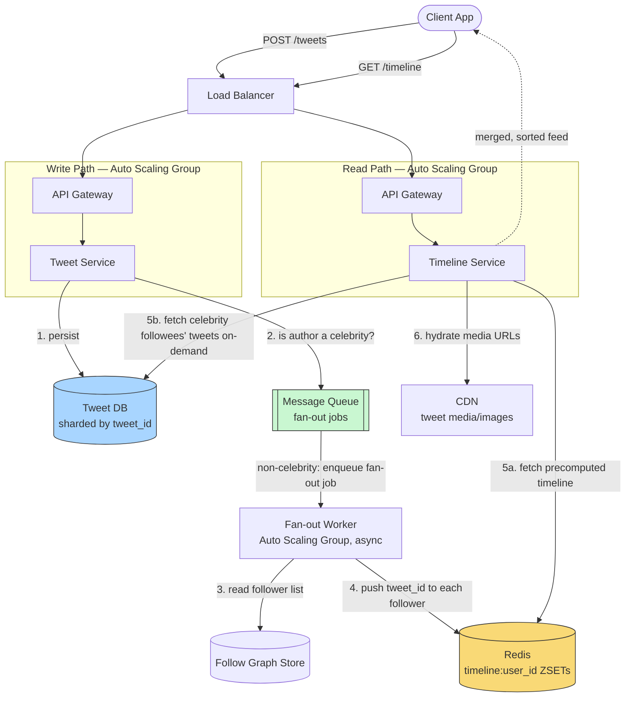

# Design a Twitter-like News Feed

> **The one hard problem this really tests:** the fan-out trade-off between computing a feed at write time vs read time — and the "celebrity problem" that breaks the naive version of both approaches at real-world scale.

---

## 1. Requirements

### Functional
- Users can post short text messages ("tweets"), optionally with media.
- Users can follow other users (asymmetric — following isn't mutual, unlike Facebook friends).
- A user's home timeline shows tweets from everyone they follow, roughly reverse-chronological (real systems also rank/rerank, but that's a separate ML-ranking concern — mention it, don't design it here unless asked).
- Users can like/retweet/reply.

### Non-Functional
- **Extreme read:write skew** — most users check their timeline far more often than they post.
- **Low latency timeline reads** (opening the app should feel instant).
- **Eventual consistency is acceptable** — it's fine if a tweet takes a few seconds to appear in a follower's feed; it is not fine if the whole system is unavailable.
- **Massive fan-out for high-follower accounts** — some accounts have 100M+ followers; a single tweet from such an account is a huge structural outlier that must not be allowed to degrade the system for everyone else.

---

## 2. Back-of-Envelope Estimation

- Assume 300M daily active users, average posting 2 tweets/day → ~600M tweets/day → ~7,000 writes/sec average, bursty to much higher during major global events.
- Assume each user checks their timeline ~10 times/day, each timeline read fetching ~20 tweets → **timeline reads vastly exceed tweet writes** — a read:write ratio easily in the thousands:1 once you count that each of 300M users is independently reading, not just the 600M raw tweet-writes.
- Average follower count might be ~200, but the distribution is **extremely long-tailed** — a small number of accounts have 100M+ followers. This long tail, not the average, is what actually shapes the architecture.

**Why the estimation matters:** the average follower count suggests fan-out-on-write is cheap (writing to ~200 followers' cached timelines per tweet is trivial). The **tail** (100M-follower accounts) is what breaks that assumption — this is exactly why the real design needs a hybrid approach, not a single strategy applied uniformly.

---

## 3. The Core Trade-off: Fan-Out-on-Write vs Fan-Out-on-Read

### Fan-Out-on-Write (Push Model)
When a user tweets, immediately push the tweet ID into a **precomputed timeline cache** (e.g., Redis, keyed per follower) for every one of their followers.

```
User tweets → Tweet stored in DB → for each follower F:
    push tweet_id onto F's cached timeline (Redis list, capped to recent N)
```
- **Read is then trivially cheap:** reading a timeline is just reading one pre-built cached list — no aggregation needed at read time.
- **Write is expensive and proportional to follower count** — for a normal user with ~200 followers, this is 200 cheap writes, entirely reasonable. For a celebrity with 100M followers, this is **100 million writes triggered by a single tweet**, which would take an unacceptably long time to complete and would hammer the caching layer — this is **the celebrity problem**.

### Fan-Out-on-Read (Pull Model)
Don't precompute anything. When a user opens their timeline, query the tweets of everyone they follow **at read time** and merge/sort them on the fly.
- **Write is trivially cheap** — a tweet is just inserted once, regardless of follower count.
- **Read is expensive** — for a user following 200 accounts, the read must fan out to (up to) 200 sources and merge-sort them, on every single timeline load, for every single user, all the time. Given that reads vastly outnumber writes (per the estimation above), this inverts the cost to the far more frequent operation — a bad trade for typical usage.

### The Hybrid (What Twitter Actually Does)

- **For the vast majority of users** (normal follower counts): use fan-out-on-write. Tweet, and immediately push into each follower's precomputed timeline cache. Reads stay cheap, which matters because reads are by far the dominant operation.
- **For celebrity/high-follower accounts:** *don't* fan out on write at all. Instead, at read time, merge the celebrity's tweets (fetched directly, since there are few celebrities and their tweets are easy to fetch on demand) into the follower's otherwise-precomputed timeline.
- **Determining "celebrity" status:** a simple follower-count threshold (e.g., accounts above some N followers, perhaps 1M+, are flagged as fan-out-on-read exceptions) — this is a pragmatic engineering heuristic, not a deep algorithm, and it's fine to state it exactly that plainly in an interview.

**This hybrid is the single most important thing to say in this interview.** A candidate who proposes only pure fan-out-on-write or only pure fan-out-on-read, without recognizing the celebrity problem and the hybrid resolution, has not fully solved the core problem this question is designed to test.

---

## 4. High-Level Design



**Take this as the reference shape of the whole system** — the diagram deliberately draws the write side and read side as two mostly-independent pipelines that only meet at the Redis timeline cache and the Tweet DB, because that separation is the entire point of the fan-out trade-off discussed in §3.

**Write path, in detail:**
1. A tweet lands at the **Tweet Service** behind the Load Balancer and API Gateway, and is persisted immediately to the **Tweet DB** — this is the only step the client waits on; everything else happens after the response is already on its way back.
2. The service checks whether the author crosses the celebrity follower-count threshold (§3). For the overwhelming majority of authors (not celebrities), a fan-out job is enqueued onto the **Message Queue** rather than fanned out inline — this is what keeps `POST /tweets` fast and of *constant* cost regardless of the author's follower count.
3. A **Fan-out Worker**, running as its own horizontally scaled pool, dequeues the job, reads the author's follower list from the **Follow Graph Store**, and pushes the new `tweet_id` onto every follower's precomputed timeline in **Redis**. This step is where "a few hundred milliseconds of propagation delay" (§5) actually happens, entirely off the user-facing critical path.
4. For celebrity authors, the worker deliberately does nothing here — no fan-out job is even created — deferring the cost to read time (step 5b below), which is the whole resolution to the celebrity problem.

**Read path, in detail:**
1. `GET /timeline` reaches the **Timeline Service**, which fetches the requesting user's precomputed feed straight out of Redis — a single key lookup, already containing every non-celebrity followee's recent tweets thanks to the write-path fan-out above.
2. In parallel, it fetches recent tweets **directly** from the Tweet DB for any celebrity accounts the user follows (a small, bounded set, cheap to query on demand precisely because there are relatively few celebrities system-wide).
3. The two result sets are merged and sorted by timestamp/Snowflake ID, media URLs are hydrated from the **CDN**, and the combined feed is returned — this merge step is the one piece of read-time cost the hybrid design *does* accept, and it's deliberately cheap because it only touches a handful of celebrity accounts, not the user's entire followee list.

---

Fanning out a single tweet to even 200 followers synchronously, in the request path of the "post tweet" API call, would add unacceptable latency to posting. The correct design: the "post tweet" API call **only writes the tweet to the database and immediately returns success to the user** — the fan-out to followers' caches happens **asynchronously**, via a message queue (see [Message Queues](../../02-building-blocks/message-queues/README.md)), decoupled from the user-facing write path.

## 5. Component Deep Dive: The Fan-Out Worker Must Be Asynchronous

Fanning out a single tweet to even 200 followers synchronously, in the request path of the "post tweet" API call, would add unacceptable latency to posting. The correct design: the "post tweet" API call **only writes the tweet to the database and immediately returns success to the user** — the fan-out to followers' caches happens **asynchronously**, via a message queue (see [Message Queues](../../02-building-blocks/message-queues/README.md)), decoupled from the user-facing write path.

This directly explains why a tweet doesn't always instantly appear in every follower's timeline the moment it's posted — a few hundred milliseconds to a couple of seconds of propagation delay through the fan-out queue is an accepted eventual-consistency trade-off (see [Consistency Models](../../01-foundations/consistency-models/README.md)) in exchange for the post-tweet action itself staying fast, always available, and not scaling in cost with follower count on the synchronous path.

---

## 6. Components Used — What Each Piece Is and Why It's Here

| Component | Role in This Design | Why This Choice, Here Specifically | Deep Dive |
|---|---|---|---|
| **Load Balancer** | Distributes both tweet-posting and timeline-read traffic across stateless service instances | Simple L7 HTTP routing with health checks; the read and write tiers can even be scaled and load-balanced independently since their traffic shapes differ enormously | [Load Balancers](../../02-building-blocks/load-balancers/README.md) |
| **Auto Scaling Group (Write & Read Tiers)** | Runs the Tweet Service and Timeline Service as independently scalable, stateless pools | Read traffic and write traffic scale by very different factors (§2) — separating them into independently-scaled groups avoids over-provisioning the cheap write tier just to keep up with the expensive read tier | [Scalability](../../01-foundations/scalability/README.md) |
| **Message Queue** | Decouples tweet persistence from follower fan-out, carrying fan-out jobs to the Fan-out Worker pool | The core mechanism that keeps `POST /tweets` fast and follower-count-independent (§5) — without it, posting would block on writing to every follower's cache | [Message Queues](../../02-building-blocks/message-queues/README.md) |
| **Fan-out Worker (Auto Scaling Group)** | Consumes fan-out jobs and pushes new tweet IDs into every non-celebrity follower's precomputed timeline | A separate, independently-scaled pool from the request-serving tiers, since fan-out volume (jobs × average follower count) scales differently from raw request volume and shouldn't compete with user-facing traffic for the same instances | [Scalability](../../01-foundations/scalability/README.md) |
| **Redis Timeline Cache** | Stores each user's precomputed timeline as a capped, time-sorted list, read directly on every timeline load | This is what makes the read path — by far the dominant traffic pattern (§2) — a single cheap key lookup instead of a fan-in query across hundreds of followees | [Caching](../../02-building-blocks/caching/README.md) |
| **Tweet DB** | Authoritative store for every tweet; also queried directly and on-demand for celebrity accounts' recent tweets at read time | Sharded by `tweet_id` (Snowflake-encoded, naturally time-sortable) so both the write path and the celebrity on-demand read path can target a single shard per query | [Sharding](../../02-building-blocks/databases/sharding/README.md) |
| **Follow Graph Store** | Answers "who follows this author" (for fan-out) and "who does this user follow" (for celebrity merge) | A dedicated graph-shaped store (or heavily-indexed relational table) is chosen because both directions of this many-to-many relationship need to be efficient, unlike a typical foreign-key lookup that only needs one direction | [SQL vs NoSQL](../../02-building-blocks/databases/sql-vs-nosql/README.md) |
| **CDN** | Serves tweet media (images/video) referenced by hydrated timeline entries | Media is large, immutable once posted, and read far more often than written — the textbook case for edge caching rather than serving every image from origin | [CDN](../../02-building-blocks/cdn/README.md) |

---

## 7. Data Model

```sql
-- Tweets: sharded by tweet_id (a Snowflake-style ID encoding creation time + shard info)
CREATE TABLE tweets (
    tweet_id     BIGINT PRIMARY KEY,   -- Snowflake ID: encodes timestamp, naturally sortable
    author_id    BIGINT NOT NULL,
    content      VARCHAR(280),
    media_url    TEXT NULL,
    created_at   TIMESTAMP NOT NULL
);
CREATE INDEX idx_author_created ON tweets (author_id, created_at DESC); -- for celebrity on-demand fetch

-- Follow graph: a classic many-to-many, needs to answer BOTH
-- "who does X follow" (for fan-out-on-read/celebrity merge) AND
-- "who follows X" (for fan-out-on-write) efficiently -- often a separate
-- specialized graph store (see SQL vs NoSQL) rather than a plain relational join table at this scale.
CREATE TABLE follows (
    follower_id  BIGINT NOT NULL,
    followee_id  BIGINT NOT NULL,
    created_at   TIMESTAMP NOT NULL,
    PRIMARY KEY (follower_id, followee_id)
);
CREATE INDEX idx_followee ON follows (followee_id); -- "who follows X" for fan-out-on-write
```

**Timeline cache (Redis):** `timeline:{user_id}` → a capped-size sorted list/ZSET of recent `tweet_id`s (score = timestamp or Snowflake ID itself, since it's naturally time-sortable), typically capped to the most recent ~800 tweet IDs per user — old enough tweets simply fall off the precomputed cache and would require a (rare) fallback query to reconstruct further back in history.

---

## 8. API Design

```
POST /api/v1/tweets
  Request:  { "content": "...", "mediaUrl": "optional" }
  Response: { "tweetId": "...", "createdAt": "..." }
  -- Returns immediately after DB write; fan-out happens asynchronously.

GET /api/v1/timeline?cursor={tweetId}&limit=20
  Response: { "tweets": [...], "nextCursor": "..." }
  -- Cursor-based pagination (using tweet_id, which is naturally time-ordered via Snowflake)
  -- is strongly preferred over offset-based pagination here: see Pagination Patterns doc.
```

---

## 9. Trade-offs & Follow-Up Questions to Anticipate

| Follow-up | Strong answer direction |
|---|---|
| "What threshold defines a 'celebrity' for fan-out-on-read?" | A pragmatic, tunable follower-count threshold (e.g., >1M), possibly combined with monitoring actual fan-out latency/cost per account and dynamically flagging outliers, rather than a purely static, one-time-configured number. |
| "What if a user follows both normal accounts and celebrities?" | Exactly the hybrid merge described above — precomputed cache for normal followees, on-demand fetch-and-merge for celebrity followees, combined at read time. |
| "How do you handle a user who just followed someone new — do they see historical tweets?" | Typically no immediate backfill into the precomputed cache (too expensive per-follow-action); either show only new tweets going forward, or lazily backfill a bounded number of recent tweets from the newly followed account on next read. |
| "How would ranking (not just chronological) change this?" | Ranking is usually a separate scoring/ML step applied to the *candidate set* the fan-out architecture produces — the fan-out problem (getting the right candidate tweets cheaply) is largely orthogonal to ranking (choosing which of those candidates to show first), and it's fine to explicitly scope ranking out unless asked to go deeper. |

---

## 10. 60-Second Interview Answer

> "The core tension is fan-out-on-write, which makes reads cheap by precomputing each follower's timeline but makes writes proportional to follower count, versus fan-out-on-read, which makes writes cheap but pushes expensive aggregation onto every read — and since timeline reads vastly outnumber tweets, pure fan-out-on-read is generally the wrong default. The real answer is a hybrid: fan-out-on-write for typical accounts, since a few hundred follower-cache writes per tweet is cheap and keeps reads fast, but skip fan-out entirely for celebrity accounts above a follower-count threshold, since fanning out to 100 million followers synchronously — or even asynchronously at that volume — isn't practical; instead merge celebrity tweets in at read time from a small, easily-queried set of high-follower accounts. Fan-out itself has to be asynchronous via a queue, decoupled from the tweet-posting request, so posting stays fast and available regardless of the author's follower count."

**Related:** [Message Queues](../../02-building-blocks/message-queues/README.md) · [Caching](../../02-building-blocks/caching/README.md) · [Consistency Models](../../01-foundations/consistency-models/README.md) · [Pagination Patterns](../../08-api-design/pagination-patterns/README.md)
