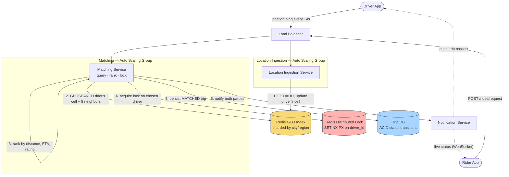

# Design Uber (Ride-Hailing / Real-Time Dispatch)

> **The one hard problem this really tests:** efficiently finding nearby available drivers for a rider's request in real time — a **geospatial indexing** problem — combined with matching under a two-sided marketplace where both supply (drivers) and demand (riders) are constantly moving and changing state.

---

## 1. Requirements

### Functional
- Riders request a ride from location A to location B; the system matches them with a nearby available driver.
- Drivers continuously broadcast their live location.
- Both parties see real-time location updates during the trip (driver approaching, trip in progress).
- Pricing/surge (mention it, it's a related but separable ML/business-logic concern — don't over-invest design time here unless asked).

### Non-Functional
- **Extremely frequent location updates** — potentially every few seconds from every active driver, globally — this is a very high-volume, write-heavy, geospatially-indexed workload, distinct from most other systems in this vault.
- **Low-latency matching** — riders expect a match within seconds of requesting.
- **Geospatial proximity queries at scale** — "find all available drivers within 3km of point (lat, lng)" must be fast, not a full table scan with Euclidean distance computed per row.
- **Consistency for the match itself** — two riders should not be matched to the same driver simultaneously (an inventory-style overselling problem, conceptually similar to [Hotel Booking](../hotel-booking/README.md)).

---

## 2. Back-of-Envelope Estimation

- Assume 5 million active drivers globally, each broadcasting location every 4 seconds → `5,000,000 / 4 ≈ 1.25 million location update writes/sec` — this single number tells you the location-update write path, not the ride-matching path, is likely the largest raw throughput driver in the whole system.
- Assume 20 million ride requests/day → roughly 230 requests/sec average, far lower than the location-update volume, but each request triggers a geospatially-scoped read (querying nearby drivers) that must complete in a couple hundred milliseconds at most.
- **The architectural implication:** the driver-location-update path and the rider-matching-query path have very different volume and latency profiles, and should likely be served by different, purpose-built components rather than one generic database handling both — this is exactly the kind of "identify the actual bottleneck" reasoning [Scalability](../../01-foundations/scalability/README.md#2-what-actually-limits-scalability) calls for.

---

## 3. Component Deep Dive: Geospatial Indexing (the actual hard problem)

A naive approach — store every driver's `(lat, lng)` in a database and query `WHERE lat BETWEEN ... AND lng BETWEEN ...` — technically works but scales poorly: a simple bounding-box query on raw coordinates doesn't account for the Earth's curvature well at the edges, and more importantly, a plain B-tree index on `lat` or `lng` independently doesn't help you efficiently answer a genuinely 2-dimensional "nearby" query — you need an index structure designed for spatial proximity.

### Option A: Geohashing
Geohashing encodes a `(lat, lng)` pair into a single string, where **nearby locations share longer common string prefixes** (with a well-known edge case: two points can be geographically close but fall on opposite sides of a geohash cell boundary and thus share a short or no common prefix — a real limitation to mention).
- A geohash of a given precision (string length) represents a grid cell of a certain size — e.g., a 6-character geohash represents roughly a ~1.2km × 0.6km cell.
- **Query approach:** to find nearby drivers, compute the geohash of the rider's location, then query for drivers whose geohash shares the same prefix (same cell), plus the **8 neighboring cells** (to handle the boundary edge case above — a driver just outside the rider's own cell, but still genuinely close, would otherwise be missed).
- Geohashes can be stored as a plain indexed string column in almost any database, or natively in Redis via its `GEOADD`/`GEORADIUS` commands, which implement geohashing internally.

### Option B: Quadtrees
A tree structure that recursively subdivides 2D space into four quadrants, subdividing further only in regions with high point density (e.g., dense urban areas get many small cells; sparse rural areas stay as large cells). This adapts cell size to actual data density, unlike geohashing's fixed-precision grid.
- More complex to implement and maintain (especially under a high-frequency-update workload like constantly moving drivers) than geohashing, but can give more balanced query performance across areas of very different driver density.

### Option C: Google's S2 Geometry Library
Divides the sphere (the actual Earth, accounting for curvature properly, unlike naive flat-grid approaches) into a hierarchy of cells, each with a unique 64-bit ID with similar prefix-sharing-implies-proximity properties to geohashing, but with better accuracy at scale and near the poles. Publicly known to be used by Google (obviously) and by several ride-hailing/delivery companies for exactly this driver-matching problem.

**Senior-level answer:** geohashing (or Redis's built-in `GEO*` commands, which implement it) is the pragmatic, simplest-to-reason-about default for an interview answer, with an explicit mention of the cell-boundary edge case and its 9-cell-neighbor-query mitigation. Naming quadtrees and S2 as more sophisticated alternatives, and explaining *why* they exist (adaptive density handling, Earth-curvature accuracy) without necessarily designing them in full, is exactly the right depth for a senior interview — showing breadth of awareness beyond just the one tool you'd actually reach for first.

---

## 4. High-Level Design



**Take this as the reference architecture** — notice the diagram deliberately separates the high-frequency, loss-tolerant **location ingestion** path (top) from the low-frequency, correctness-critical **matching** path (bottom); they only meet at the shared Redis GEO index, which is exactly the "different components for different volume/latency profiles" reasoning from §2.

**Location ingestion, step by step:** every ~4 seconds, each active driver's app pings its coordinates through the Load Balancer to the **Location Ingestion Service** — a thin, horizontally-scaled, stateless tier whose only job is a single `GEOADD` call updating that driver's position in the **Redis GEO index**, sharded per city/region (§6) so a write never has to consider drivers outside its own geography. This path is deliberately built to tolerate occasional lost updates (§8) since a slightly stale position is a minor inconvenience, not a correctness bug.

**Matching, step by step:**
1. A ride request reaches the **Matching Service**, which computes the rider's geohash cell and issues a `GEOSEARCH` against that cell plus its 8 neighbors (§3) — a bounded, fast, purely local query regardless of how many total drivers exist globally.
2. Candidates are ranked by distance, estimated time of arrival, and driver rating (a scoring step, explicitly scoped as a related-but-separate concern in §1).
3. The service attempts to acquire a **short-lived distributed lock** on the top candidate before doing anything else (§5) — this is the step that converts an otherwise race-prone read into a safe, exclusive claim.
4. On successful lock, a `trip` record is persisted as `MATCHED` in the **Trip DB**, and the **Notification Service** pushes the request to the driver's app and opens a live status channel (typically a persistent WebSocket, per §8) to the rider's app.
5. If the lock attempt fails (another concurrent request already claimed that driver), the Matching Service simply retries against the next-ranked candidate — no special error handling needed beyond that fallback.

---

## 5. Component Deep Dive: Preventing a Driver From Being Double-Matched

Two riders requesting a ride at nearly the same moment, both matched to the same nearby driver by two different, concurrently-executing matching requests, is a real correctness bug — the driver can only serve one of them. This is structurally the same **inventory-overselling problem** as [Hotel Booking](../hotel-booking/README.md#4-component-deep-dive-preventing-overbooking-the-actual-hard-problem) — a CP (per [CAP Theorem](../../01-foundations/cap-theorem/README.md)) decision is appropriate here, since a wrong match is a real-world correctness failure, not a cosmetic staleness issue.

**Mitigation:** upon selecting a candidate driver, the matching service attempts to acquire a **short-lived distributed lock** (e.g., via Redis `SET key value NX PX <ttl>`, an atomic "set if not exists with expiry" operation) on that specific driver's ID before sending the trip request notification. If the lock acquisition fails (another concurrent request already locked this driver), the matching service falls back to the next-best candidate instead. The lock naturally expires after a short TTL if the driver doesn't respond in time, returning them to the available pool without needing an explicit unlock call in the timeout case.

---

## 6. Components Used — What Each Piece Is and Why It's Here

| Component | Role in This Design | Why This Choice, Here Specifically | Deep Dive |
|---|---|---|---|
| **Load Balancer** | Fronts both the Location Ingestion Service and the Matching Service | Two very different traffic shapes (§2) sharing one entry tier, health-checked and routed at L7 | [Load Balancers](../../02-building-blocks/load-balancers/README.md) |
| **Auto Scaling Group (Location Ingestion Tier)** | Absorbs the dominant write volume in this entire system — ~1.25M location pings/sec globally | The service does one cheap `GEOADD` per request with no cross-request coordination, making it a textbook case for stateless horizontal scaling proportional to active-driver count | [Scalability](../../01-foundations/scalability/README.md) |
| **Auto Scaling Group (Matching Tier)** | Runs the ranking and locking logic per ride request | Lower request volume than ingestion (§2) but each request does more work (a geo query, ranking, a lock attempt, a DB write) — scaled and provisioned independently from the ingestion tier for exactly that reason | [Scalability](../../01-foundations/scalability/README.md) |
| **Redis GEO Index** | The live, queryable "who's nearby right now" structure, sharded per city/region | Geohashing gives cheap proximity queries via prefix/neighbor-cell lookups (§3); sharding by geography aligns the shard key with the fact that matching is inherently local (§6 below) | [Caching](../../02-building-blocks/caching/README.md) · [Sharding](../../02-building-blocks/databases/sharding/README.md) |
| **Redis Distributed Lock** | Gives exclusive, short-TTL ownership of a candidate driver during the match attempt | An atomic `SET NX PX` is a simple, well-understood primitive for exactly this "claim exactly one of N concurrent bidders" problem, with the TTL handling the no-response failure mode without extra cleanup logic | [Consistency Models](../../01-foundations/consistency-models/README.md) |
| **Trip DB** | Durable, ACID-compliant record of trip status transitions from `MATCHED` through `COMPLETED` | A relational store fits well here — status transitions and fare calculation benefit from real transactional guarantees, unlike the ephemeral, high-churn location index | [SQL vs NoSQL](../../02-building-blocks/databases/sql-vs-nosql/README.md) |
| **Notification Service** | Pushes the trip request to the driver and streams live status/location to the rider during an active trip | A persistent connection (WebSocket) fits better than polling for exactly this kind of low-latency, bidirectional, session-long update stream | [WebSockets](../../08-api-design/websockets/README.md) |

---

## 7. Data Model

```sql
-- Trip: the durable record of a matched ride, needs standard ACID semantics
-- (status transitions, fare calculation) -- a relational store fits well here.
CREATE TABLE trips (
    trip_id       BIGINT PRIMARY KEY,
    rider_id      BIGINT NOT NULL,
    driver_id     BIGINT NOT NULL,
    status        ENUM('REQUESTED','MATCHED','IN_PROGRESS','COMPLETED','CANCELLED'),
    pickup_lat    DOUBLE, pickup_lng  DOUBLE,
    dropoff_lat   DOUBLE, dropoff_lng DOUBLE,
    requested_at  TIMESTAMP,
    completed_at  TIMESTAMP NULL
);
```

```
-- Live driver location index: this is NOT a relational table in practice --
-- it's an in-memory geospatial structure (Redis GEO, or a custom geohash-indexed
-- store), because it's updated at extremely high frequency (every few seconds,
-- per driver) and only needs to answer "who's nearby RIGHT NOW" -- historical
-- location data (if needed at all, e.g. for trip route reconstruction) lives
-- in a SEPARATE, append-only, much cheaper store, not the hot live index.

Redis:  GEOADD driver-locations:{cityShard} {lng} {lat} {driverId}
        GEOSEARCH driver-locations:{cityShard} FROMLONLAT {riderLng} {riderLat}
                  BYRADIUS 3 km ASC COUNT 10
```

**Sharding the location index by city/region** is a natural and important choice here — driver location queries are inherently local (a rider in Chicago is never matched with a driver in Tokyo), so **geographic sharding aligns perfectly with the dominant query pattern**, directly following the shard-key selection guidance from [Sharding](../../02-building-blocks/databases/sharding/README.md#3-choosing-a-shard-key--the-single-most-consequential-decision).

---

## 8. API Design

```
POST /api/v1/driver/location
  Request: { "driverId": "...", "lat": ..., "lng": ..., "timestamp": "..." }
  -- High-frequency, fire-and-forget-tolerant (occasional lost update is fine --
  -- see CAP: this specific write can lean AP, unlike the match/lock step, which leans CP)

POST /api/v1/rides/request
  Request: { "riderId": "...", "pickupLat": ..., "pickupLng": ... }
  Response: { "tripId": "...", "status": "MATCHING" }

GET /api/v1/rides/{tripId}/status
  -- Or, more realistically, a persistent WebSocket connection (see WhatsApp's
  -- gateway-layer pattern) pushing live status/location updates to both
  -- rider and driver apps during an active trip, rather than polling.
```

---

## 9. Trade-offs & Follow-Up Questions to Anticipate

| Follow-up | Strong answer direction |
|---|---|
| "How do you handle a driver going through a tunnel / losing GPS signal?" | Treat missing recent pings as a staleness signal — if a driver's last location update exceeds some threshold age, exclude them from matching candidates until a fresh ping arrives, rather than matching against known-stale coordinates. |
| "How would surge pricing fit into this?" | A separate service consuming supply/demand ratio metrics *per geospatial cell* (the same geohash-cell partitioning used for matching) to compute a price multiplier — a natural reuse of the same spatial partitioning already built for matching. |
| "What if the driver-location Redis instance goes down?" | This is a legitimate availability risk for a component that's genuinely hot and critical — mitigate with Redis replication/clustering (see [Replication](../../02-building-blocks/databases/replication/README.md)) sharded per city, so a single region's outage doesn't take down matching globally. |
| "How do you avoid matching a rider with a driver who's about to go off-shift?" | Include driver-declared availability status as a filter alongside geospatial proximity in the candidate query — proximity alone isn't sufficient. |

---

## 10. 60-Second Interview Answer

> "The core problem is efficient proximity search — finding available drivers near a rider fast, at a scale of millions of drivers each pinging their location every few seconds. I'd index live driver locations with geohashing, using Redis's built-in GEO commands, querying the rider's cell plus its 8 neighbors to avoid missing drivers just across a cell boundary — and I'd shard that index geographically by city or region, since proximity queries are inherently local and that aligns the shard key with the actual query pattern. To prevent two riders being matched to the same driver simultaneously, I'd use a short-lived distributed lock on the candidate driver before sending the trip request, falling back to the next candidate if the lock is already held — treating the match itself as a consistency-critical operation, unlike the high-frequency location pings, which can tolerate occasional loss."

**Related:** [Database Sharding](../../02-building-blocks/databases/sharding/README.md) · [CAP Theorem](../../01-foundations/cap-theorem/README.md) · [Hotel Booking](../hotel-booking/README.md) · [Caching](../../02-building-blocks/caching/README.md)
