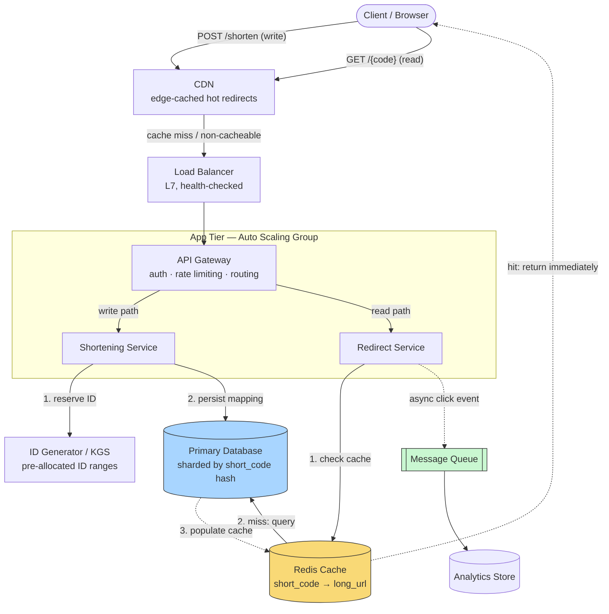

# Design a URL Shortener (TinyURL / Bitly)

> **The one hard problem this really tests:** generating short, unique, non-colliding identifiers at scale — and building a system where reads (redirects) outnumber writes (shortening) by orders of magnitude, so almost every architectural decision should be optimized for read latency.

---

## 1. Requirements

### Functional
- Given a long URL, generate a short URL (e.g., `https://short.ly/aZ9kQ2`).
- Given a short URL, redirect the user to the original long URL.
- (Optional) Users can pick a custom alias.
- (Optional) Links can expire after a configurable time.
- (Optional) Basic analytics: click count, referrer, geography.

### Non-Functional
- **Read-heavy:** redirects vastly outnumber creations (typically cited ratio: ~100:1 to 1000:1 read:write).
- **Low latency redirects** — a redirect is on the critical path of someone else's page load; it must be fast (sub-50ms ideally).
- **High availability** — a shortener going down breaks every link that's ever been shared anywhere (social media, print, emails already sent) — this is an availability-critical system disproportionate to its apparent simplicity.
- **Uniqueness** — no two long URLs should ever collide on the same short code (unless deliberately intended, e.g., idempotent re-shortening of the same URL).
- Short codes should not be sequentially guessable if privacy of unlisted links matters (edge case worth raising).

### Explicitly Out of Scope (state this out loud in an interview)
- User accounts / link management dashboards (mention it exists, don't design it in depth unless asked).
- Deep analytics pipelines (mention as an extension, point to [Notification System](../notification-system/README.md)-style async fan-out if pushed).

---

## 2. Back-of-Envelope Estimation

Assume a mid-large scale service (Bitly-like), not a toy:

- **New URLs created:** 100 million/month → ~40 writes/sec average (100M / (30×24×3600)).
- **Read:write ratio of 100:1** → ~4,000 reads/sec average. Design for peak, typically **5-10x average** → ~20,000-40,000 reads/sec peak.
- **Storage:** assume each record (long URL + short code + metadata) averages ~500 bytes. Over 5 years: `100M/month × 60 months × 500 bytes ≈ 3 TB`. Entirely feasible on a single well-indexed relational database's storage, or trivially shardable if needed.
- **Short code length:** using base62 encoding (`[a-zA-Z0-9]`, 62 symbols), `62^7 ≈ 3.5 trillion` combinations — a 7-character code comfortably covers billions of URLs with room to spare. This number is exactly the kind of thing an interviewer expects you to compute live, not recite.

**Why this estimation matters architecturally:** ~40 writes/sec is trivial for a single relational database's write path — **you do not need to shard the write path for this scale**, and proposing a complex sharded-write architecture here without being asked to design for Bitly's absolute peak (or explicitly told to assume 100x this volume) is a mild red flag: it signals over-engineering relative to the stated requirement. The **read** path, on the other hand, absolutely needs caching — 20-40K reads/sec against a single database (even one that could technically handle the write volume) would create unnecessary read contention that a cache trivially eliminates.

---

## 3. High-Level Design

The system splits cleanly into a **write path** (shortening a URL, rare, latency-tolerant) and a **read path** (resolving a redirect, extremely frequent, latency-critical) — nearly every component below exists to serve one of these two paths as cheaply as possible, and the diagram is drawn so you can trace each path with your finger.



**Take this diagram as the base for reasoning about the whole system** — every box is something you should be able to justify removing or keeping if an interviewer pushes on it, and every arrow is a network hop with its own latency and failure-mode implications.

**Read path, walked through step by step (the hot path — optimize this first):**
1. A client clicks a short link — `GET /{code}` first hits the **CDN**. Extremely popular links (a viral tweet's link) can be served straight from the CDN's edge cache without ever reaching origin infrastructure — this is the single biggest latency and load win available, because it means the busiest links cost you the least.
2. A CDN miss reaches the **Load Balancer**, which health-checks the App Tier and distributes the request to a healthy instance — see [Load Balancers](../../02-building-blocks/load-balancers/README.md) for L4 vs L7 mechanics; this workload is simple HTTP so an L7 load balancer (path/host-based routing isn't even required here, but TLS termination and health checks are) is the natural fit.
3. The **Redirect Service** (a stateless instance in the Auto Scaling Group) checks **Redis** for `short_code → long_url`. A cache hit returns the `301`/`302` immediately — this is the request that should dominate your latency budget reasoning, since it's the overwhelming majority of traffic.
4. A cache miss falls through to the **Database**, which is authoritative. The result is written back into Redis (cache-aside — see [Caching](../../02-building-blocks/caching/README.md)) before the redirect is returned, so the *next* request for that code is a cache hit.
5. Independently of the response, the Redirect Service emits a lightweight **click event** onto a **Message Queue**, consumed asynchronously into an analytics store — deliberately kept off the critical path so a slow analytics pipeline can never add latency to a redirect (see the hot-row discussion in §6).

**Write path, walked through step by step:**
1. `POST /shorten` reaches the same Load Balancer → API Gateway → **Shortening Service**.
2. The Shortening Service asks the **ID Generator (KGS)** for a unique ID (see §4 for why this component exists and how it avoids becoming a bottleneck), base62-encodes it into a short code.
3. It persists `{short_code, long_url}` to the **Database** and returns the short URL to the client. Note there's deliberately **no cache write here** — the code doesn't need to be cached until it's actually read for the first time, which cache-aside handles naturally on the next redirect.

---

## 4. Component Deep Dive: Generating the Short Code (the actual hard problem)

This is the part of the interview that separates strong candidates — there are several legitimate approaches, and you should be able to compare them, not just pick one.

### Approach A: Hash the Long URL (MD5/SHA-256), Truncate
Hash the long URL, take the first 7 characters (base62-encoded).
- **Problem:** collisions. Two different long URLs can truncate to the same 7 characters (birthday paradox math applies), requiring collision detection (check if the code already maps to a *different* URL, and if so, append a salt and re-hash) — this adds retry logic and unpredictable latency on collision.
- **Upside:** the same long URL always produces the same short code, which naturally deduplicates repeated shortening of the same URL (a nice free property) — but only if you don't need per-user custom codes for the same URL.

### Approach B: Base62-Encode an Auto-Incrementing Counter (the generally preferred approach)
Maintain a globally unique, monotonically increasing counter (e.g., a dedicated ID-generation service, or a database sequence), and base62-encode the number directly into the short code.
- **No collisions, by construction** — every counter value is unique, so every encoding is unique.
- **The real engineering problem this creates: how do you generate unique IDs FAST, without a single database sequence becoming a bottleneck or single point of failure?** This is where the actual system design depth lives:
  - **Pre-allocated ID ranges (a "Key Generation Service" / ticket server pattern):** a central service hands out *ranges* of IDs (e.g., "server A, you own IDs 1,000,000–1,999,999") to application servers in batches, so each app server can generate IDs locally within its assigned range without a network round trip per ID, only needing to go back to the central service when its range is exhausted. This is the classic Bitly-style "KGS" (Key Generation Service) approach.
  - **Distributed ID generators (Twitter Snowflake-style):** encode `{timestamp | machine ID | sequence number}` into a single 64-bit integer, generated **locally on each machine with no coordination at all** — trades a small amount of ID predictability/orderliness for zero coordination overhead. Excellent for extreme write scale; slight overkill for this system's actual estimated ~40 writes/sec, but the right answer if the interviewer scales up the requirements.

**Senior-level answer:** given this system's actual estimated write volume (~40/sec, occasionally bursty), a **pre-allocated range-based Key Generation Service** is the right-sized answer — it eliminates the single-sequence bottleneck without the added complexity of a fully coordination-free Snowflake-style generator, which would be justified only at a much higher write volume than this specific system's numbers support. **Explicitly stating this "right-sized for the estimated load" reasoning is exactly what separates a senior answer from a junior one that reaches for Snowflake by reflex.**

### Approach C: Random Generation + Collision Check
Generate a random 7-character base62 string, check the database for a collision, retry if one exists.
- With `62^7 ≈ 3.5 trillion` possible codes and, say, a few billion URLs stored, collision probability per attempt is extremely low (well under 0.1%) — this is a perfectly reasonable, simple approach for many real systems, and worth mentioning as the pragmatic "don't over-engineer it" option if the interviewer signals they want a simpler discussion.

---

## 5. Components Used — What Each Piece Is and Why It's Here

Every box in the §3 diagram is a deliberate choice, not a default. This table exists so you can defend each one individually if an interviewer asks "why did you put that there?"

| Component | Role in This Design | Why This Choice, Here Specifically | Deep Dive |
|---|---|---|---|
| **CDN** | Edge-caches responses for extremely hot short codes so the busiest redirects never reach origin infrastructure at all | A tiny fraction of links (viral shares) generate a disproportionate share of traffic — the classic long-tail/hot-key shape — so caching at the edge, closest to the reader, cuts both latency and origin load precisely where it matters most | [CDN](../../02-building-blocks/cdn/README.md) |
| **Load Balancer** | Distributes both read and write traffic across the stateless App Tier, health-checks instances, terminates TLS | L7 is the right layer since this is plain HTTP with no need for non-HTTP protocol support; health checks are what let the Auto Scaling Group add/remove instances without a human updating a target list | [Load Balancers](../../02-building-blocks/load-balancers/README.md) |
| **Auto Scaling Group (App Tier)** | Runs the API Gateway, Shortening Service, and Redirect Service as stateless, horizontally scalable instances | The service layer holds no session state (every request is fully self-contained), which is exactly the precondition that makes horizontal auto-scaling safe and simple — see the stateless-service discipline in [Scalability](../../01-foundations/scalability/README.md) | [Scalability](../../01-foundations/scalability/README.md) |
| **Redis Cache** | Holds the hot `short_code → long_url` mapping in memory, serving the overwhelming majority of read traffic without touching the database | Reads outnumber writes ~100:1 (§2) — a cache-aside pattern in front of the database is the single highest-leverage component in this entire design, since it's what keeps redirect latency low regardless of database load | [Caching](../../02-building-blocks/caching/README.md) |
| **Primary Database** | The authoritative store of every `short_code → long_url` mapping; source of truth on a cache miss | A relational database is sufficient and preferable here — the access pattern is simple exact-match lookups with no complex queries, and ~40 writes/sec (§2) is trivial for a single well-indexed instance; shard by `short_code` hash only once genuinely necessary | [SQL vs NoSQL](../../02-building-blocks/databases/sql-vs-nosql/README.md) · [Sharding](../../02-building-blocks/databases/sharding/README.md) |
| **ID Generator / KGS** | Hands out globally unique, pre-allocated ID ranges to app server instances so short-code generation never contends on a single counter | Removes the write path's only real coordination point without over-engineering toward a fully coordination-free Snowflake-style generator this system's actual load doesn't justify (§4) | [Scalability](../../01-foundations/scalability/README.md) |
| **Message Queue** | Carries click events off the latency-critical redirect path to be aggregated asynchronously | Decouples "return the redirect fast" from "count this click somewhere" — a slow or temporarily-down analytics pipeline must never be able to add latency, or an outage, to a redirect | [Message Queues](../../02-building-blocks/message-queues/README.md) |
| **Analytics Store** | Aggregates click counts, referrers, and geography from the queue, entirely separate from the low-latency serving path | A write-heavy, append-friendly store (or even a batch/OLAP system) is a better fit here than bolting analytics onto the same row-per-link table the redirect path reads from | [Message Queues](../../02-building-blocks/message-queues/README.md) |

---

## 6. Data Model

```sql
CREATE TABLE url_mapping (
    short_code   VARCHAR(10) PRIMARY KEY,   -- base62 encoded, indexed for O(1) lookup
    long_url     TEXT NOT NULL,
    created_at   TIMESTAMP NOT NULL DEFAULT now(),
    expires_at   TIMESTAMP NULL,             -- NULL = never expires
    created_by   BIGINT NULL,                -- nullable: supports anonymous shortening
    click_count  BIGINT NOT NULL DEFAULT 0   -- see note below on why this is a bad idea as-is
);
CREATE INDEX idx_long_url_hash ON url_mapping (md5(long_url)); -- for dedup lookups on re-shortening
```

**A deliberate senior-level callout:** storing `click_count` as a column incremented on every redirect creates **write contention on a hot row** for popular links (see the "hot key problem" from [Sharding](../../02-building-blocks/databases/sharding/README.md) and [Rate Limiting](../../02-building-blocks/rate-limiting/README.md)) — every single redirect of a viral link would issue an `UPDATE` against the same row. The better answer: **emit a click event to a message queue** (see [Message Queues](../../02-building-blocks/message-queues/README.md)) asynchronously from the redirect path, and aggregate click counts in a separate analytics pipeline/table, entirely decoupled from the latency-critical redirect path. This is a very commonly probed follow-up ("how would you add click analytics without slowing down redirects?").

---

## 7. API Design

```
POST /api/v1/shorten
  Request:  { "longUrl": "https://example.com/very/long/path", "customAlias": "optional", "expiresAt": "optional-ISO8601" }
  Response: { "shortUrl": "https://short.ly/aZ9kQ2" }
  Status codes: 201 Created, 400 Bad Request (invalid URL), 409 Conflict (custom alias taken)

GET /{shortCode}
  Response: HTTP 301/302 redirect to the long URL
  Status codes: 301/302 (found), 404 Not Found, 410 Gone (expired)
```

**301 vs 302, a genuine interview trap:** a `301 (Permanent Redirect)` is cached by browsers, meaning subsequent clicks from the *same browser* never even hit your server again — saving load, but also meaning you **lose the ability to track repeat clicks from that browser**, and if the mapping ever needs to change, cached clients won't see the update. A `302 (Found / Temporary Redirect)` is not cached, hits your server every time, giving full click tracking and flexibility to change the mapping, at a (usually acceptable) cost of more redirect traffic. **Most production shorteners use 302 specifically to preserve analytics** — stating this trade-off explicitly, unprompted, is a strong signal.

---

## 8. Trade-offs & Follow-Up Questions to Anticipate

| Follow-up | Strong answer direction |
|---|---|
| "How do you prevent malicious/spam URLs?" | Check against a threat-intelligence blocklist (e.g., Google Safe Browsing API) synchronously or asynchronously at creation time; consider rate limiting creation per IP/account (see [Rate Limiting](../../02-building-blocks/rate-limiting/README.md)). |
| "What if a custom alias is requested that's taken?" | Database unique constraint on `short_code` naturally rejects it; return `409 Conflict` to the client — no special distributed coordination needed since this is a single-row uniqueness check. |
| "How would you scale to 100x this load?" | Read: add more Redis replicas / a CDN layer for redirect responses on extremely hot links. Write: at genuinely higher scale, move from range-based KGS to a Snowflake-style generator to remove even the batch-refill coordination point. |
| "How do you handle the database being the bottleneck eventually?" | Shard by `short_code` hash (see [Sharding](../../02-building-blocks/databases/sharding/README.md)) — a great shard key here since lookups are always by exact `short_code`, no range queries needed, so hash-based sharding has no real downside for this specific access pattern. |
| "What about expired links?" | A background job (or lazy check-on-read) marks/deletes expired rows; lazy deletion (check `expires_at` at read time, return 410 without needing a proactive sweep) is often simpler and sufficient. |

---

## 9. 60-Second Interview Answer

> "This system is read-heavy — reads outnumber writes by roughly 100:1 — so I'd optimize the redirect path first: cache-aside with Redis in front of the database, keyed by short code. For generating unique codes, I'd avoid hashing the long URL due to collision handling overhead, and instead base62-encode IDs from a Key Generation Service that hands out pre-allocated ID ranges to app servers, avoiding a single sequence becoming a write bottleneck, while being right-sized for the estimated ~40 writes/sec rather than reaching for a fully coordination-free Snowflake-style generator that this scale doesn't justify. I'd shard the database by short code hash if it ever needs to scale past a single instance, since lookups are always exact-match. And I'd deliberately use 302 redirects instead of 301, since 301s get cached by browsers and silently kill click analytics."

**Related:** [Caching](../../02-building-blocks/caching/README.md) · [Database Sharding](../../02-building-blocks/databases/sharding/README.md) · [Rate Limiting](../../02-building-blocks/rate-limiting/README.md) · [Scalability](../../01-foundations/scalability/README.md)
