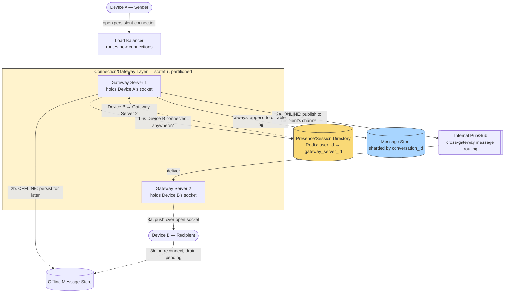

# Design WhatsApp (Real-Time Messaging)

> **The one hard problem this really tests:** maintaining real-time, ordered, exactly-once-feeling message delivery over unreliable mobile networks, across online and offline recipients, at a scale of billions of messages per day — with end-to-end encryption layered on top without breaking any of it.

---

## 1. Requirements

### Functional
- 1:1 messaging and group messaging (up to some max group size, e.g., 1024).
- Delivery status: sent (✓), delivered (✓✓), read (✓✓ blue).
- Messages delivered even if the recipient is offline when sent (queued for later delivery).
- Media messages (images, video, voice notes).
- End-to-end encryption via the Signal Protocol (covered in depth in §6, since it materially shapes what the server is architecturally allowed to do).
- Online/last-seen presence indicators.

### Non-Functional
- **Real-time delivery** — sub-second latency when both parties are online.
- **At-least-once delivery guarantee** — a message must never be silently lost, even across app crashes, network drops, or server failures; duplicates are acceptable if the client de-duplicates (see [Message Queues](../../02-building-blocks/message-queues/README.md#2-delivery-guarantees--the-precise-definitions)).
- **Ordering** — messages within a single conversation must arrive in the order they were sent (per-conversation ordering, not necessarily global ordering).
- **Massive concurrent connection count** — billions of devices need a persistent connection open at any given moment, which is a distinct scaling problem from typical stateless HTTP request/response scaling.

---

## 2. Back-of-Envelope Estimation

- Assume 2 billion monthly active users, ~50 billion messages/day sent → ~580,000 messages/sec average, bursty far higher at peak (e.g., New Year's Eve message spikes, publicly documented by WhatsApp engineering as multi-hour sustained peaks several times normal volume).
- Concurrent open connections: assume ~500 million devices connected at any given moment globally (accounting for time zones) — **this is the number that shapes the architecture more than raw message throughput does**, because it determines how many persistent (not request/response) connections the serving fleet must hold open simultaneously.
- Each connection consumes server-side memory/file-descriptor resources even when idle — a traditional one-thread-per-connection server model (common in older Java servlet containers) would need an enormous number of OS threads just to hold idle connections open, which is why this system fundamentally requires an **event-driven, non-blocking I/O architecture** (Erlang/OTP historically, per WhatsApp's well-known engineering history, or Netty-based async I/O in a JVM context) rather than a traditional thread-per-request model.

---

## 3. High-Level Design



**Take this as the reference shape of the whole system** — the one detail that makes this diagram unlike almost every other design in this vault is the **Gateway Tier itself being stateful**: Device A and Device B are, in general, connected to two *different* physical gateway machines, so a message can never be routed by a simple stateless load-balancer decision alone — it has to be actively looked up and forwarded across machines, which is exactly what the Presence Store and internal Pub/Sub layer exist to do.

**The online-delivery path, step by step:**
1. Device A sends a message over its already-open persistent connection to **Gateway Server 1**.
2. Gateway Server 1 looks up Device B's current connection location in the **Presence/Session Directory** — a single fast key lookup answering "which gateway machine, if any, currently holds this user's socket."
3. If Device B is online (connected to Gateway Server 2, a different machine), Gateway Server 1 publishes the message onto an **internal pub/sub channel** scoped to Device B's user ID; Gateway Server 2, subscribed to that channel because it holds Device B's live connection, receives it and pushes it down the open socket immediately.
4. Independently of the delivery attempt, the message is appended to the durable **Message Store** — this happens on every message regardless of the recipient's online status, since the message log is the system's source of truth, not the transient push itself.

**The offline-delivery path, step by step:**
1. If the Presence Store lookup finds no live connection for Device B, Gateway Server 1 instead persists the message into the **Offline Message Store**, keyed by recipient.
2. When Device B's app reconnects (to whichever gateway server the Load Balancer happens to route it to next), that gateway server queries the Offline Message Store for any pending messages and delivers them in sequence-number order, then clears them from the offline store.
3. This is also exactly the recovery path for a **gateway server crash** (§9): any device whose connection drops simply reconnects elsewhere and resumes from its last known per-conversation sequence number, treating the gap as if it had simply been offline.

---

## 4. Component Deep Dive: The Connection/Gateway Layer

This is the component that makes this system architecturally distinct from a typical request/response web service.

- **Why not plain HTTP polling?** Polling (repeatedly asking "any new messages?") wastes enormous resources at this scale and adds latency proportional to the poll interval. A **persistent connection** (historically raw TCP with a custom lightweight protocol at WhatsApp; more commonly WebSockets or gRPC bidirectional streaming in modern designs) lets the server **push** a message to the client the instant it arrives, with no polling delay.
- **Stateful gateway servers, by necessity:** unlike a stateless HTTP app server (see [Scalability](../../01-foundations/scalability/README.md)), a connection gateway server **must** hold state — specifically, which device is connected to which specific machine, because that's literally where the open socket lives. This is one of the few legitimate cases where "the server holds state in memory" is not an anti-pattern but an inherent property of the problem — you can't externalize an open TCP/WebSocket connection to Redis.
- **The routing implication:** because Device A's message might need to reach Device B, who is connected to a *different* gateway server, the gateway fleet needs an internal routing mechanism — either a **shared, low-latency presence/session directory** (which gateway server is each user currently connected to) combined with direct server-to-server message routing, or an internal pub/sub layer (each gateway server subscribes to a channel per user connected to it, and messages are published to the recipient's channel regardless of which gateway server produced them).
- **Horizontal scaling of a stateful layer:** since each gateway server holds a specific, non-transferable set of live connections, scaling this layer horizontally means adding more gateway servers, each independently holding a fraction of the total connection count — this is horizontal scaling of a **partitioned stateful** system (partitioned by which connections happen to land on which server), a different pattern from the usual "any stateless replica can serve any request."

---

## 5. Message Ordering and Delivery Guarantees

- **Per-conversation ordering:** each message is assigned a **monotonically increasing sequence number scoped to the conversation** (not a global sequence, which would require unnecessary global coordination — see [Scalability](../../01-foundations/scalability/README.md#3-scalability-patterns-the-toolbox) and the [Message Queues](../../02-building-blocks/message-queues/README.md#4-ordering-guarantees) partitioned-ordering principle). The recipient's client can then detect gaps or out-of-order arrival and reorder/request retransmission locally.
- **At-least-once delivery with client-side deduplication:** every message carries a unique client-generated message ID. If a network blip causes the server or client to be unsure whether a message was received, it's safe to resend — the receiving client deduplicates by message ID before displaying it, exactly matching the [at-least-once + idempotent consumer](../../02-building-blocks/message-queues/README.md#2-delivery-guarantees--the-precise-definitions) pattern from the Message Queues building block, here applied at the client rather than a server-side consumer.
- **The three checkmark states are a client-visible representation of a delivery pipeline:** sent (✓, server has accepted and durably stored the message) → delivered (✓✓, recipient device has acknowledged receipt) → read (✓✓ blue, recipient has opened/viewed it) — each transition is a distinct acknowledgment event flowing back to the sender, itself delivered through the same persistent-connection infrastructure.

---

## 6. Component Deep Dive: End-to-End Encryption (the Signal Protocol)

This deserves more than a scoping-out note, since it's the single most defining technical characteristic of this specific product, and interviewers who ask "design WhatsApp" specifically (rather than a generic chat system) frequently probe here. WhatsApp's E2E encryption is built on the **Signal Protocol**, and the mechanism is worth being able to sketch precisely:

- **X3DH (Extended Triple Diffie-Hellman) — establishing the first shared secret:** when Alice wants to message Bob for the first time, she fetches a bundle of Bob's public keys from the server (his identity key, a signed pre-key, and a one-time pre-key) — the server can hold and hand out these *public* keys freely since they reveal nothing useful to an eavesdropper. Alice combines her own private keys with Bob's public keys through several Diffie-Hellman exchanges to derive a shared secret **that only Alice and Bob can compute**, even though the key material needed to compute it passed through the server — the server never sees the resulting secret itself, only public keys.
- **The Double Ratchet — a new key for every single message:** rather than reusing that one shared secret for the whole conversation (which would mean one compromised key exposes the entire message history), the Double Ratchet algorithm derives a **new encryption key for every message**, ratcheting forward in a way that's mathematically one-directional. This gives two critical properties: **forward secrecy** (compromising today's key doesn't let an attacker decrypt yesterday's already-sent messages, since old keys are actively discarded after use) and **post-compromise/future secrecy** (a compromised key doesn't compromise future messages either, since the ratchet keeps advancing with fresh Diffie-Hellman contributions from both sides).
- **What this means architecturally, precisely, for the server design in §3-4:** the server's job shrinks to being a **durable, ordered relay of opaque ciphertext** — it stores and forwards encrypted blobs it cannot read, which is exactly why the `content` column in §8's data model is described as an encrypted payload the server never inspects. This has real, concrete design consequences: server-side content search, spam/abuse content-filtering, and message previews for notifications all become impossible (or must be redesigned around metadata/client-side signals only, since the server has no plaintext to work with) — a genuinely important follow-up an interviewer may probe ("if the server can't read messages, how do push notifications show a preview?" — the honest answer is that either they don't, or the preview is generated and encrypted client-side for the recipient's own devices only).
- **Group messaging complicates this further:** rather than pairwise Double-Ratchet sessions scaling as O(n²) for an n-person group, WhatsApp (like Signal) uses a **sender key** scheme — each group member generates one symmetric key and distributes it once (pairwise, using the 1:1 protocol above) to every other member, then encrypts messages to the group with that single key, so a message is encrypted once and fanned out, not re-encrypted per recipient — trading a small amount of forward-secrecy granularity (a compromised sender key exposes that member's messages until they rotate it) for making group messaging computationally tractable at scale.

**Why this is worth naming precisely rather than gesturing at "it's encrypted":** it demonstrates you understand E2E encryption isn't a checkbox the server flips — it fundamentally reshapes what the server is *allowed* to do with the data flowing through it, with real, cascading design consequences for every content-aware feature discussed elsewhere in this design.

---

## 7. Components Used — What Each Piece Is and Why It's Here

| Component | Role in This Design | Why This Choice, Here Specifically | Deep Dive |
|---|---|---|---|
| **Load Balancer** | Routes new incoming connections to a gateway server; does **not** route individual messages, since it never sees them after the connection is established | Only involved at connect time — once a socket is open, all message routing happens inside the Gateway Tier via the Presence Store and pub/sub, not through the load balancer again | [Load Balancers](../../02-building-blocks/load-balancers/README.md) |
| **Gateway Server Fleet (partitioned, stateful)** | Holds millions of open persistent connections, each pinned to one specific machine | The one legitimate case where "the server holds state in memory" isn't an anti-pattern — an open socket physically cannot be externalized to a shared cache the way a session token can (§4) | [Scalability](../../01-foundations/scalability/README.md) |
| **Presence/Session Directory (Redis)** | Answers "which gateway machine, if any, currently holds this user's connection" — one fast lookup per outgoing message | Extremely hot, extremely simple key-value shape (`user_id → gateway_server_id`) — exactly the profile Redis is built for, and it must be low-latency since it sits on the critical path of every single message | [Caching](../../02-building-blocks/caching/README.md) |
| **Internal Pub/Sub Layer** | Routes a message from the sending gateway server to the specific gateway server holding the recipient's connection | Decouples "which machine produced this message" from "which machine must deliver it" — without this, gateway servers would need direct network paths to every other gateway server for every cross-machine message | [Message Queues](../../02-building-blocks/message-queues/README.md) |
| **Offline Message Store** | Durably holds messages for recipients with no live connection anywhere, delivered on next reconnect | Must be optimized for a specific access pattern — write once, read-and-clear once on reconnect, keyed by recipient — rather than general-purpose querying | [Message Queues](../../02-building-blocks/message-queues/README.md) |
| **Message Store** | The durable, append-only source of truth for every message, sharded by conversation ID | Sharding by `conversation_id` (not by user) keeps all messages in a single conversation co-located, matching the per-conversation sequence-number ordering guarantee (§5) | [Sharding](../../02-building-blocks/databases/sharding/README.md) |

---

## 8. Data Model

```sql
-- Messages: a message belongs to a conversation, ordered by a per-conversation sequence.
-- At WhatsApp's actual scale this would be a wide-column/NoSQL store (see SQL vs NoSQL),
-- sharded by conversation_id, but the logical shape is shown relationally for clarity.
CREATE TABLE messages (
    conversation_id   BIGINT NOT NULL,
    sequence_number   BIGINT NOT NULL,   -- monotonic PER conversation, not global
    sender_id         BIGINT NOT NULL,
    content           BLOB NOT NULL,      -- encrypted payload; server never sees plaintext (E2E)
    sent_at           TIMESTAMP NOT NULL,
    PRIMARY KEY (conversation_id, sequence_number)
);

-- Offline message queue: pending messages for a currently-disconnected recipient.
-- Deleted once delivered and acknowledged -- this table should stay small in steady
-- state (most users are online most of the time relative to message volume),
-- but must handle the "phone off for days" tail case without unbounded growth
-- (a max retention / expiry policy is a reasonable, commonly-asked follow-up).
CREATE TABLE offline_messages (
    recipient_id      BIGINT NOT NULL,
    message_id        BIGINT NOT NULL,
    conversation_id   BIGINT NOT NULL,
    enqueued_at       TIMESTAMP NOT NULL,
    PRIMARY KEY (recipient_id, message_id)
);

-- Presence/session directory: which gateway server (if any) holds this user's live connection.
-- This is a small, extremely hot, low-latency-critical table/store -- typically Redis,
-- not a relational table, given the read/write volume and the "just need the current value" shape.
-- presence:{user_id} -> { gateway_server_id, connected_at, last_seen }
```

---

## 9. API / Protocol Design

Unlike a typical REST API, this system is dominated by a **persistent, bidirectional protocol** rather than discrete request/response calls:

```
Client → Server (over persistent connection):
  SEND_MESSAGE { conversationId, clientMessageId, ciphertext, sequenceHint }
  ACK_DELIVERED { messageId }
  ACK_READ { messageId }

Server → Client (pushed, not polled):
  NEW_MESSAGE { conversationId, messageId, sequenceNumber, ciphertext, senderId }
  DELIVERY_RECEIPT { messageId, status: DELIVERED | READ }
  PRESENCE_UPDATE { userId, status: ONLINE | OFFLINE, lastSeen }
```

A REST-style HTTP API still exists alongside this for non-real-time concerns (account management, media upload URLs, group metadata changes) — it's specifically the message-delivery path that needs the persistent-connection model.

---

## 10. Trade-offs & Follow-Up Questions to Anticipate

| Follow-up | Strong answer direction |
|---|---|
| "How do you scale group messages to 1000 members?" | Fan-out on send to each online member's gateway connection (similar in spirit to [Twitter's fan-out-on-write](../twitter-feed/README.md#3-the-core-trade-off-fan-out-on-write-vs-fan-out-on-read), but at a much smaller, bounded fan-out factor than a celebrity's followers, so the celebrity-problem hybrid usually isn't needed here — 1024 is small enough for direct fan-out). |
| "What happens if a gateway server crashes?" | All connections held by that server drop; clients detect the disconnect and reconnect (often to a different server via a load balancer), then resume from their last known sequence number per conversation to catch up on any messages sent during the gap — this is why per-conversation sequence numbers exist, not just for ordering but for gap detection/recovery. |
| "How do you handle multi-device (same account on phone + web + desktop)?" | Fan out delivery to all of a user's currently-connected devices, and track delivery/read receipts per-device or reconcile them, since "delivered" now means "delivered to at least one active device" rather than a single connection. |
| "How does end-to-end encryption change the server's role?" | The server becomes purely a durable, ordered relay of opaque ciphertext — it cannot inspect content, which also means server-side features requiring content visibility (like content-based spam filtering) must be redesigned or pushed to the client/metadata layer. |

---

## 11. 60-Second Interview Answer

> "The defining challenge here isn't the message volume itself — it's holding hundreds of millions of persistent connections open simultaneously, which requires a stateful, event-driven gateway layer rather than typical stateless request/response app servers, since an open socket physically lives on one specific machine and can't be externalized to a shared cache. I'd assign each conversation a monotonic, per-conversation sequence number rather than a global one, giving ordering and gap-detection without unnecessary global coordination. Delivery is at-least-once with client-side deduplication by message ID, since exactly-once delivery over unreliable mobile networks isn't realistically achievable, matching the same pattern used in reliable message queues. For offline recipients, messages are durably queued and delivered on reconnect, using the same sequence numbers to let the client detect and fill any gap."

**Related:** [Message Queues](../../02-building-blocks/message-queues/README.md) · [Scalability](../../01-foundations/scalability/README.md) · [Consistency Models](../../01-foundations/consistency-models/README.md) · [WebSockets](../../08-api-design/websockets/README.md)
