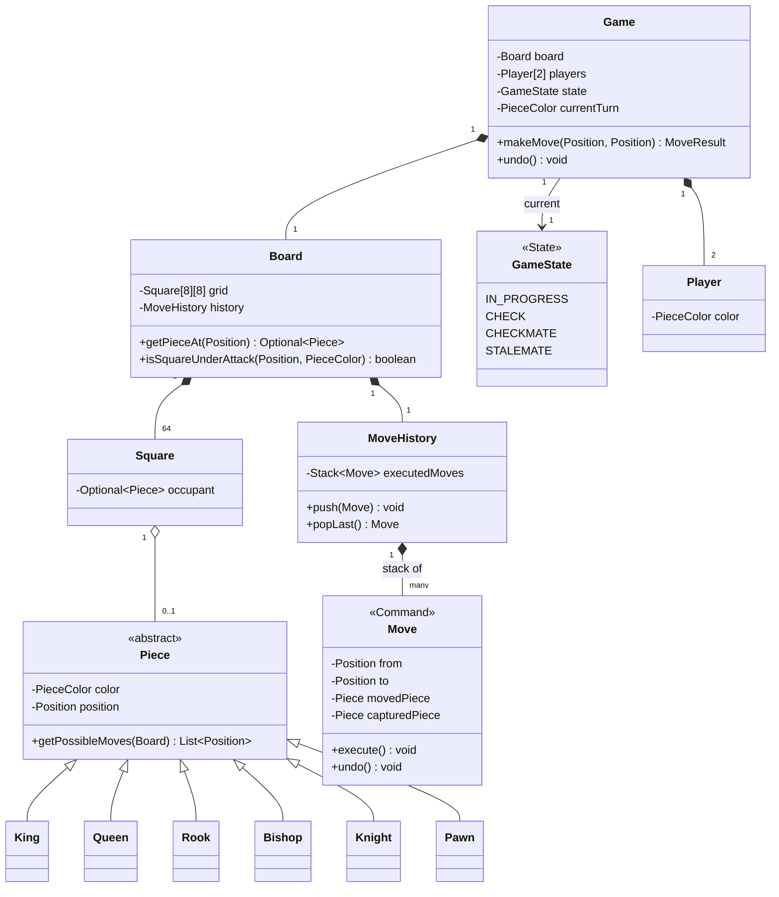

# Low-Level Design: Chess Game

> **The core OOP challenge:** using polymorphism so each piece type encapsulates its *own* movement rules (rather than one giant `switch` on piece type scattered through a `Board` class), while cleanly supporting move validation, check/checkmate detection, and move history/undo — a genuinely rich test of whether OOP fundamentals are second nature or memorized.

---

## 1. Requirements Clarification

- Standard 8×8 board, standard piece set and movement rules.
- Validate that a move is legal (piece-specific movement rules + not moving through/into check).
- Detect check, checkmate, and stalemate.
- Support move history and undo (a natural fit for the Command pattern).
- (Extension to anticipate) Special moves: castling, en passant, pawn promotion.

---

## 2. Class Design



**Take this diagram as the base for the whole design** — two relationships carry the entire design's intent. First, `Piece <|-- King/Queen/.../Pawn` (inheritance, not a `switch` statement) is what §3 is about: each subclass answers "where can I legally move from here" for itself. Second, `MoveHistory "1" *-- "many" Move`, combined with `Move`'s own `execute()`/`undo()` methods, is the Command pattern (§5) made visual — history isn't a log of *descriptions* of what happened, it's a stack of *executable, reversible objects*.

---

## 3. Key Classes & Interfaces — What Each One Is Responsible For

| Class | Responsibility | Why It's Shaped This Way |
|---|---|---|
| `Game` | Top-level orchestrator — owns the board, both players, current turn, and game state | The only class client code talks to; `makeMove` is the single public entry point that internally coordinates validation, execution, and state transition |
| `Board` | Owns the 8×8 grid and the move history; answers spatial queries like "is this square under attack" | Deliberately holds no turn/game-state logic of its own — it's a spatial data structure, not a rules engine |
| `Piece` (abstract) + 6 subtypes | Each subtype knows its own legal-move generation rules | This is the polymorphism decision from §3 — the alternative (one `switch` in `Board`) was rejected specifically because it doesn't scale to special-move extensions (castling, en passant) without bloating a central class |
| `Move` | An executable, reversible command — not just a data record of "piece X went from A to B" | Storing `execute()`/`undo()` behavior on the object itself, rather than reconstructing undo logic externally from a move description, is what makes undo/history trivial (§5) |
| `MoveHistory` | A stack of executed `Move` commands | A stack is the natural structure for "undo the most recent thing," and pairs directly with the Command pattern's reversibility |
| `GameState` | Tracks whether the game is in progress, check, checkmate, or stalemate | Modeled explicitly as a State-pattern-managed enum rather than scattered boolean flags (`isInCheck`, `isCheckmate`, ...) that could drift out of sync with each other |
| `Player` | Represents one side, holding its color | Kept minimal — a player doesn't own pieces directly; ownership is inferred from `PieceColor`, avoiding a second, redundant piece-tracking list |

---

## 4. Piece Polymorphism — the Core Design Decision

Rather than a `Board` class containing a giant `switch (piece.getType())` to compute legal moves for every piece type, **each `Piece` subclass knows its own movement rules**:

```java
public abstract class Piece {
    protected final PieceColor color;
    protected Piece(PieceColor color) { this.color = color; }

    // Each subtype implements this with ITS OWN rules -- the Board never
    // needs to know or care what kind of piece it's asking.
    public abstract List<Position> getPossibleMoves(Board board, Position currentPosition);

    public PieceColor getColor() { return color; }
}

public class Bishop extends Piece {
    public Bishop(PieceColor color) { super(color); }

    @Override
    public List<Position> getPossibleMoves(Board board, Position currentPosition) {
        List<Position> moves = new ArrayList<>();
        int[][] diagonalDirections = {{1,1}, {1,-1}, {-1,1}, {-1,-1}};
        for (int[] direction : diagonalDirections) {
            moves.addAll(scanDirection(board, currentPosition, direction));
        }
        return moves;
    }

    // Shared helper: walk in one direction until hitting the edge, a friendly
    // piece (stop, don't include), or an enemy piece (stop, DO include -- it's capturable).
    private List<Position> scanDirection(Board board, Position start, int[] direction) {
        List<Position> result = new ArrayList<>();
        Position current = start.offsetBy(direction[0], direction[1]);
        while (board.isValidPosition(current)) {
            Optional<Piece> occupant = board.getPieceAt(current);
            if (occupant.isEmpty()) {
                result.add(current);
            } else {
                if (occupant.get().getColor() != this.color) result.add(current); // capturable
                break; // blocked either way -- friendly piece or a capture, can't continue past it
            }
            current = current.offsetBy(direction[0], direction[1]);
        }
        return result;
    }
}

public class Knight extends Piece {
    public Knight(PieceColor color) { super(color); }

    @Override
    public List<Position> getPossibleMoves(Board board, Position currentPosition) {
        int[][] knightOffsets = {{2,1},{2,-1},{-2,1},{-2,-1},{1,2},{1,-2},{-1,2},{-1,-2}};
        List<Position> moves = new ArrayList<>();
        for (int[] offset : knightOffsets) {
            Position target = currentPosition.offsetBy(offset[0], offset[1]);
            if (board.isValidPosition(target) && !isOccupiedByFriendly(board, target)) {
                moves.add(target); // Knight uniquely ignores blocking pieces along the "path" --
                                    // it has no path, it jumps directly, which is why its rule
                                    // is structurally simpler than Bishop/Rook/Queen's scanning logic
            }
        }
        return moves;
    }

    private boolean isOccupiedByFriendly(Board board, Position pos) {
        return board.getPieceAt(pos).map(p -> p.getColor() == this.color).orElse(false);
    }
}
```

**Why this matters at senior level:** adding a new piece type (unlikely in standard chess, but common in chess *variants*, a realistic follow-up) means adding **one new subclass** implementing `getPossibleMoves` — zero changes to `Board`, `Game`, or any existing piece class. This is the Open/Closed Principle made completely concrete, and it's the single biggest difference between a strong and a weak answer to this question — a `switch`-based approach in `Board` would need modification (violating Open/Closed) every time a new piece type is added.

---

## 5. Move Validation: Two Distinct Layers (a Commonly Missed Subtlety)

A move being "geometrically possible" for a piece (from `getPossibleMoves`) is **necessarily insufficient** on its own — chess has a second, independent validation layer: **a move cannot leave your own king in check**, even if it's otherwise geometrically legal for that piece.

```java
public class MoveValidator {
    public boolean isLegalMove(Board board, Move move, PieceColor movingColor) {
        Piece piece = board.getPieceAt(move.getFrom())
            .orElseThrow(() -> new IllegalStateException("No piece at source position"));

        // Layer 1: is this move geometrically valid for THIS piece type?
        if (!piece.getPossibleMoves(board, move.getFrom()).contains(move.getTo())) {
            return false;
        }

        // Layer 2: does executing this move leave the mover's OWN king in check?
        // This requires simulating the move, checking, then reverting -- a direct,
        // concrete use of the Command pattern's execute()/undo() symmetry.
        move.execute();
        boolean kingInCheck = isKingInCheck(board, movingColor);
        move.undo();

        return !kingInCheck;
    }

    private boolean isKingInCheck(Board board, PieceColor color) {
        Position kingPosition = board.findKingPosition(color);
        return board.getAllPieces(opponentOf(color)).stream()
            .anyMatch(enemyPiece -> enemyPiece
                .getPossibleMoves(board, board.getPositionOf(enemyPiece))
                .contains(kingPosition));
    }
}
```

**Why the Command pattern's `execute()`/`undo()` symmetry is exactly the right fit here, not just a coincidence:** validating "would this move leave me in check" fundamentally requires **speculatively trying the move, checking the resulting board state, and then reverting** — this is precisely what a reversible Command object gives you for free, and it's why representing moves as Command objects (rather than just directly mutating the board with no way back) isn't just useful for the user-facing undo button — it's structurally necessary for legal move validation itself.

---

## 6. The Command Pattern for Moves (Undo/History)

```java
public class Move {
    private final Board board;
    private final Position from, to;
    private Piece capturedPiece; // remembered for undo -- may be null

    public Move(Board board, Position from, Position to) {
        this.board = board; this.from = from; this.to = to;
    }

    public void execute() {
        this.capturedPiece = board.getPieceAt(to).orElse(null);
        Piece movingPiece = board.getPieceAt(from).orElseThrow();
        board.setPieceAt(to, movingPiece);
        board.clearSquare(from);
    }

    public void undo() {
        Piece movedPiece = board.getPieceAt(to).orElseThrow();
        board.setPieceAt(from, movedPiece);
        if (capturedPiece != null) {
            board.setPieceAt(to, capturedPiece);
        } else {
            board.clearSquare(to);
        }
    }

    public Position getFrom() { return from; }
    public Position getTo() { return to; }
}

public class MoveHistory {
    private final Deque<Move> history = new ArrayDeque<>();

    public void recordAndExecute(Move move) {
        move.execute();
        history.push(move);
    }

    public Optional<Move> undoLast() {
        if (history.isEmpty()) return Optional.empty();
        Move last = history.pop();
        last.undo();
        return Optional.of(last);
    }
}
```

---

## 7. Game State as a State Machine

```java
public interface GameState {
    GameState nextState(Game game);
}

public class InProgressState implements GameState {
    @Override
    public GameState nextState(Game game) {
        PieceColor opponent = game.getOpponentOfCurrentPlayer();
        boolean inCheck = game.isInCheck(opponent);
        boolean hasLegalMoves = game.hasAnyLegalMove(opponent);

        if (inCheck && !hasLegalMoves) return new CheckmateState();
        if (!inCheck && !hasLegalMoves) return new StalemateState();
        if (inCheck) return new CheckState();
        return this; // remain in progress
    }
}

public class CheckmateState implements GameState {
    @Override
    public GameState nextState(Game game) { return this; } // terminal -- game over
}
```

This directly reuses the [State pattern](../design-patterns/behavioral/README.md#2-state) discussed in the Behavioral Patterns doc, and the [Elevator System's](../elevator-system/README.md#3-the-state-pattern-for-elevator-movement) near-identical structural use of it — a strong candidate should notice and name this parallel explicitly.

---

## 8. Extensibility Walkthrough

| Follow-up | How this design absorbs it |
|---|---|
| "Add castling." | A `CastlingMove` subclass (or a composed move) implementing the same `execute()`/`undo()` contract, with its own additional legality checks (king/rook haven't moved yet, squares between them are empty and not under attack) layered into `MoveValidator` — the Board and other pieces need no changes. |
| "Add pawn promotion." | The `Move` (or a `PromotionMove` subtype) additionally replaces the pawn piece with the chosen promoted piece type upon reaching the final rank, as part of its `execute()` — `undo()` correspondingly restores the original pawn. |
| "Support a chess variant with a new custom piece." | One new `Piece` subclass implementing `getPossibleMoves` — the single clearest payoff of the polymorphic piece design over a switch-based one. |
| "How would you detect a draw by repetition?" | `MoveHistory` (already tracking every executed move) can additionally hash/track board state snapshots after each move, and flag a draw if the identical position has occurred a defined number of times — a natural extension of a structure already present for undo. |

---

## 9. 60-Second Interview Answer

> "I'd give each piece type its own subclass implementing a shared `getPossibleMoves` method, so movement rules are polymorphic rather than a giant switch statement in the Board class — adding a new piece type, which comes up in chess variants, means one new subclass and zero changes anywhere else. Move validation has two distinct layers people often conflate: whether a move is geometrically legal for that piece, and separately, whether making it would leave your own king in check — the second one requires speculatively executing the move, checking, and reverting, which is exactly why I'd model every move as a Command object with symmetric execute and undo methods, rather than directly mutating the board with no way back. That same Command structure gives move history and the undo feature essentially for free, as a side effect of solving the check-validation problem correctly. Game status — check, checkmate, stalemate — I'd model as an explicit State machine, computed fresh after each move rather than tracked as loose boolean flags that could drift out of sync with the actual board."

**Related:** [Design Patterns: Behavioral (Command, State)](../design-patterns/behavioral/README.md) · [Elevator System](../elevator-system/README.md)
