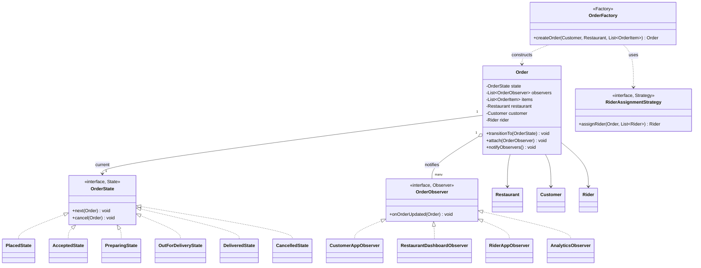

# Low-Level Design: Food Delivery App (Swiggy/DoorDash/UberEats-style)

> **The core OOP challenge:** this is a **multi-actor state machine** — an order simultaneously has meaning to the customer, the restaurant, and the delivery rider, each caring about different transitions — combined with an Observer-driven notification fan-out and a Strategy-based rider-assignment algorithm. It's deliberately the capstone LLD question in this vault because it legitimately combines State, Observer, Strategy, and Factory in one coherent design.

---

## 1. Requirements Clarification

- A customer places an order from a restaurant's menu.
- The restaurant accepts/rejects and prepares the order.
- A delivery rider is assigned, picks up the food, and delivers it.
- All three parties (customer, restaurant, rider) need visibility into the order's current status.
- (Extension to anticipate) Support order cancellation, with different rules depending on how far the order has progressed.

---

## 2. Class Design



**Take this diagram as the base for the whole design** — it's deliberately drawn to show all four patterns working together rather than in isolation: `OrderFactory` (Factory) constructs an `Order` already wired up with its initial `OrderState` (State) and its full set of `OrderObserver`s (Observer) subscribed, and separately consults a `RiderAssignmentStrategy` (Strategy) when a rider needs to be matched. No single pattern solves this problem alone — the diagram's four distinct relationship types (`<|..` realization, `o--` aggregation, `..>` dependency) map directly onto why each pattern was reached for.

---

## 3. Key Classes & Interfaces — What Each One Is Responsible For

| Class / Interface | Responsibility | Why It's Shaped This Way |
|---|---|---|
| `Order` | The central entity — owns current state, subscribed observers, and line items | Deliberately thin — it delegates "what happens on the next transition" to `OrderState` and "who needs to know" to its observer list, rather than hardcoding either |
| `OrderState` (interface) + 6 states | Encapsulates valid transitions and what each transition means for this specific status | Prevents illegal transitions (e.g., `DELIVERED` → `PREPARING`) by construction — each state only exposes the transitions that are actually valid from it |
| `OrderObserver` (interface) + 4 observers | Each independently reacts to an order update in its own way (push a customer notification, refresh a restaurant dashboard, alert a rider, log analytics) | New stakeholders (e.g., a support-ticket auto-updater) are added by writing one new observer class — `Order` never needs to change to support a new notification target |
| `RiderAssignmentStrategy` (interface) | Matches an order to an available rider | The same matching-algorithm problem as [Uber's](../../03-high-level-design/uber/README.md) driver assignment, reapplied here — kept as a swappable interface since matching logic is exactly the kind of thing that gets tuned/A-B-tested independently of everything else |
| `OrderFactory` | Constructs a fully-formed `Order` — correct initial state, standard observers pre-registered | Centralizes "how is a valid Order actually built" in one place, so construction logic doesn't leak into every call site that creates an order |
| `Restaurant`, `Customer`, `Rider` | The three actor entities an `Order` references | Kept as simple reference-holding entities — none of them contain order-lifecycle logic themselves, which stays centralized in `OrderState` |

---

## 4. The Order State Machine (the centerpiece of this design)

```java
public interface OrderState {
    OrderState next(Order order);
    void cancel(Order order);
    String getName();
}

public class PlacedState implements OrderState {
    public OrderState next(Order order) {
        order.notifyRestaurant();       // triggers Observer notification, see below
        return new AcceptedByRestaurantState();
    }
    public void cancel(Order order) {
        order.refundCustomer(); // free cancellation at this earliest stage
    }
    public String getName() { return "PLACED"; }
}

public class AcceptedByRestaurantState implements OrderState {
    public OrderState next(Order order) {
        order.notifyCustomer("Your order is being prepared!");
        return new PreparingState();
    }
    public void cancel(Order order) {
        order.refundCustomer(); // restaurant hasn't started cooking yet -- still free
    }
    public String getName() { return "ACCEPTED"; }
}

public class PreparingState implements OrderState {
    public OrderState next(Order order) {
        Rider rider = order.assignRider(); // triggers RiderAssignmentStrategy
        order.notifyRider(rider);
        return new RiderAssignedState();
    }
    public void cancel(Order order) {
        // Business rule: cancellation once cooking has started incurs a partial
        // charge -- the STATE ITSELF enforces this rule, exactly like the
        // PreparingState example in the Behavioral Patterns doc's State section.
        order.partialRefundCustomer();
    }
    public String getName() { return "PREPARING"; }
}

public class RiderAssignedState implements OrderState {
    public OrderState next(Order order) {
        order.notifyCustomer("Your rider is on the way to the restaurant!");
        return new PickedUpState();
    }
    public void cancel(Order order) {
        throw new IllegalStateException("Cannot cancel once a rider has been assigned");
    }
    public String getName() { return "RIDER_ASSIGNED"; }
}

public class PickedUpState implements OrderState {
    public OrderState next(Order order) {
        order.notifyCustomer("Your order is on the way!");
        return new DeliveredState();
    }
    public void cancel(Order order) {
        throw new IllegalStateException("Cannot cancel once picked up");
    }
    public String getName() { return "PICKED_UP"; }
}

public class DeliveredState implements OrderState {
    public OrderState next(Order order) { return this; } // terminal state
    public void cancel(Order order) {
        throw new IllegalStateException("Cannot cancel a delivered order");
    }
    public String getName() { return "DELIVERED"; }
}
```

**This is the exact same structural pattern used in [Elevator System's](../elevator-system/README.md#3-the-state-pattern-for-elevator-movement) movement states and [Chess Game's](../chess-game/README.md#6-game-state-as-a-state-machine) game status** — noticing and explicitly naming that recurrence across three completely different domains, unprompted, is a strong signal that a candidate understands the *pattern*, not just three memorized, unrelated example solutions.

---

## 5. The Observer Pattern for Multi-Party Notification

Each state transition needs to notify potentially different parties (the restaurant needs to know about `PLACED → ACCEPTED`; the customer needs to know about almost every transition; the rider only cares from `PREPARING` onward). Rather than hardcoding "who to notify" inside each state class, the `Order` maintains a list of observers, and the state classes simply trigger generic notification calls:

```java
public interface OrderObserver {
    void onOrderStatusChanged(Order order, String newStatus);
}

public class Order {
    private OrderState currentState;
    private final List<OrderObserver> observers = new ArrayList<>();

    public void addObserver(OrderObserver observer) { observers.add(observer); }

    public void advanceState() {
        this.currentState = currentState.next(this);
        notifyObservers();
    }

    private void notifyObservers() {
        observers.forEach(observer ->
            observer.onOrderStatusChanged(this, currentState.getName()));
    }

    public void cancel() { currentState.cancel(this); }

    // Called BY the state classes -- e.g., "notifyRestaurant" is really just
    // a semantically-named entry point that still goes through the same
    // generic observer fan-out, kept separate here mainly for readability.
    void notifyRestaurant() { notifyObservers(); }
    void notifyCustomer(String message) { notifyObservers(); }
    void notifyRider(Rider rider) { notifyObservers(); }
}

// Each observer decides for ITSELF whether a given status change is relevant --
// keeping "who cares about what" logic OUT of the Order/State classes entirely.
public class CustomerAppObserver implements OrderObserver {
    public void onOrderStatusChanged(Order order, String newStatus) {
        pushNotificationToCustomerApp(order.getCustomerId(), newStatus);
        // internally, this triggers the fan-out described in the
        // Notification System HLD (push/SMS/email per user preference)
    }
}

public class RiderAppObserver implements OrderObserver {
    private static final Set<String> RIDER_RELEVANT_STATES =
        Set.of("RIDER_ASSIGNED", "PICKED_UP", "DELIVERED");

    public void onOrderStatusChanged(Order order, String newStatus) {
        if (RIDER_RELEVANT_STATES.contains(newStatus)) {
            pushNotificationToRiderApp(order.getAssignedRiderId(), newStatus);
        }
        // states before rider assignment are silently ignored by THIS observer --
        // the Order class never needed to know that "rider doesn't care about PLACED"
    }
}
```

**Why this is the correct application of Observer here (connecting back to the pattern doc):** exactly as described in [Behavioral Patterns](../design-patterns/behavioral/README.md#3-observer), the `Order`/state classes don't know or care *how many* observers exist or *what* they each do with a status change — adding a new observer (e.g., an `AnalyticsObserver` tracking order-funnel metrics, or a `RestaurantDashboardObserver`) requires zero changes to `Order`, `OrderState`, or any existing observer. This in-process fan-out is the direct OOP-level analogue of the pub/sub fan-out architecture in the [Notification System](../../03-high-level-design/notification-system/README.md) HLD — a strong candidate states this connection explicitly.

---

## 6. Rider Assignment via Strategy

```java
public interface RiderAssignmentStrategy {
    Optional<Rider> assignRider(Order order, List<Rider> availableRiders);
}

// Default: nearest available rider to the RESTAURANT (not the customer --
// the rider needs to reach the restaurant first to pick up the food).
public class NearestRiderStrategy implements RiderAssignmentStrategy {
    @Override
    public Optional<Rider> assignRider(Order order, List<Rider> availableRiders) {
        return availableRiders.stream()
            .filter(Rider::isAvailable)
            .min(Comparator.comparingDouble(rider ->
                distanceBetween(rider.getCurrentLocation(), order.getRestaurantLocation())));
    }
}
```

This reuses the exact geospatial-proximity reasoning from [Uber's](../../03-high-level-design/uber/README.md#3-component-deep-dive-geospatial-indexing-the-actual-hard-problem) matching design — at genuinely large scale, this same `RiderAssignmentStrategy` interface's implementation would be backed by the same geohash-indexed proximity query described there, rather than a naive linear scan over `availableRiders` as shown here for LLD-level clarity.

---

## 7. Order Construction via Factory

```java
public class OrderFactory {
    private final NotificationService notificationService;

    public Order createOrder(Customer customer, Restaurant restaurant, List<OrderItem> items) {
        Order order = new Order(customer, restaurant, items, new PlacedState());

        // Every order gets the SAME standard set of observers wired up --
        // centralizing this here means callers never need to remember to
        // register all the right observers manually every time an order is created.
        order.addObserver(new CustomerAppObserver());
        order.addObserver(new RestaurantDashboardObserver());
        order.addObserver(new RiderAppObserver());
        order.addObserver(new AnalyticsObserver());

        return order;
    }
}
```

---

## 8. Extensibility Walkthrough

| Follow-up | How this design absorbs it |
|---|---|
| "Add order cancellation with a partial refund once cooking starts." | Already modeled — see `PreparingState.cancel()` — each state independently encodes its own cancellation consequence, and this is exactly the kind of rule an interviewer will test by asking "what happens if a customer cancels during X state?" |
| "Support group orders (multiple customers, one delivery)." | `Order` gains a `List<Customer>` instead of one; the State machine and Observer fan-out logic don't need to change at all, since they operate on the Order as a whole, not assuming a single customer. |
| "Add real-time rider location tracking during delivery." | A `RiderLocationObserver` (or reusing the existing `RiderAppObserver`) subscribing to a separate, higher-frequency location-update stream — architecturally similar to [Uber's](../../03-high-level-design/uber/README.md) location-ping ingestion, kept deliberately separate from the lower-frequency order-status Observer fan-out shown here, since the two have very different update frequencies. |
| "How would you prevent a rider being assigned to two orders at once?" | The same short-lived distributed lock / atomic claim pattern used in [Uber's](../../03-high-level-design/uber/README.md#5-component-deep-dive-preventing-a-driver-from-being-double-matched) and [Hotel Booking's](../../03-high-level-design/hotel-booking/README.md#4-component-deep-dive-preventing-overbooking-the-actual-hard-problem) designs applies identically here — `RiderAssignmentStrategy.assignRider` finding a candidate and actually claiming them need to be atomic, or two concurrent orders could both select the same rider. |

---

## 9. 60-Second Interview Answer

> "The order lifecycle is naturally a State machine — placed, accepted, preparing, rider assigned, picked up, delivered — and I'd give each state its own class so that state-specific rules, like whether cancellation is still allowed and what refund policy applies, live with that state rather than in a shared conditional that gets harder to maintain correctly as more rules are added. Since the customer, restaurant, and rider each care about different subsets of status changes, I'd use the Observer pattern — the Order and its states just announce 'status changed,' and each observer independently decides whether that particular change is relevant to it, so adding a new interested party, like an analytics tracker, never requires touching the Order or State classes. Rider assignment is a Strategy, since it's conceptually the same nearest-available-match problem as Uber's driver matching, just reapplied to riders relative to the restaurant's location instead of a rider's location. And I'd flag the same double-assignment race condition that shows up in Uber and in hotel booking — finding a candidate rider and actually claiming them needs to be atomic, or two concurrent orders could grab the same rider."

**Related:** [Design Patterns: Behavioral (State, Observer, Strategy)](../design-patterns/behavioral/README.md) · [Uber](../../03-high-level-design/uber/README.md) · [Notification System](../../03-high-level-design/notification-system/README.md) · [Elevator System](../elevator-system/README.md) · [Chess Game](../chess-game/README.md)
