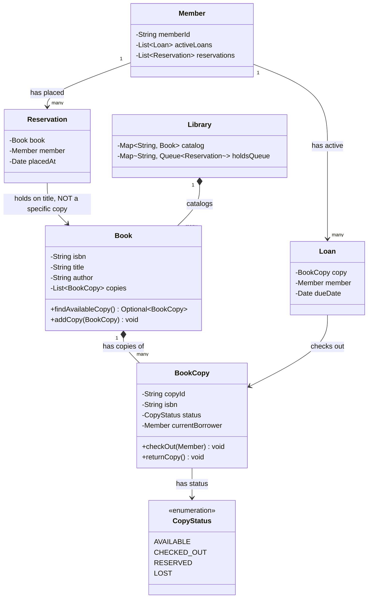

# Low-Level Design: Library Management System

> **The core OOP challenge:** this question looks deceptively simple ("just model books and members"), but the actual interview signal is in correctly modeling **the distinction between a Book (the title/work) and a BookCopy (one physical/lendable instance of it)**, and designing a clean **reservation/holds queue** workflow — most weak answers collapse these into one entity and then struggle when asked about multiple copies of the same title.

---

## 1. Requirements Clarification

- Members can search the catalog, check out available copies, and return them.
- A library may own **multiple physical copies** of the same title — some may be checked out while others remain available.
- Members can place a **hold/reservation** on a title if all copies are currently checked out, and are notified when a copy becomes available.
- Overdue tracking and (optionally) fines.

---

## 2. Class Design — the Book vs. BookCopy Distinction



**Take this diagram as the base for the whole design** — the single most load-bearing relationship in it is `Reservation --> Book`, deliberately pointing at `Book` and never at `BookCopy`. That one arrow is the entire "Book vs. BookCopy" insight made visual: a member reserving a title doesn't care which physical copy they eventually get, so the reservation is modeled against the catalog-level work, while a `Loan` — an actual, physical checkout — correctly points at a specific `BookCopy` instead.

**Why this distinction is the single most important modeling decision in this whole exercise:** if you model "Book" as a single entity with a `status` field, you cannot represent a library owning 3 copies where 2 are checked out and 1 is available — you'd need some awkward workaround (a count field with no way to track *which specific copy* a given member has, breaking due-date tracking per copy). Separating **Book** (the catalog-level work, one row per ISBN) from **BookCopy** (one row per physical, individually-trackable, individually-loanable item) is exactly analogous to separating a product's catalog listing from its individual inventory units in an e-commerce system — a pattern that recurs constantly in real systems once you're looking for it.

---

## 3. Key Classes & Interfaces — What Each One Is Responsible For

| Class | Responsibility | Why It's Shaped This Way |
|---|---|---|
| `Book` | Represents the catalog-level work (one row per ISBN); owns the list of its physical `BookCopy` instances | Deliberately holds no status of its own — availability is a property of individual copies, not the title, so `Book` only ever aggregates and queries them |
| `BookCopy` | Represents one physical, individually-trackable item; owns its own `CopyStatus` and current borrower | Every state transition (`checkOut`/`returnCopy`) lives here, not on `Book` or `Library` — the object that owns the state is the object that mutates it |
| `Member` | Tracks a person's active `Loan`s and placed `Reservation`s | Kept as the natural owner of "what does this person currently have," which is exactly what a librarian needs to look up at the desk |
| `Loan` | Records one active checkout — which copy, which member, when it's due | Points at `BookCopy` specifically, since a loan is inherently about one physical item, not the abstract title |
| `Reservation` | Records a hold on a title, not a specific copy | Points at `Book`, not `BookCopy` — this is the crux of the whole design (see above) |
| `Library` | Top-level catalog owner; maps ISBN → `Book` and ISBN → per-title holds queue | The one class that knows about every title system-wide; individual checkout/return logic is still delegated down to `BookCopy`, not reimplemented here |

---

## 4. Core Classes

```java
public class Book {
    private final String isbn;
    private final String title;
    private final String author;
    private final List<BookCopy> copies = new ArrayList<>();

    public Book(String isbn, String title, String author) {
        this.isbn = isbn; this.title = title; this.author = author;
    }

    public Optional<BookCopy> findAvailableCopy() {
        return copies.stream()
            .filter(copy -> copy.getStatus() == CopyStatus.AVAILABLE)
            .findFirst();
    }

    public void addCopy(BookCopy copy) { copies.add(copy); }
    public String getIsbn() { return isbn; }
}

public class BookCopy {
    private final String copyId;
    private final String isbn; // which Book (title/work) this copy belongs to
    private CopyStatus status = CopyStatus.AVAILABLE;
    private Member currentBorrower; // null unless CHECKED_OUT

    public BookCopy(String copyId, String isbn) {
        this.copyId = copyId; this.isbn = isbn;
    }

    public void checkOut(Member member) {
        if (status != CopyStatus.AVAILABLE) {
            throw new IllegalStateException("Copy " + copyId + " is not available");
        }
        this.status = CopyStatus.CHECKED_OUT;
        this.currentBorrower = member;
    }

    public void returnCopy() {
        this.status = CopyStatus.AVAILABLE;
        this.currentBorrower = null;
    }

    public CopyStatus getStatus() { return status; }
}

public enum CopyStatus { AVAILABLE, CHECKED_OUT, RESERVED, LOST }
```

---

## 5. Component Deep Dive: The Reservation/Holds Queue

A hold is placed on the **Book (title)**, not on any specific `BookCopy` — the member doesn't care *which* physical copy they get, only that a copy of that title becomes available. When any copy of that title is returned, the **longest-waiting reservation** for that title should be offered the copy first (a fairness/FIFO requirement).

```java
public class ReservationQueue {
    private final Map<String, Queue<Reservation>> holdsByIsbn = new HashMap<>();

    public void placeHold(String isbn, Member member) {
        holdsByIsbn.computeIfAbsent(isbn, k -> new LinkedList<>())
                   .offer(new Reservation(isbn, member, Instant.now()));
    }

    // Called whenever a copy of this title is returned -- offers it to the
    // longest-waiting member, FIFO, rather than making it generally available
    // and letting a DIFFERENT, later-arriving member grab it first.
    public Optional<Reservation> pollNextReservation(String isbn) {
        Queue<Reservation> queue = holdsByIsbn.get(isbn);
        return (queue == null || queue.isEmpty()) ? Optional.empty() : Optional.ofNullable(queue.poll());
    }
}

public class Reservation {
    private final String isbn;
    private final Member member;
    private final Instant reservedAt;

    public Reservation(String isbn, Member member, Instant reservedAt) {
        this.isbn = isbn; this.member = member; this.reservedAt = reservedAt;
    }
}
```

```java
public class LibraryService {
    private final Map<String, Book> catalog = new HashMap<>();
    private final ReservationQueue reservationQueue = new ReservationQueue();
    private final NotificationService notificationService; // reuses the Notification System HLD's pattern

    public CheckoutResult checkOut(String isbn, Member member) {
        Book book = catalog.get(isbn);
        Optional<BookCopy> availableCopy = book.findAvailableCopy();

        if (availableCopy.isEmpty()) {
            reservationQueue.placeHold(isbn, member);
            return CheckoutResult.noCopiesAvailablePlacedOnHold();
        }

        availableCopy.get().checkOut(member);
        return CheckoutResult.success(availableCopy.get());
    }

    public void returnBook(BookCopy copy) {
        copy.returnCopy();

        // The key workflow: on return, check the HOLDS QUEUE first, before
        // simply leaving the copy generally available for anyone to grab.
        reservationQueue.pollNextReservation(copy.getIsbn()).ifPresentOrElse(
            reservation -> {
                copy.reserveFor(reservation.getMember()); // move to RESERVED, held for pickup
                notificationService.notifyMember(reservation.getMember(),
                    "Your reserved book is ready for pickup!");
            },
            () -> { /* no one waiting -- copy simply remains AVAILABLE for walk-in checkout */ }
        );
    }
}
```

**Why checking the holds queue on return is the crux of this design:** a naive implementation might simply mark a returned copy as `AVAILABLE` and let whoever asks next take it — this silently breaks fairness for a member who placed a hold and has been waiting, potentially for a long time, only to have a walk-in member take the copy first. Explicitly routing every return through the reservation queue check, before the copy is ever exposed as generally available, is exactly the detail that separates a considered design from a superficial one on this specific question.

---

## 6. Data Model (for a persisted, real deployment)

```sql
CREATE TABLE books (
    isbn    VARCHAR(20) PRIMARY KEY,
    title   VARCHAR(255),
    author  VARCHAR(255)
);

CREATE TABLE book_copies (
    copy_id           BIGINT PRIMARY KEY,
    isbn              VARCHAR(20) NOT NULL REFERENCES books(isbn),
    status            ENUM('AVAILABLE','CHECKED_OUT','RESERVED','LOST'),
    current_borrower_id BIGINT NULL
);

CREATE TABLE loans (
    loan_id      BIGINT PRIMARY KEY,
    copy_id      BIGINT NOT NULL,
    member_id    BIGINT NOT NULL,
    checked_out_at TIMESTAMP,
    due_date       DATE,
    returned_at    TIMESTAMP NULL
);

CREATE TABLE reservations (
    reservation_id BIGINT PRIMARY KEY,
    isbn           VARCHAR(20) NOT NULL,
    member_id      BIGINT NOT NULL,
    reserved_at    TIMESTAMP,
    -- ordering for FIFO fairness comes naturally from ORDER BY reserved_at ASC
    status         ENUM('WAITING','READY_FOR_PICKUP','FULFILLED','CANCELLED')
);
```

---

## 7. Extensibility Walkthrough

| Follow-up | How this design absorbs it |
|---|---|
| "Add overdue fines." | A scheduled job (or a check at return time) comparing `due_date` against the actual return timestamp, computing a fine via a pluggable `FinePolicy` interface (Strategy pattern, same shape as [Parking Lot's](../parking-lot/README.md#core-interfaces-the-extensibility-seams) `PricingStrategy`) — no changes to the core checkout/return flow. |
| "Support inter-library loans (borrowing a copy from a different branch)." | `BookCopy` gains a `branchId` field; `findAvailableCopy` and the reservation fulfillment logic can be extended to consider cross-branch copies, with an added transfer/shipping workflow layered on top — the core Book/BookCopy separation doesn't need to change. |
| "What if a reserved copy isn't picked up within some window?" | A `RESERVED` copy carries an expiry timestamp; a background sweep releases it back to `AVAILABLE` (and offers it to the next reservation in the queue) if unclaimed past that window — directly analogous to the short-lived reservation "hold" pattern in [Hotel Booking](../../03-high-level-design/hotel-booking/README.md#4-component-deep-dive-preventing-overbooking-the-actual-hard-problem). |

---

## 8. 60-Second Interview Answer

> "The key modeling decision is separating Book, the catalog-level title, from BookCopy, an individual physical item — a library can own several copies of the same title, some checked out and some available, and collapsing that into one entity makes it impossible to track which specific copy a given member has, or to support per-copy due dates. A hold is placed against the Book, not a specific copy, since the member doesn't care which physical copy they get. The detail I'd make sure to get right is that returning a copy has to check the reservation queue for that title first, offering it to the longest-waiting member before it's ever exposed as generally available — otherwise a walk-in member could take a copy out from under someone who's been waiting, which silently breaks the fairness the holds feature exists to guarantee."

**Related:** [Design Patterns: Creational (Factory), Behavioral (Strategy)](../design-patterns/behavioral/README.md) · [Hotel Booking](../../03-high-level-design/hotel-booking/README.md) · [Parking Lot](../parking-lot/README.md)
