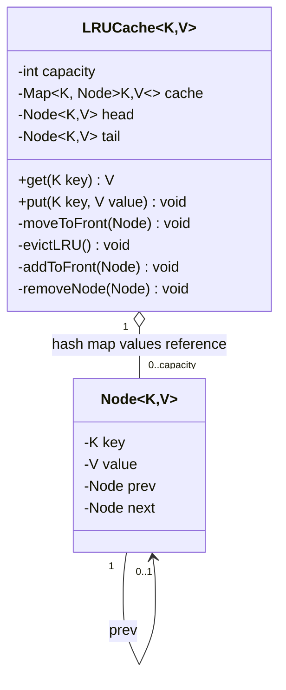

# Low-Level Design: LRU Cache

> **The core OOP/data-structure challenge:** implementing `get` and `put` in true **O(1)** time — not O(log n), not "O(1) amortized with an asterisk" — which requires combining exactly two data structures (a hash map and a doubly linked list) in a specific way, and is one of the most frequently asked coding+design hybrid questions at every level from mid to staff.

---

## 1. Requirements

- `get(key)` — return the value if present (and mark it as most-recently-used), or a sentinel/`-1`/`Optional.empty()` if absent.
- `put(key, value)` — insert or update a key's value (marking it most-recently-used); if the cache is at capacity and a *new* key is being inserted, evict the **least recently used** entry first.
- Both operations must be **O(1)** — this is a hard, stated constraint, not a nice-to-have, and it's the entire reason this is an interesting design question rather than a two-line wrapper around `LinkedHashMap`.

---

## 2. Why Neither Structure Alone Works

- **A hash map alone** gives O(1) `get`/`put` by key, but has **no notion of access order** — you cannot efficiently determine "which key was used longest ago" from a hash map alone; finding the least-recently-used entry would require an O(n) scan.
- **A doubly linked list alone** naturally maintains access order (move a node to the front on access, evict from the back), but **finding a given key's node** to move it requires an O(n) traversal — defeating the O(1) requirement.

**The insight that makes this O(1): combine them.** The hash map stores `key → reference to that key's node in the linked list`, giving O(1) *lookup* of the node, while the doubly linked list gives O(1) *reordering* (moving a node to the front, or removing the tail) once you already have a direct reference to it — no traversal needed for either operation.

---

## 3. Class Design



**Take this diagram as the base for reasoning about every operation:** the `o--` (aggregation) from `LRUCache` to `Node` is the whole trick — the hash map doesn't store values directly, it stores **references into the same linked list nodes** the list itself is threading together, so a hash map lookup and a linked-list splice operate on the *identical* object. That single shared-reference relationship is what collapses two separate O(n) problems (find-by-key, find-least-recently-used) into two O(1) ones.

```java
public class LRUCache<K, V> {

    // A node in the doubly linked list -- holds the actual key+value, plus
    // prev/next pointers for O(1) removal and re-insertion at the front.
    private static class Node<K, V> {
        K key;
        V value;
        Node<K, V> prev, next;
        Node(K key, V value) { this.key = key; this.value = value; }
    }

    private final int capacity;
    private final Map<K, Node<K, V>> cache;   // key -> node reference: O(1) lookup
    private final Node<K, V> head, tail;       // sentinel (dummy) nodes -- see below

    public LRUCache(int capacity) {
        if (capacity <= 0) throw new IllegalArgumentException("Capacity must be positive");
        this.capacity = capacity;
        this.cache = new HashMap<>();
        // Sentinel head/tail nodes eliminate null-checks for "is this the first/last
        // real node" edge cases -- head.next is always the MOST recently used real
        // node, tail.prev is always the LEAST recently used real node.
        this.head = new Node<>(null, null);
        this.tail = new Node<>(null, null);
        head.next = tail;
        tail.prev = head;
    }

    public synchronized V get(K key) {
        Node<K, V> node = cache.get(key);
        if (node == null) {
            return null; // or Optional.empty() / a dedicated sentinel, per API design taste
        }
        moveToFront(node); // ANY access, read or write, counts as "recently used"
        return node.value;
    }

    public synchronized void put(K key, V value) {
        Node<K, V> existing = cache.get(key);
        if (existing != null) {
            existing.value = value;
            moveToFront(existing);
            return;
        }

        if (cache.size() >= capacity) {
            evictLeastRecentlyUsed();
        }

        Node<K, V> newNode = new Node<>(key, value);
        cache.put(key, newNode);
        addToFront(newNode);
    }

    // ---- Internal O(1) linked-list operations ----

    private void addToFront(Node<K, V> node) {
        node.prev = head;
        node.next = head.next;
        head.next.prev = node;
        head.next = node;
    }

    private void removeNode(Node<K, V> node) {
        node.prev.next = node.next;
        node.next.prev = node.prev;
    }

    private void moveToFront(Node<K, V> node) {
        removeNode(node);
        addToFront(node);
    }

    private void evictLeastRecentlyUsed() {
        Node<K, V> lru = tail.prev; // sentinel guarantees this is always a REAL node if cache is non-empty
        removeNode(lru);
        cache.remove(lru.key);
    }
}
```

---

## 4. Why Sentinel (Dummy) Head/Tail Nodes Matter

A very common source of bugs in a live-coded version of this structure is handling the edge cases of "the list is empty" or "we're removing the only node" with a plain `null`-terminated linked list — every insertion/removal needs special-cased null checks for "is this the first node" and "is this the last node."

**Using dummy sentinel `head` and `tail` nodes that are never actually removed** eliminates every one of these special cases: `head.next` is *always* a valid reference (either a real node, or `tail` itself if the cache happens to be empty), so `addToFront`/`removeNode`/`moveToFront` never need a null check at all. This is a small detail, but it's exactly the kind of implementation-correctness detail a senior interviewer watches for when someone live-codes this structure — getting the sentinel-node trick right, unprompted, is a strong signal.

---

## 5. Thread Safety — a Real Follow-Up, Not a Throwaway Detail

The `synchronized` keyword on `get`/`put` above is the simplest correct answer, but it serializes **all** access — a real interview follow-up ("this cache is a bottleneck under high concurrent read load, what would you do?") should be answered with:

- **`ReadWriteLock`** doesn't actually help much here, because `get` in an LRU cache **isn't a pure read** — it mutates the linked list (moving the accessed node to the front), so it needs the same exclusive lock as `put` would. This is a genuinely important, non-obvious point to raise proactively: a candidate who reflexively suggests `ReadWriteLock` without noticing that LRU's `get` is actually a write to the recency-ordering structure has missed something real.
- **Sharding the cache** (e.g., `N` independent `LRUCache` instances, each responsible for a hash-partitioned subset of keys, similar in spirit to [Database Sharding](../../02-building-blocks/databases/sharding/README.md)) is the standard real-world mitigation — it doesn't reduce contention on any single key, but it does allow concurrent operations on *different* keys to proceed independently across shards, which is the realistic bottleneck in practice.

---

## 6. Complexity Summary

| Operation | Time | Why |
|---|---|---|
| `get` | O(1) | Hash map gives the node reference directly; linked-list pointer updates to move it are constant-time |
| `put` (existing key) | O(1) | Same as `get`, plus an O(1) value update |
| `put` (new key, at capacity) | O(1) | O(1) map removal of the evicted key + O(1) removal of the tail's previous node |
| Space | O(capacity) | One hash map entry + one linked-list node per cached key |

---

## 7. Connecting Back to the Building Blocks Section

This exact data structure is the mechanism underlying the **LRU eviction policy** described at the architectural level in [Caching](../../02-building-blocks/caching/README.md#3-eviction-policies--what-happens-when-the-cache-is-full) — that document describes *when and why* you'd choose LRU as an eviction policy for a distributed cache like Redis; this document is the *actual data structure* Redis (and Java's own `LinkedHashMap` in access-order mode, which implements nearly this exact mechanism internally) uses to make that eviction decision in true O(1) time. Being able to connect the HLD-level policy discussion to the LLD-level data structure that implements it is exactly the kind of cross-level fluency a senior/staff interview loop is designed to surface.

---

## 8. 60-Second Interview Answer

> "Neither a hash map nor a linked list alone gets you O(1) for both operations — a hash map has no access-order concept, and a linked list needs a traversal to find a given key's node. Combining them solves it: the hash map stores key to node-reference for O(1) lookup, and the doubly linked list maintains recency order, so once you have the node reference, moving it to the front or evicting the tail is O(1) pointer manipulation, no traversal needed. I'd use dummy sentinel head and tail nodes specifically to avoid null-check special cases on every insert/remove. One thing I'd flag proactively: under high concurrency, `get` isn't actually a pure read in this structure, since it mutates the linked list's ordering — so a naive ReadWriteLock wouldn't help; sharding the cache by key hash into several independent LRU instances is the more realistic way to reduce contention."

**Related:** [Caching](../../02-building-blocks/caching/README.md) · [Database Sharding](../../02-building-blocks/databases/sharding/README.md)
