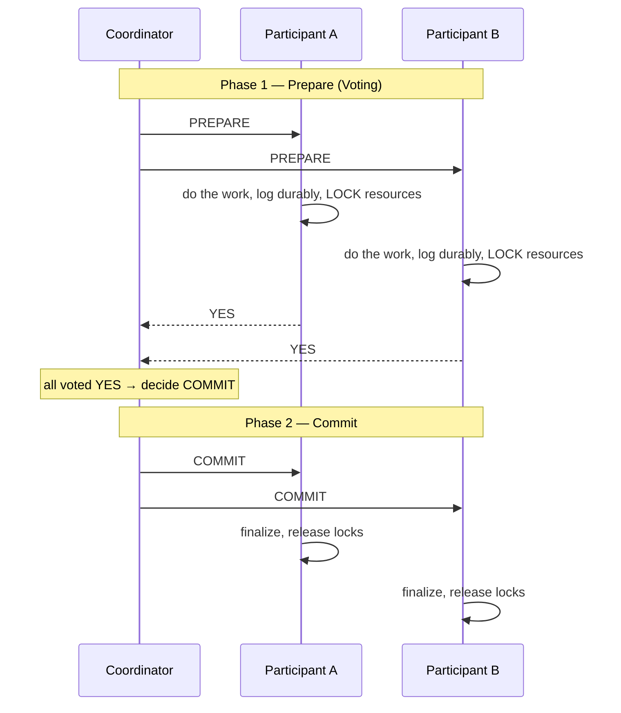
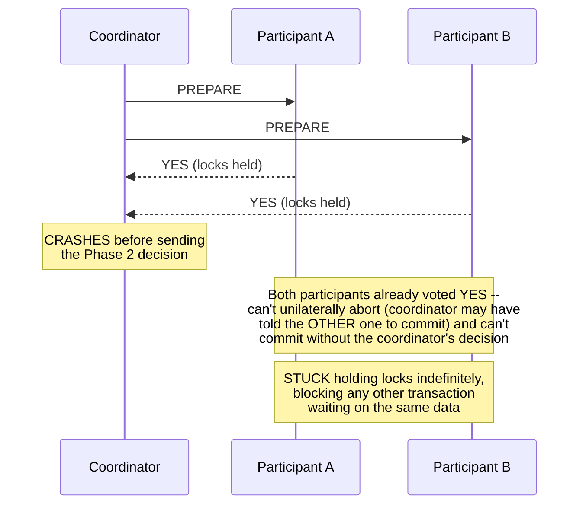

# Distributed Transactions

> **The problem, precisely stated:** a single logical operation needs to atomically update data across **multiple independent databases or services** — either all the updates happen, or none do. A single-node database gives you this for free via ACID transactions; the moment the operation spans a network boundary, achieving the same guarantee becomes dramatically harder, more expensive, and — at real-world scale — often the wrong goal to pursue directly at all.

---

## 1. Why This Is Hard: the Failure Modes a Single-Node Transaction Never Has to Consider

A single-node database transaction can rely on the database engine's own internal locking and write-ahead logging to guarantee atomicity. A distributed transaction spanning multiple nodes has to additionally survive:

- **A participant crashing mid-transaction** — did it commit before crashing, or not? The coordinator can't always tell.
- **Network partition between coordinator and a participant** — the coordinator doesn't know if the participant received its message, processed it, or both.
- **The coordinator itself crashing** — participants are left in limbo, having tentatively agreed to something but with no one to tell them whether to finalize or roll back.

Every distributed transaction protocol is fundamentally a strategy for surviving these specific failure modes while still arriving at a correct, agreed-upon outcome.

---

## 2. Two-Phase Commit (2PC) — the Classical Answer

2PC coordinates a distributed transaction via a designated **coordinator** and multiple **participants** (e.g., separate databases each owning a piece of the transaction).

### Phase 1: Prepare (Voting)
The coordinator sends a `PREPARE` message to every participant. Each participant does all the work needed to commit **but does not actually commit yet** — it writes the change to a durable log and locks the relevant resources, then replies `YES` (ready to commit) or `NO` (cannot commit, e.g., a constraint violation).

### Phase 2: Commit or Abort
- If **all** participants voted `YES`, the coordinator sends `COMMIT` to everyone, and each participant finalizes its change and releases locks.
- If **any** participant voted `NO` (or timed out), the coordinator sends `ABORT` to everyone, and each participant rolls back.



### The Fatal Flaw: the Blocking Problem



If the **coordinator crashes after Phase 1 but before sending the Phase 2 decision**, every participant that voted `YES` is left **holding its locks indefinitely**, unable to unilaterally decide whether to commit or abort — it already promised it *could* commit (voted YES), so it can't safely abort on its own (the coordinator might have already told other participants to commit), and it has no way to know the actual decision without the coordinator. **This is 2PC's defining weakness: participants can be blocked, holding locks and unable to make progress, for as long as the coordinator remains unavailable** — directly sacrificing availability (see [CAP Theorem](../../01-foundations/cap-theorem/README.md)) for the sake of strict atomicity, and doing so in a way that can cascade (locked resources block *other*, unrelated transactions waiting on the same data).

This blocking behavior is precisely why 2PC is **rarely used directly across service boundaries in modern microservice architectures** — a single slow or crashed coordinator can freeze a meaningful portion of a distributed system's throughput, which is an unacceptable availability cost for most real products, even though the atomicity guarantee itself is appealing.

---

## 3. Three-Phase Commit (3PC) — a Partial (and Rarely Used) Fix

3PC adds an extra phase (`CanCommit? → PreCommit → DoCommit`) specifically to reduce the blocking window by giving participants enough information to make a safe, independent decision even if the coordinator crashes mid-protocol, **under the assumption that the network doesn't partition** (only nodes crash). In practice, **3PC is rarely deployed in real systems** — the network-partition assumption it relies on to fully avoid blocking is exactly the failure mode most worth protecting against in real distributed systems, undermining its main advantage over 2PC in the cases that matter most. It's worth knowing this trade-off exists and can be named, but it's not something you need to design in depth for most interviews.

---

## 4. Why 2PC Doesn't Scale, and What Real Systems Do Instead

Beyond the blocking problem, 2PC has other real costs: it requires all participants to be available and reachable at transaction time (an availability cost that compounds with more participants — see the [Availability & Reliability](../../01-foundations/availability-reliability/README.md#1-the-math-interviewers-actually-expect) series-availability math: chaining more required-available participants multiplicatively lowers overall transaction success probability), and it holds locks across a network round trip, which is slow and directly limits throughput under contention.

**The practical, modern answer for most microservice architectures is to avoid distributed ACID transactions entirely, and instead use the [Saga Pattern](../saga-pattern/README.md)** — a sequence of local transactions, each committing independently, with explicit compensating actions to undo prior steps if a later step fails. This trades strict atomicity (an instantaneous, indivisible all-or-nothing guarantee) for **eventual consistency achieved through compensation** — the system briefly passes through intermediate, partially-completed states, but is guaranteed to eventually reach either a fully-completed or fully-compensated (rolled back) state. The Saga Pattern document goes into this in full depth; this document exists so you can correctly explain *why* the Saga Pattern is usually preferred over 2PC when asked, rather than jumping straight to "just use sagas" without justification.

---

## 5. Where 2PC Is Still the Right Answer

It's a mistake to conclude 2PC is simply "bad" — it remains the correct tool in specific, narrower contexts:

- **Within a single database engine spanning multiple internal shards/partitions** (e.g., a distributed SQL database like CockroachDB or Google Spanner coordinating a transaction across shards it fully controls) — here, the "participants" are all under one operator's control, failure handling can be tightly engineered and tested, and the atomicity guarantee is often a core selling point of the database product itself.
- **XA transactions** (a standardized 2PC protocol) are still used in some enterprise contexts coordinating across a small, fixed, tightly-controlled set of resources (e.g., a message queue and a database that must be updated together) — appropriate when the participant count is small, availability requirements are less extreme, and strict atomicity genuinely outweighs the blocking risk.

**The senior-level nuance:** the real decision isn't "2PC vs Saga" as a universal rule — it's **"how many participants, how tightly are they operationally controlled, and how much does this specific operation value strict atomicity over availability."** A payment-and-ledger update within a single team's tightly-controlled set of databases might reasonably use 2PC-like coordination; an order-placement flow spanning inventory, payment, and shipping — three separately-owned, independently-deployed microservices — should almost always use a Saga instead.

---

## 6. Spring Boot Example: Why "Just Use @Transactional Across Two Datasources" Doesn't Actually Work Safely

A common mistake: assuming Spring's `@Transactional` annotation automatically gives you distributed-transaction safety just because two different repositories (backed by two different databases) are called within the same method.

```java
// THE ANTI-PATTERN: this looks atomic, but it is NOT, unless a proper
// JTA (Java Transaction API) transaction manager with XA-compliant
// datasources is explicitly configured -- which almost no default
// Spring Boot setup provides out of the box.
@Service
@RequiredArgsConstructor
public class OrderServiceBroken {

    private final OrderRepository orderRepository;       // datasource A
    private final InventoryRepository inventoryRepository; // datasource B (DIFFERENT database)

    @Transactional // this manages ONE transaction manager -- typically only datasource A's!
    public void placeOrder(OrderRequest request) {
        orderRepository.save(Order.from(request));         // commits/rolls back with datasource A
        inventoryRepository.decrementStock(request.getSku(), request.getQty()); // SEPARATE transaction on datasource B!
        // If the inventory decrement fails AFTER the order save has already
        // committed to datasource A, @Transactional here does NOT roll back
        // the order -- the two operations were never actually atomic together.
    }
}
```

```java
// A genuinely correct fix requires an explicit JTA/XA transaction manager
// (e.g., Atomikos or Narayana) configured across BOTH datasources -- real,
// but adds real operational complexity and the exact blocking-under-failure
// risk described in Section 2. This is precisely why, in practice, most
// teams choose the Saga pattern below instead of setting this up.
@Configuration
public class JtaTransactionConfig {
    @Bean
    public PlatformTransactionManager transactionManager() {
        // Requires XA-compliant DataSource beans for BOTH order-db and
        // inventory-db, registered with a JTA transaction manager like
        // Atomikos, which then actually performs 2PC across them.
        return new JtaTransactionManager();
    }
}
```

**The senior-level answer when this comes up in an interview:** don't just point out the bug — explain the trade-off explicitly: "I could configure a real JTA/XA transaction manager to make this genuinely atomic via 2PC, but that reintroduces the coordinator-blocking risk from Section 2 across two independently-owned services, so I'd instead redesign this as a Saga — decrementing inventory as its own local transaction, publishing an event, and having a compensating action to restore inventory if the order ultimately fails downstream (e.g., at payment)."

---

## 7. Common Pitfalls

- Assuming `@Transactional` (or any single ORM-level transaction annotation) provides cross-database atomicity by default — it doesn't, without an explicitly configured, genuinely distributed (JTA/XA) transaction manager.
- Reaching for 2PC by default for cross-microservice operations without weighing its blocking-under-coordinator-failure risk against the (usually preferable) Saga pattern's eventual-consistency trade-off.
- Dismissing 2PC as universally obsolete — it remains the right tool within a single, operator-controlled distributed database or a small, tightly-controlled set of enterprise resources.
- Confusing 3PC's non-blocking claim with a general-purpose fix — it only avoids blocking under a no-network-partition assumption, which limits its practical value in real, partition-prone systems.

---

## 8. 60-Second Interview Answer

> "A distributed transaction needs to atomically commit or roll back across multiple independent databases or services, and the classical answer is Two-Phase Commit — a prepare phase where every participant votes, followed by a commit or abort phase based on the vote. Its fatal weakness is that if the coordinator crashes between those two phases, every participant that already voted yes is stuck holding its locks, unable to safely decide on its own whether to commit or abort — that blocking risk is exactly why 2PC is rarely used directly across independently-owned microservices today, even though the atomicity it offers is appealing. In practice, I'd reach for the Saga pattern instead for cross-service operations — a sequence of local transactions with explicit compensating actions to undo earlier steps if a later one fails, trading strict, instantaneous atomicity for eventual consistency achieved through compensation. 2PC still earns its place within a single, operator-controlled distributed database coordinating its own internal shards, or across a small, tightly-controlled set of enterprise resources, where the participant count and failure surface are both small and well understood."

**Related:** [Saga Pattern](../saga-pattern/README.md) · [CAP Theorem](../../01-foundations/cap-theorem/README.md) · [Payment System](../../03-high-level-design/payment-system/README.md) · [Consensus Algorithms: Raft](../consensus-algorithms/raft/README.md)
