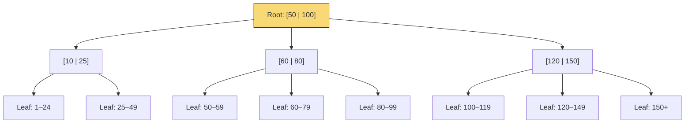
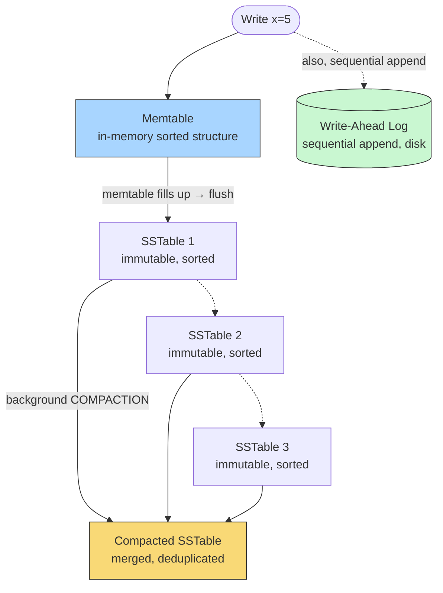
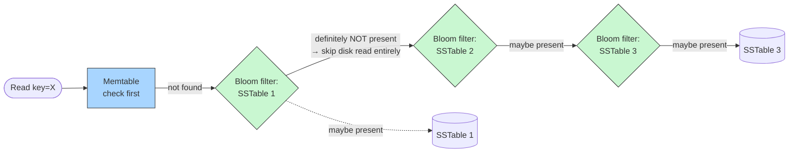

# B-Trees vs LSM-Trees

> **The question this answers, precisely:** why does Postgres/MySQL (B-Tree-based) behave differently under heavy write load than Cassandra/RocksDB/LevelDB (LSM-Tree-based) — this is the actual mechanical reason "some databases are better for writes, some for reads" is true, not just a marketing claim, and it's the single most-asked "go deeper" question following any discussion of [SQL vs NoSQL](../../02-building-blocks/databases/sql-vs-nosql/README.md).

---

## 1. B-Trees: the Classical, Read-Optimized Structure

**Take this as the reference structure** — notice it's deliberately **shallow and wide**, not deep and narrow: each node holds multiple keys and multiple children (not just 2, as in a binary tree), which is precisely what keeps real B-Trees at 3-4 levels deep even across millions of rows. A lookup for key `72` is a single root-to-leaf walk: `72 > 50` → go right into `[60|80]`'s subtree, `60 ≤ 72 < 80` → land in the `60–79` leaf — three node reads total, each one a single disk page fetch.

A **B-Tree** (and its common variant, the **B+Tree**, which nearly every real relational database actually uses) is a self-balancing tree structure where each node holds multiple sorted keys and pointers to children, keeping the tree shallow (typically 3-4 levels deep even for millions of rows) so that any lookup requires very few disk reads.

- **Reads:** a lookup traverses from the root down to a leaf, following the appropriate pointer at each level based on key comparisons — `O(log n)` disk seeks, and because each node is sized to match a disk page (commonly 4KB or 8KB), a single node read is a single disk I/O operation, making this structure very well matched to how disks (and their read granularity) actually work.
- **Writes:** an insert or update must find the correct leaf position (a read, first) and then **modify data in place** — potentially triggering a cascade of node splits and rebalancing if the target node is full, which can propagate up multiple levels of the tree. **This in-place modification is the crux of why B-Trees are comparatively write-expensive**: each write is a **random** disk I/O (the target leaf could be anywhere on disk, unrelated to where the previous write happened), and random I/O is dramatically slower than sequential I/O on spinning disks, and meaningfully slower even on SSDs (due to how flash storage handles small random writes internally, including write amplification from its own garbage collection).

---

## 2. LSM-Trees: the Write-Optimized Alternative

A **Log-Structured Merge-Tree (LSM-Tree)** takes a fundamentally different approach: **never modify data in place.** Instead:

1. **Writes go to an in-memory structure first** (a "memtable," typically a sorted structure like a skip list or balanced tree, held in RAM) — this is extremely fast, since it's a pure in-memory operation with no disk I/O on the write's critical path at all.
2. For durability, the write is **also** appended to a **write-ahead log (WAL)** on disk — but critically, this is a **sequential** append, not a random write to a specific location, and sequential disk I/O is dramatically faster than random I/O (often by one to two orders of magnitude on spinning disks, and still meaningfully faster on SSDs).
3. Once the memtable reaches a size threshold, it's **flushed to disk as an immutable, sorted file** (commonly called an "SSTable" — Sorted String Table). This flush is also a large, sequential write.
4. Over time, many SSTables accumulate on disk. A background process called **compaction** periodically merges multiple SSTables together, discarding overwritten/deleted values and producing new, consolidated SSTables — reclaiming space and keeping the number of files a read needs to check manageable.

**Why this makes writes so much faster:** the expensive, random-I/O-pattern work (finding and modifying the "correct" on-disk location for a given key) is **eliminated from the write path entirely** — writes are always sequential appends (to the WAL) plus fast in-memory updates (to the memtable). The cost of eventually organizing that data into an efficiently-readable, sorted, deduplicated form is **deferred to the background compaction process**, decoupled from the latency of any individual write.

---

## 3. The Trade-off LSM-Trees Make: Read Amplification and Compaction Overhead

Nothing is free — LSM-Trees pay for their write advantage in two specific, nameable costs:

**Take this as the reference for why Bloom filters matter:** without them, a read for a key not present in SSTable 1 would still require an actual disk read of SSTable 1 to find that out — the Bloom filter answers "definitely absent" from an in-memory probabilistic structure, letting the read skip straight past SSTables it provably can't be in, and only pay the real disk-read cost for SSTables where the key **might** actually be present.

- **Read amplification:** because a given key might exist in the memtable, or in any of several on-disk SSTables (an older value in one, possibly overwritten by a newer value in a more recent one), a read may need to **check multiple locations** to find the current value, unlike a B-Tree's single, direct root-to-leaf traversal. This is mitigated (not eliminated) by **Bloom filters** — a compact, probabilistic data structure that can quickly tell you "this SSTable definitely does NOT contain this key" (with zero false negatives, though a small rate of false positives is possible), letting a read skip SSTables that provably can't have the key, without needing to actually read them from disk.
- **Compaction overhead:** the background compaction process itself consumes real CPU and I/O — an LSM-Tree-based database under heavy sustained write load needs to budget resources for compaction keeping pace with the incoming write rate, or SSTables accumulate faster than they're merged, degrading read performance (more and more files to check) and eventually write performance too (a well-known operational failure mode called **"compaction falling behind,"** which experienced Cassandra/RocksDB operators specifically monitor for).

**Senior-level answer, stated precisely:** an LSM-Tree trades **read amplification and background compaction cost** for **dramatically better write throughput**, by converting random-I/O writes into sequential-I/O writes and deferring the "make this efficiently readable" work to an asynchronous background process — this is a direct instance of the [Latency vs Throughput](../../01-foundations/latency-vs-throughput/README.md) trade-off, and of the general principle that batching/deferring expensive work (compaction, here) off the hot path improves throughput at the cost of some added complexity and periodic background resource consumption.

---

## 4. Choosing Between Them — the Decision Framework

| Workload characteristic | Favors |
|---|---|
| Read-heavy, with a relatively low, steady write rate | B-Tree (Postgres, MySQL/InnoDB) |
| Write-heavy, especially high-volume sequential/append-style writes (event logs, time-series, sensor data) | LSM-Tree (Cassandra, RocksDB, LevelDB, HBase) |
| Need for fast, single-key point lookups with strict, predictable latency | B-Tree, generally — fewer places a given key could be, and no compaction-related latency variance |
| Need to sustain very high write throughput and can tolerate/manage a compaction-related background resource cost and read amplification | LSM-Tree |

**A genuinely important nuance for a senior answer:** this isn't purely academic — it directly explains **why Cassandra (LSM-Tree-based) is the go-to choice for write-heavy, append-style workloads** like the wide-column time-series/event data described in [SQL vs NoSQL](../../02-building-blocks/databases/sql-vs-nosql/README.md#2-what-noSQL-actually-buys-you), while **Postgres/MySQL (B-Tree-based) remain the default for typical read-heavy transactional/relational workloads.** The storage-engine choice underneath a database isn't an implementation detail unrelated to the SQL-vs-NoSQL decision — for many real NoSQL databases, the LSM-Tree structure **is** a large part of *why* they're well-suited to the write-heavy workloads that motivate choosing them in the first place, not an unrelated internal detail.

---

## 5. Real-World Example: RocksDB — the LSM-Tree Engine Under Many Systems You've Already Read About

**RocksDB** (Facebook/Meta's LSM-Tree-based embedded storage engine, itself built on Google's earlier LevelDB) is used as the underlying storage layer inside a surprising number of systems referenced elsewhere in this vault — including as a **storage engine option for MySQL** (MyRocks) specifically to get LSM-Tree-style write throughput while keeping MySQL's relational query layer on top, and as the local storage engine inside several stream-processing systems (e.g., for maintaining local state in Kafka Streams applications) specifically because those workloads are dominated by high-volume sequential writes with less demanding point-read latency requirements.

**The lesson:** the B-Tree-vs-LSM-Tree choice isn't strictly tied to "SQL database" vs "NoSQL database" as categories — it's a genuinely separable storage-engine decision, and MyRocks is a concrete, real example of taking a traditionally B-Tree-based relational database (MySQL) and swapping in an LSM-Tree storage engine underneath it specifically to shift its write/read trade-off, while keeping the SQL query interface unchanged. Knowing this example demonstrates that you understand storage engine choice and query-model choice (SQL vs NoSQL) are **two separate axes**, not one conflated decision.

---

## 6. Connecting Back: Why This Matters for System Design Interviews

Every time an HLD design in this vault reached for "use Cassandra/DynamoDB for this write-heavy data" (e.g., [Twitter's](../../03-high-level-design/twitter-feed/README.md) fan-out writes, [Uber's](../../03-high-level-design/uber/README.md) high-frequency location pings), the *actual mechanical reason* that choice makes sense is the LSM-Tree write path described here — not just "NoSQL scales better" as a vague slogan. Being able to say, when pushed, **"specifically because it uses an LSM-Tree storage engine, which converts random writes into sequential ones and defers consolidation to background compaction"** is exactly the kind of one-level-deeper justification that separates a senior candidate from someone reciting a technology's marketing.

---

## 7. Common Pitfalls

- Treating "B-Tree vs LSM-Tree" as identical to "SQL vs NoSQL" — they're related but separable decisions (MyRocks demonstrates a B-Tree-associated database using an LSM-Tree engine).
- Describing LSM-Trees as strictly "better" without naming read amplification and compaction overhead as real, concrete costs.
- Forgetting Bloom filters' role in mitigating (not eliminating) LSM-Tree read amplification — a candidate who names Bloom filters unprompted here signals genuine depth.
- Assuming B-Tree writes are simply "slow" without explaining *why* — the random-I/O-vs-sequential-I/O distinction is the actual mechanism, not an assertion to take on faith.

---

## 8. 60-Second Interview Answer

> "B-Trees keep data sorted and modify it in place, which makes reads a fast, shallow, direct traversal, but makes writes comparatively expensive because they require random disk I/O to reach and update the correct on-disk location, potentially cascading into node splits. LSM-Trees take the opposite trade: writes go to an in-memory memtable plus a sequential append to a write-ahead log, both fast, and are only later flushed and merged into sorted files on disk via a background compaction process — so the expensive part of maintaining sorted, efficiently-readable data is deferred off the write's critical path entirely. The cost is read amplification, since a key might exist in several places and a read may need to check multiple files, mitigated but not eliminated by Bloom filters, plus real background compaction overhead that needs to keep pace with the write rate. This is the actual mechanical reason Cassandra and RocksDB, which are LSM-Tree-based, are the default choice for write-heavy, append-style workloads, while Postgres and MySQL's B-Tree-based storage remains the default for typical read-heavy relational workloads — and it's a genuinely separate axis from the SQL-vs-NoSQL query-model decision, which MyRocks demonstrates by putting an LSM-Tree engine underneath MySQL's relational interface."

**Related:** [SQL vs NoSQL](../../02-building-blocks/databases/sql-vs-nosql/README.md) · [Indexing Strategies](../indexing-strategies/README.md) · [Latency vs Throughput](../../01-foundations/latency-vs-throughput/README.md) · [Twitter Feed](../../03-high-level-design/twitter-feed/README.md)
