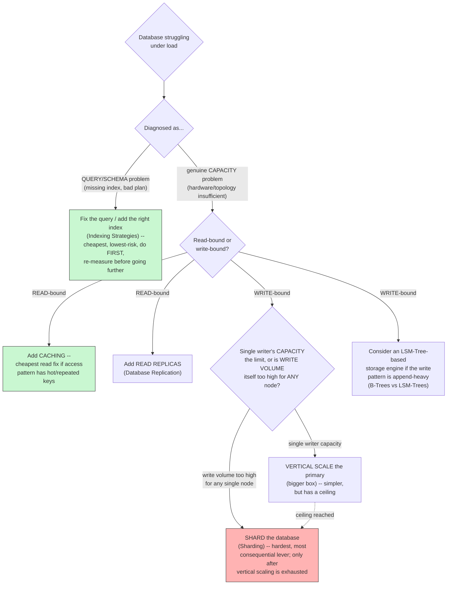

# Database Scaling — the Capstone Decision Tree

> This document doesn't introduce new concepts — it's the **decision tree** that ties together everything from [Scalability](../../01-foundations/scalability/README.md), [Replication](../../02-building-blocks/databases/replication/README.md), [Sharding](../../02-building-blocks/databases/sharding/README.md), [B-Trees vs LSM-Trees](../b-trees-lsm-trees/README.md), and [Indexing](../indexing-strategies/README.md) into the actual, sequential reasoning process a senior architect walks through when told "this database is struggling under load." Interviewers deliberately ask this as a capstone question specifically to see whether you reach for the right lever *in the right order*, rather than jumping straight to the most dramatic (and most expensive/risky) option.

---

## 1. Step Zero: Diagnose Before Prescribing

Before reaching for any scaling technique, identify **which specific resource is actually saturated**, per the [Scalability](../../01-foundations/scalability/README.md#2-what-actually-limits-scalability) foundation's bottleneck taxonomy:

- **CPU-bound?** (Check: high CPU utilization, queries themselves are computationally heavy — complex joins, aggregations, missing indexes causing full scans.)
- **I/O-bound (disk)?** (Check: high disk queue depth/latency, working set doesn't fit in memory, causing constant disk reads.)
- **Memory-bound?** (Check: frequent cache/buffer-pool evictions, swapping.)
- **Lock contention / single hot row or table?** (Check: many transactions waiting on the same lock, a specific "hot" shard key.)
- **Connection-bound?** (Check: connection pool exhaustion, more concurrent client connections than the database can efficiently serve.)

**This step is not optional, and skipping it is the single most common mistake in this entire exercise** — applying sharding to fix a problem that was actually a missing index (fixable in minutes, with zero architectural risk) is a real, embarrassing, and unfortunately common failure mode, and a senior interviewer will specifically probe "how do you know that's the actual bottleneck?" if you jump straight to an architectural change.

---

## 2. The Decision Tree

---

## 3. Step-by-Step Reasoning, With the "Why This Order" Justification

### Step 1: Query and Schema Optimization (Always First)
Per [Indexing Strategies](../indexing-strategies/README.md), a missing or wrong-shaped index, or an inefficient query, can single-handedly cause the exact symptoms ("the database is slow") that might otherwise trigger a much more drastic and expensive architectural response. **This is always the first, cheapest, lowest-risk lever, and skipping it is the most common real-world mistake** — running `EXPLAIN ANALYZE` on the actual slow queries costs minutes; sharding a database is a multi-week-to-multi-month, high-risk project. A senior architect always exhausts the cheap, reversible options before reaching for the expensive, hard-to-reverse ones.

### Step 2: Caching (For Read-Heavy Workloads With Hot/Repeated Access Patterns)
Per [Caching](../../02-building-blocks/caching/README.md), if the read load has a skewed access pattern (some data read far more often than other data — true of most real-world systems, per the general Pareto-distribution tendency of real traffic), a cache-aside layer can absorb a very large fraction of read load with comparatively little engineering cost, **before** touching the database topology at all.

### Step 3: Read Replicas (For Genuinely High, Broadly-Distributed Read Volume)
Per [Replication](../../02-building-blocks/databases/replication/README.md), once caching alone isn't sufficient (e.g., read volume is high but not concentrated on a small hot set that caching would help), adding read replicas scales read throughput horizontally, at the cost of introducing replication lag and the associated [read-your-writes](../../01-foundations/consistency-models/README.md#5-read-your-writes-consistency) considerations. This is still a comparatively low-risk, well-understood, reversible change relative to sharding.

### Step 4: Vertical Scaling of the Primary (For Write-Bound Workloads, First Resort)
If the bottleneck is specifically **write** throughput (which replication and caching don't help at all, per [Replication's](../../02-building-blocks/databases/replication/README.md#1-replication-topologies) explicit note that replication only scales reads), the first, simpler lever is [vertical scaling](../../01-foundations/scalability/README.md#2-vertical-scaling-scale-up) of the single write-capable primary — more CPU, more RAM (to hold a larger working set in the buffer pool, reducing disk I/O), faster storage (NVMe over spinning disk, or over network-attached storage with higher latency). This has a ceiling, but it's a **far less risky and far more reversible** change than sharding, and modern cloud instance sizes push that ceiling quite high before it's genuinely exhausted.

### Step 5: Sharding (Only Once Everything Above Is Genuinely Exhausted)
Per [Sharding's](../../02-building-blocks/databases/sharding/README.md#7-common-pitfalls) own explicit guidance, this is a **close to one-way door** — reached for only when write volume genuinely exceeds what any single (even maximally vertically-scaled) node can handle. At this point, the earlier documents' full guidance applies: choosing a shard key aligned with the dominant query pattern, favoring consistent hashing over naive modulo hashing, and accepting the real costs (broken cross-shard joins/transactions/uniqueness constraints) as a deliberate, informed trade-off rather than a surprise discovered after the fact.

### A Parallel Consideration Throughout: Storage Engine Fit
Independent of *where* in this decision tree you are, it's worth asking, per [B-Trees vs LSM-Trees](../b-trees-lsm-trees/README.md#4-choosing-between-them--the-decision-framework): **is the underlying storage engine even well-matched to this workload's read/write ratio?** A write-heavy, append-style workload running on a B-Tree-based database may benefit enormously from switching to (or adding, e.g., via MyRocks) an LSM-Tree-based storage engine **before** reaching for sharding — this is a genuinely underused lever in practice, and naming it as a consideration alongside the more commonly-cited replication/sharding levers is a strong senior-level signal.

---

## 4. Real-World Example: Stack Overflow's Famously Long-Lived Single-Primary Vertical Scaling Strategy

Stack Overflow's publicly documented infrastructure has, at various points, been cited as an example of a very large, high-traffic site running on a **surprisingly small number of vertically-scaled database servers**, for a remarkably long time, rather than an early jump to sharding or a NoSQL rewrite — combined with **aggressive caching** (heavy use of an in-memory caching layer) and careful, disciplined query optimization. Their publicly-discussed engineering philosophy has emphasized that a well-tuned, well-indexed, aggressively-cached, vertically-scaled relational database can serve enormous traffic volumes far longer than many teams assume before genuinely needing to shard — a real, concrete, large-scale counter-example to the instinct that "if you're big, you must be sharded and using NoSQL everywhere."

**The lesson, tied directly back to this document's decision tree:** Stack Overflow's approach is a real-world demonstration of exhausting Steps 1 through 4 (query optimization, caching, replication, vertical scaling) extremely thoroughly and for a very long time before ever seriously needing Step 5 — and it's a valuable, concrete rebuttal to reach for whenever an interview conversation drifts toward "at scale, you obviously need to shard/go NoSQL," since it demonstrates that **scale and sharding are not synonymous**, and a disciplined application of the cheaper levers first can go much further than commonly assumed.

---

## 5. Common Pitfalls

- Jumping straight to sharding (or a NoSQL migration) as a reflexive response to "the database is slow," without first diagnosing the actual bottleneck via query analysis — the single most common, most costly mistake in this entire topic.
- Treating replication as a write-scaling technique — it explicitly is not; only sharding (or a fundamentally different write path, like an LSM-Tree-based engine or an append-only/event-sourced model) addresses write-throughput bottlenecks.
- Underestimating how far vertical scaling plus caching plus read replicas can go before sharding is genuinely necessary — the Stack Overflow example is a valuable, concrete counterpoint to reflexive "scale means shard" thinking.
- Forgetting that storage-engine choice (B-Tree vs LSM-Tree) is an independent lever from replication/sharding topology, and can sometimes solve a write-throughput problem without touching topology at all.

---

## 6. 60-Second Interview Answer

> "Before reaching for any architectural change, I'd diagnose the actual bottleneck — CPU, disk I/O, lock contention, or connections — because a missing index or a bad query plan can produce every symptom that might otherwise trigger a much more drastic response, and fixing that is minutes of work versus a multi-week sharding project. From there, I'd follow cheapest-and-most-reversible first: caching for read-heavy workloads with hot access patterns, then read replicas for broader read scaling, then vertical scaling of the primary if the bottleneck is specifically writes, since replication doesn't help write throughput at all. Sharding is the last resort, reached for only once write volume genuinely exceeds what any single, even maximally vertically-scaled, node can handle, because it's close to a one-way door — it breaks cross-shard joins, transactions, and uniqueness constraints, and choosing a bad shard key is expensive to walk back. I'd also independently ask whether the storage engine itself is well matched to the workload — a write-heavy, append-style pattern running on a B-Tree-based engine might benefit from an LSM-Tree-based one before ever needing to shard at all."

**Related:** [Scalability](../../01-foundations/scalability/README.md) · [Database Sharding](../../02-building-blocks/databases/sharding/README.md) · [Database Replication](../../02-building-blocks/databases/replication/README.md) · [Caching](../../02-building-blocks/caching/README.md) · [Indexing Strategies](../indexing-strategies/README.md) · [B-Trees vs LSM-Trees](../b-trees-lsm-trees/README.md)
