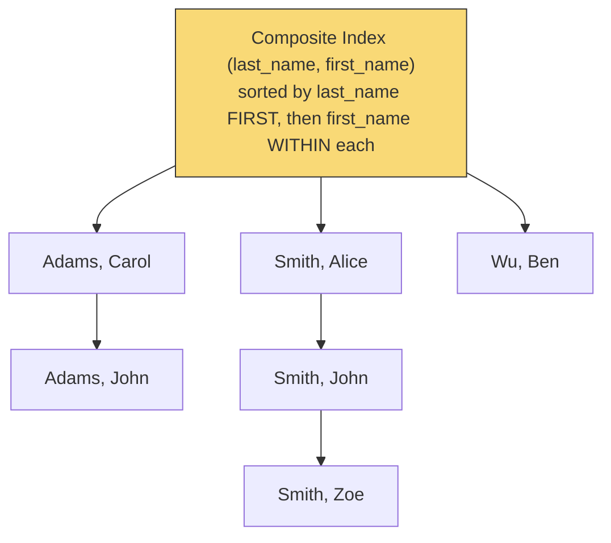
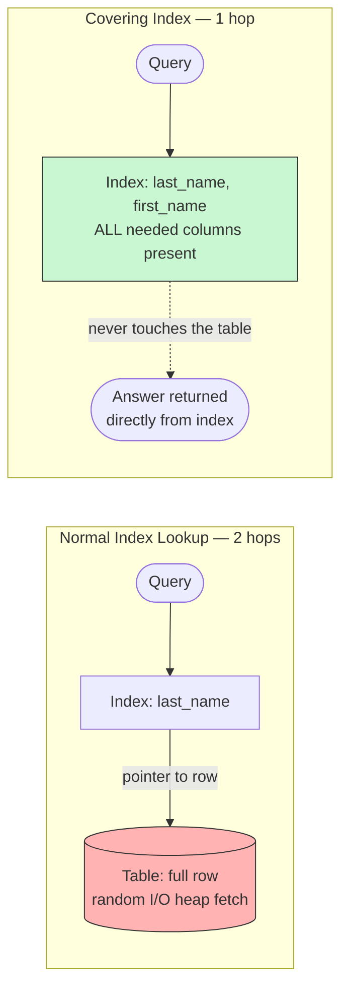

# Indexing Strategies

> **"Just add an index" is not a complete answer.** The wrong index type, or an index on the wrong column(s) or in the wrong order, can leave a query just as slow as having no index at all — or actively slow down writes for no corresponding read benefit. This document is what a senior interviewer is actually listening for when they ask "how would you speed up this slow query."

---

## 1. What an Index Actually Is, Mechanically

An index is a **separate, auxiliary data structure** (most commonly a [B-Tree](../b-trees-lsm-trees/README.md), per the previous document) that stores a sorted mapping from indexed column value(s) to the location of the corresponding row(s) in the actual table — allowing the database to find matching rows via a fast `O(log n)` tree traversal, instead of scanning every row in the table (`O(n)`, a "full table scan").

**The fundamental trade-off, stated precisely:** an index speeds up reads that filter/sort/join on the indexed column(s), but **every index must itself be updated on every write** (insert, update, delete) to the table — so adding an index always makes writes at least marginally slower and always consumes additional storage, in exchange for faster reads matching that specific index's shape. This is why "add an index to every column just in case" is a real anti-pattern, not just an aesthetic preference — it's a genuine, measurable write-throughput and storage cost with no benefit for queries that never end up using that index.

---

## 2. Types of Indexes and When Each Fits

### B-Tree Index (the default, general-purpose choice)
Supports equality (`WHERE col = ?`), range (`WHERE col > ? AND col < ?`), and sorting (`ORDER BY col`) efficiently, because the underlying structure keeps data sorted. This is what you get by default when you "just add an index" in virtually every relational database.

### Hash Index
Supports **only** exact-equality lookups (`WHERE col = ?`) — no ranges, no sorting — but can be marginally faster than a B-Tree for pure equality lookups since it doesn't need to traverse a tree, just compute a hash and jump directly to a bucket. **Rarely the right default choice** given how much more versatile a B-Tree index is for a similar cost; reach for it specifically when you know, with confidence, that a column will only ever be queried via exact equality and never via range or sort.

### Composite (Multi-Column) Index
An index spanning multiple columns together (e.g., `INDEX (last_name, first_name)`), where **column order is not a stylistic choice — it fundamentally determines which queries the index can actually help.**

**The critical rule (the single most commonly-missed detail on this whole topic):** a composite index on `(A, B)` can efficiently serve queries filtering on `A` alone, or on `A AND B` together — but **cannot** efficiently serve a query filtering on `B` alone, because the index is sorted first by `A`, then by `B` *within* each `A` value — without knowing `A`, the database has no way to narrow down where to look for a given `B` value using this index at all (it would need a full scan of the index, defeating the purpose). This is sometimes called the **"leftmost prefix rule."**



**Take this as the reference for why the leftmost-prefix rule is a structural fact, not a query-planner limitation:** `WHERE last_name = 'Smith'` can jump straight to the `Smith` group — the index is sorted by `last_name` first, so all `Smith` rows are physically adjacent. But `WHERE first_name = 'John'` has **no such shortcut**: matching `John`s (`Adams, John` and `Smith, John`) are scattered across entirely different, non-adjacent parts of the tree, because the index was never sorted by `first_name` at the top level — the database would have to walk the *entire* index to find them, which is exactly a full scan, just of the index instead of the table.

```sql
CREATE INDEX idx_lastname_firstname ON employees (last_name, first_name);

-- Uses the index efficiently (matches the leftmost prefix):
SELECT * FROM employees WHERE last_name = 'Smith';
SELECT * FROM employees WHERE last_name = 'Smith' AND first_name = 'John';

-- Does NOT use this index efficiently (skips the leftmost column):
SELECT * FROM employees WHERE first_name = 'John';
-- This query would need a SEPARATE index on first_name alone (or leading
-- with first_name) to be efficient -- the composite index above cannot help it.
```

**A genuinely important senior-level nuance:** when designing a composite index, **order the columns by the actual query patterns you need to serve**, not alphabetically or by table-definition order — if most queries filter by `tenant_id` first and then optionally by `status`, the index should be `(tenant_id, status)`, not the reverse, specifically so the most common query shape hits the leftmost-prefix-efficient path.

### Covering Index
A composite index that includes **every column a specific query needs**, not just the columns being filtered/sorted on — allowing the database to answer the query **entirely from the index itself**, without ever touching the actual table data (a technique often called an "index-only scan").

```sql
-- Query: SELECT first_name, last_name FROM employees WHERE last_name = 'Smith';

-- A covering index includes first_name even though it's not in the WHERE
-- clause, specifically so this exact query never needs to read the table itself.
CREATE INDEX idx_covering ON employees (last_name, first_name);
```

**Why this matters for performance beyond a normal index:** a normal (non-covering) index lookup still requires a second step — following the index entry's pointer back to the actual table row to retrieve any columns not present in the index itself (this second step is sometimes called a "bookmark lookup" or "heap fetch," and for many matching rows, it can itself be a source of significant, easy-to-overlook random I/O, per the [B-Trees vs LSM-Trees](../b-trees-lsm-trees/README.md#1-b-trees-the-classical-read-optimized-structure) random-I/O cost discussion). A covering index eliminates that second step entirely for queries it fully covers — a genuinely valuable, if narrower-scoped, optimization worth naming when asked how to optimize a specific, known, frequently-run query.



---

## 3. Diagnosing a Slow Query — the Actual Interview Skill

The correct process, worth walking through explicitly if asked "how would you speed up this slow query":

1. **Run `EXPLAIN` (or `EXPLAIN ANALYZE`)** on the query — every major relational database provides this, showing the actual query execution plan the database chose: which indexes (if any) were used, whether a full table scan occurred, the estimated/actual row counts at each step, and the query's cost estimate.
2. **Look specifically for `Seq Scan` / "full table scan"** on a large table where an index-based lookup should have been possible — this is the single most common, most fixable finding.
3. **Check whether an existing index's leftmost-prefix shape actually matches the query's filter columns** (per Section 2) — a very common, subtle cause of "I already have an index, why isn't it being used" confusion.
4. **Consider whether the query is filtering on a computed/transformed value** (e.g., `WHERE UPPER(last_name) = 'SMITH'`) — a standard index on `last_name` **cannot** help this, because the index stores the raw column value, not the transformed one; the fix is either a **functional/expression index** (an index built specifically on the computed expression, supported by most modern relational databases) or normalizing the data at write time instead of transforming it at query time.
5. **Verify the query planner's statistics are up to date** — query planners make cost-based decisions using stored statistics about data distribution (e.g., how many distinct values a column has); stale statistics after a large data change can cause the planner to choose a poor plan even with a perfectly good index available — most databases have an explicit `ANALYZE`-style command to refresh these.

---

## 4. Real-World Example: A Common Production Incident Pattern

A frequently-recurring, publicly-discussed pattern across many engineering blogs: a query that filters on a low-cardinality column (e.g., `status` with only 3-4 possible values, like `PENDING`/`SHIPPED`/`DELIVERED`) performs **worse** with an index than a full table scan would, once a large fraction of rows share the same value. This happens because for a very common value (say, 60% of all rows are `DELIVERED`), the query planner correctly determines that using the index — which involves many scattered lookups back to the actual table rows for each of those many matches — is actually **more expensive** than simply scanning the whole table sequentially once. **A well-informed senior candidate should be able to explain this counterintuitive result**: index usage isn't automatically better; it's a **cost-based trade-off** the query planner evaluates given the actual data distribution, and a low-cardinality column is a classic case where an index may provide little or even negative value, motivating either a **composite index that adds a more selective second column**, or (for genuinely low-cardinality filtering at scale) restructuring the data (e.g., partitioning the table by status) instead of relying on indexing alone.

---

## 5. Common Pitfalls

- Assuming any index is automatically better than no index — a low-cardinality column indexed alone is a classic counterexample where the planner may correctly prefer a full scan.
- Forgetting the leftmost-prefix rule when designing (or debugging) a composite index — "I have an index on `(a, b)`, why isn't my query on `b` alone using it" is one of the single most common real-world indexing confusions.
- Indexing every column defensively "just in case," incurring a genuine, ongoing write-throughput and storage cost for indexes that may never actually be used by any real query.
- Not checking whether a query filters on a transformed/computed expression, which silently defeats a standard index on the raw column and requires either a functional index or a query/data rewrite.

---

## 6. 60-Second Interview Answer

> "An index is a separate sorted structure, typically a B-Tree, that turns an O(n) full table scan into an O(log n) lookup for queries matching its shape — but every index adds write overhead and storage cost, so indexing isn't free and shouldn't be applied defensively to every column. For composite indexes, column order isn't stylistic — it determines the leftmost-prefix rule: an index on (A, B) serves queries filtering on A alone or A-and-B together, but can't help a query filtering on B alone, which is one of the most common real-world sources of 'I have an index, why isn't it being used' confusion. To actually diagnose a slow query, I'd run EXPLAIN ANALYZE first rather than guessing — checking for a full table scan where an index should apply, verifying an existing index's column order actually matches the query's filter pattern, checking whether the query filters on a transformed value that a plain index on the raw column can't help with, and confirming the planner's statistics are current. I'd also flag that an index isn't automatically better — for a low-cardinality column where most rows share the same value, the query planner may correctly prefer a full scan over the scattered lookups an index would otherwise require."

**Related:** [B-Trees vs LSM-Trees](../b-trees-lsm-trees/README.md) · [Database Sharding](../../02-building-blocks/databases/sharding/README.md) · [Search Autocomplete](../../03-high-level-design/search-autocomplete/README.md)
