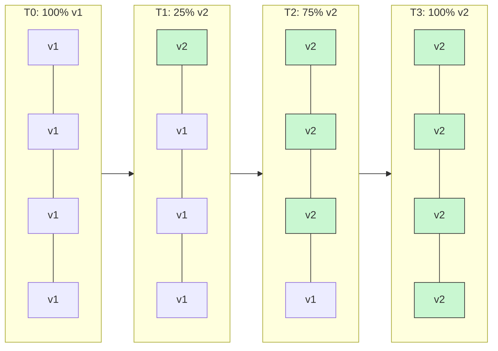
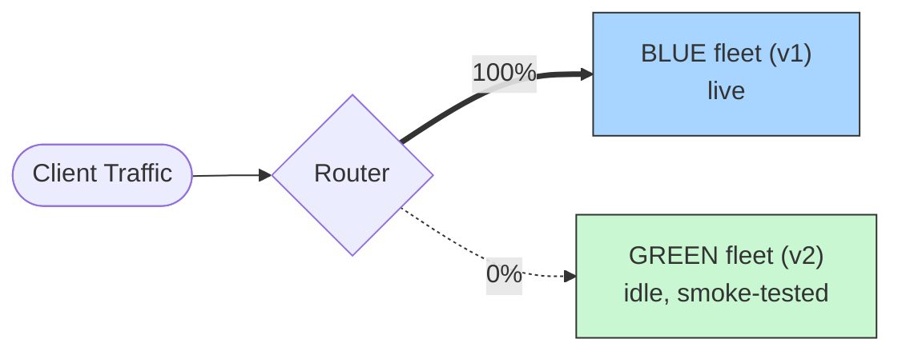
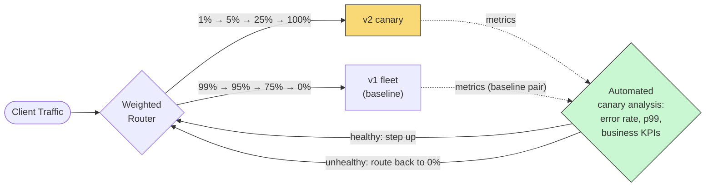
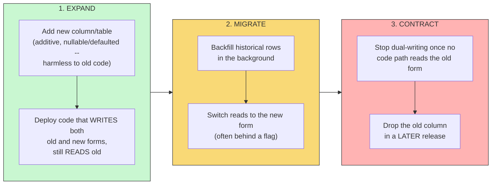

# Deployment Patterns — Rolling, Blue-Green, Canary, Feature Flags

> **The question this answers, precisely:** how do you ship a new version of a service to production **without downtime and without betting the whole user base on it being correct** — and how do you undo it in seconds when it isn't? This is the standard closing chapter of a microservices interview arc ("great, you have 50 services — how do changes reach production safely?"), and it's where reliability meets engineering velocity: deploy safety is what *allows* teams to ship many times a day.

---

## 1. The principle underneath all of them

Every pattern below is a different answer to the same two questions: **(1) what fraction of traffic sees the new version at each moment, and (2) how fast can you get back to the old version?** The senior insight to state up front: **decouple *deploy* from *release*** — getting new code onto machines (deploy) and exposing users to it (release) should be separately controlled events. Everything else is mechanism.

## 2. Rolling deployment — the default

Replace instances gradually: take 1 (or a batch) out of the [load balancer](../../02-building-blocks/load-balancers/README.md), upgrade, health-check, return, repeat. This is Kubernetes' default (`maxUnavailable`/`maxSurge`).

**Take this as the reference for why "two versions coexist" is the defining risk:** at T1 and T2, v1 and v2 instances sit **behind the same load balancer simultaneously**, both serving live traffic and both hitting the same shared database — this is exactly why §6's schema-compatibility discipline isn't optional.

- **Pros:** no extra fleet cost; no downtime; built into every orchestrator.
- **Cons:** **two versions run simultaneously** for the whole rollout — so every schema and API change must be backward-compatible (see §6, the part interviewers actually probe); rollback means rolling forward-in-reverse (minutes, not seconds); and a bad version reaches a growing share of *all* traffic indiscriminately while metrics catch up.
- **The connection-draining detail:** instances must be removed from [service-discovery](../service-discovery/README.md) rotation and allowed to finish in-flight requests *before* termination, or every deploy causes a blip of 502s.

## 3. Blue-Green deployment — instant, total switchover

Run two identical environments: **blue** (live, v1) and **green** (idle, v2). Deploy to green, run smoke tests against it in production conditions, then flip the router so 100% of traffic moves to green. Blue stays warm as the rollback target.

**After the flip:** the router sends 100% to Green and 0% to Blue — Blue keeps running, warm, as the rollback target.

**Take this as the reference for why rollback is fast here specifically:** unlike rolling deployment's "roll forward in reverse," blue-green's rollback is the **same router flip in the opposite direction** — Blue never stopped running, so reverting is instant, not a redeploy.

- **Pros:** rollback is a router flip — **seconds**; the new version is fully tested in a production-identical environment before any user sees it; no mixed-version window for *traffic* (though the DB is still shared — schema compatibility is still required).
- **Cons:** **2x infrastructure cost** during the window; the cutover is all-or-nothing — if v2 has a bug that only manifests at full production load or with real traffic diversity, 100% of users find it simultaneously; stateful concerns (in-flight sessions, in-progress jobs) need draining across the flip.

## 4. Canary deployment — the risk-managed default at scale

Ship v2 to a tiny slice first — 1% of traffic (or one region/cell) — and **compare its key metrics against v1's** (error rate, p99 latency, business KPIs). Healthy ⇒ step up: 1% → 5% → 25% → 100%. Unhealthy ⇒ route the 1% back — blast radius was 1%.

**Automated canary analysis** is the staff-level phrase: pipelines (e.g., Spinnaker+Kayenta lineage) compare canary vs baseline statistically and promote or roll back *without a human staring at dashboards*. Best practice runs a **baseline pair**: a fresh v1 instance alongside the canary v2, so you compare two identically-warm instances rather than canary-vs-long-warmed-fleet.
- **Pros:** bounded blast radius; validates against *real* traffic (which no staging environment reproduces); rollback trivial at low percentages.
- **Cons:** needs solid [observability](../../10-security-observability/observability/README.md) to judge health — a canary without metrics is theater; slow burns (memory leak over hours) escape short canary windows; mixed versions run for the longest of all patterns, so compatibility discipline is maximal; and sticky-session/user-consistency questions (a user bouncing between v1 and v2 mid-session) need handling.

## 5. Feature flags — release control moved into code

A **feature flag** wraps new behavior in a runtime conditional evaluated per-request against a flag service (LaunchDarkly-style or in-house): `if flags.enabled("new-checkout", user)`. Code deploys **dark** (flag off), then is released by flipping the flag — to internal users, 1% of users, a country, or everyone — **with no deploy at all**, and killed the same way (**kill switch**).

- **This completes the deploy/release decoupling:** canary controls *which instances* get traffic; flags control *which users* get behavior — orthogonal and usually combined. Flags also enable **A/B experiments** (percentage-bucketed variants + metrics) and **trunk-based development** (merge incomplete work safely behind flags, ending long-lived branches).
- **Costs to name:** flag sprawl and dead flags are real tech debt (flag count grows monotonically without a removal discipline); a flag *service* outage needs a defined fail-open/fail-closed default per flag; and combinatorial flag states make testing harder ("works with A on and B off, but not both on?").

## 6. The part interviewers actually probe: database migrations under zero-downtime deploys

Every pattern above has old and new code running against **one database** at some point — so schema changes must be **backward-compatible across one version step**, achieved with the **expand–migrate–contract** pattern:

1. **Expand:** add the new column/table (additive, nullable/defaulted — harmless to old code). Deploy code that **writes both** old and new forms but still reads old.
2. **Migrate:** backfill historical rows in the background; switch reads to the new form (often behind a flag).
3. **Contract:** once no code path reads the old form, stop dual-writing, then drop the old column in a later release.

Renaming a column in one step breaks either old or new code mid-rollout — walking through expand–migrate–contract unprompted is one of the strongest "has actually operated software" signals available in this topic.

## 7. Choosing (the comparison you can draw on a whiteboard)

| Pattern | Blast radius | Rollback speed | Extra cost | Key requirement |
|---|---|---|---|---|
| Rolling | Grows during rollout | Minutes (reverse roll) | None | Version compatibility, connection draining |
| Blue-Green | 0% then 100% | Seconds (router flip) | 2x fleet | Production-identical green env |
| Canary | 1% → stepped | Seconds at low % | Small (canary pool) | Strong metrics + automated analysis |
| Feature flags | Per-user, arbitrary | Instant (kill switch) | Flag service + debt | Flag hygiene, default-on-outage policy |

Real production practice at scale composes them: **deploy dark with flags → canary the instances → step up on automated analysis → release features by flag → keep the kill switch.**

## 8. Common pitfalls

- Ignoring the database: any "zero-downtime" answer that renames a column in one release is self-refuting — expand–migrate–contract is the fix.
- Canarying without metrics or with too-short windows (missing slow burns).
- Claiming blue-green needs no compatibility discipline — the DB is still shared across the flip, and a rollback after v2 has written new-format data still needs v1 to tolerate it.
- Forgetting connection draining in rolling deploys — the "every deploy causes 502s" smell.
- No flag-removal discipline — "we have 900 flags and nobody knows which are load-bearing."

## 9. 60-Second Interview Answer

> "Safe deployment is about controlling two variables: what fraction of traffic sees the new version, and how fast you can get back. Rolling deploys replace instances gradually — free and default, but rollback is slow and old and new versions coexist, so changes must be backward-compatible. Blue-green runs a full idle environment, flips a router for instant cutover and seconds-fast rollback, at the price of double infrastructure and an all-or-nothing exposure. Canary is the risk-managed default at scale: send one percent of real traffic to the new version, statistically compare its error rate and p99 against a baseline, and step up automatically — bounded blast radius, but it demands real observability. Feature flags decouple deploy from release entirely: code ships dark and behavior is turned on per-user or per-cohort at runtime, with a kill switch — at the cost of flag debt and a defined default if the flag service dies. In practice I compose them: deploy dark behind flags, canary with automated analysis, release by flag. And the part that makes all of it actually work is database discipline — expand–migrate–contract, dual-writing during the transition — because with any of these patterns, two code versions share one schema mid-rollout."

**Related:** [Resilience Patterns](../resilience-patterns/README.md) · [Service Discovery](../service-discovery/README.md) · [Observability](../../10-security-observability/observability/README.md) · [Load Balancers](../../02-building-blocks/load-balancers/README.md)
