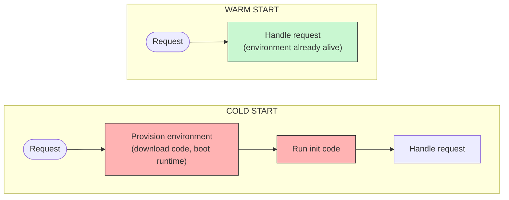
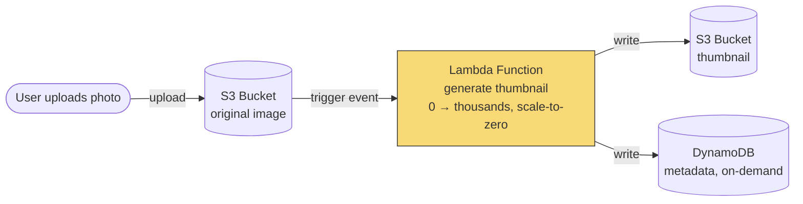

# Serverless & Functions-as-a-Service

> **The question this answers, precisely:** when is "don't run servers at all — upload functions and pay per invocation" the right architecture, what do cold starts and execution limits actually cost you, and why did serverless *not* replace services the way 2016 predicted? Interviewers use serverless to test economic reasoning: it's fundamentally a **cost-model and operations question**, not a technology preference.

---

## 1. What serverless actually means

- **FaaS (the core):** you deploy *functions* (AWS Lambda, Google Cloud Functions, Azure Functions); the platform runs each invocation in a managed, ephemeral environment, scaling from **0 to thousands of concurrent executions automatically**, billing per-invocation + per-ms of execution. No capacity planning, no patching, no idle cost.
- **The broader "serverless" umbrella** includes managed services with the same pay-per-use, scale-to-zero shape: DynamoDB on-demand, S3, SQS, Aurora Serverless, API Gateway. A "serverless architecture" typically wires these together: `API Gateway → Lambda → DynamoDB` with S3/SQS/EventBridge triggers.
- **The defining property to state:** *scale-to-zero with per-use billing.* Containers-on-Kubernetes autoscale too, but you pay for idle minimum capacity and you own the runtime; FaaS inverts both.

## 2. The trade-offs, mechanically

**What it buys:**
- **Zero ops for compute** — no fleet, no AMIs, no autoscaling groups to tune; the [availability](../../01-foundations/availability-reliability/README.md) of the compute layer is the provider's SLA, not your pager.
- **Perfect cost fit for spiky/low-duty-cycle traffic** — a workload that runs 3 minutes/hour pays for 3 minutes, not 60. This is the economic core: **FaaS wins when utilization is low or unpredictable; dedicated fleets win when utilization is high and steady** (at sustained load, per-ms Lambda pricing is a large multiple of an equivalent reserved instance).
- **Instant, extreme elasticity** — 0 → 10,000 concurrent without pre-provisioning; ideal for burst events (flash sales, ticket drops) if downstream systems can also absorb it.

**What it costs:**
- **Cold starts:** an invocation with no warm environment must provision one — copy code, boot runtime, run init. Penalty ranges from ~50–100ms (Go, Node, tuned) to seconds (JVM with heavy frameworks, VPC-attached functions historically). It hits **p99, not average** — exactly the [tail-latency](../../01-foundations/latency-vs-throughput/README.md) metric that matters — and it's why latency-critical synchronous paths are the weakest fit. Mitigations: provisioned concurrency (pre-warmed pool — note you're now paying for idle again, partially refuting the model), lighter runtimes, SnapStart-style snapshotting.

**Take this as the reference for why cold starts hit p99 specifically, not the average:** most invocations in a steady traffic stream land on an already-warm environment (the fast, green path) — it's only the invocations that happen to need a *new* environment (traffic spikes, scale-to-zero after idle, a new deployment) that pay the provisioning tax, which is exactly why the damage shows up concentrated in the tail percentiles rather than spread evenly across every request.
- **Execution limits:** capped duration (e.g., 15 min on Lambda), memory, and payload sizes — long-running jobs must be re-architected (step functions, queues) or don't fit.
- **Statelessness is mandatory:** any state must live in external stores; in-memory caches and long-lived connections don't survive between invocations. The classic trap: **each concurrent Lambda opens its own database connections**, so a burst of 5,000 concurrent functions can exhaust a relational database's connection pool instantly — the standard fixes are a connection proxy (RDS Proxy) or a serverless-native store (DynamoDB).
- **Vendor lock-in** — not so much the function code as the *event-source wiring* (IAM, EventBridge, DynamoDB streams) around it; **harder local testing/debugging**; and **per-invocation observability** needs [distributed tracing](../../10-security-observability/observability/README.md) because every hop is a network boundary.

## 3. Decision framework

| Workload shape | Fit |
|---|---|
| Event-driven glue: file-upload processing (S3 → thumbnail), stream/queue consumers, webhooks, cron jobs | **Excellent** — the canonical use; bursty, short, stateless |
| Spiky or unpredictable APIs, low average utilization, small teams wanting zero ops | **Good** — accept the cold-start p99 or pay for provisioned concurrency |
| Steady high-throughput core services (the hot path of a large product) | **Poor economics** — sustained utilization makes reserved/committed compute several times cheaper |
| Latency-critical p99-sensitive paths (trading, real-time bidding) | **Poor** — cold starts and less runtime control |
| Long-running, stateful, or connection-heavy work (video encodes > 15 min, WebSocket fan-out, chatty DB transactions) | **Doesn't fit the model** — use containers/queues, or purpose-built managed services |

**The senior synthesis:** serverless is not an all-or-nothing architecture. Real systems are hybrids — steady core on containers, spiky edges (image processing, notifications, scheduled jobs) on functions. The [Prime Video case](../monolith-vs-microservices/README.md) (serverless workflow → monolith, ~90% cheaper) is the canonical evidence that *granularity and cost model must match the workload*, not the trend.

## 4. Real-world reference

**S3 → Lambda thumbnail/media processing** is the textbook win: perfectly bursty, embarrassingly parallel, stateless, seconds-long — you'd otherwise run an idle fleet sized for peak upload hours. At the other pole, companies with steady enormous request volumes keep the hot path on provisioned fleets for exactly the utilization-economics reason above. Knowing *both* poles — and the RDS-connection-exhaustion trap in between — is the depth signal.

**Take this as the reference architecture for the "serverless" pattern as a whole:** every component in this diagram is itself pay-per-use and scale-to-zero — S3 storage, Lambda invocations, and DynamoDB on-demand capacity — which is precisely the "broader umbrella" property named in §1, not just the function-as-a-service piece in isolation.

## 5. Common pitfalls

- Pitching serverless as "infinitely scalable" without noting the burst passes straight through to downstream databases and third parties — you've moved the bottleneck, not removed it.
- Ignoring cold starts, or citing average latency when the interviewer asked about p99.
- Forgetting the connection-pool exhaustion problem with relational databases.
- Framing it as cheap universally — it's cheap at *low utilization*; do the arithmetic at sustained load.
- Treating "serverless vs microservices" as rivals — FaaS is a deployment/compute model; most serverless architectures *are* microservice architectures with a different compute substrate.

## 6. 60-Second Interview Answer

> "Serverless means scale-to-zero compute billed per invocation — Lambda-style functions triggered by events, with the platform owning provisioning, scaling, and patching. Its sweet spot is bursty, short-lived, stateless work: file processing, queue consumers, webhooks, cron — anywhere a dedicated fleet would sit mostly idle, because the economics flip on utilization: pay-per-ms wins at low or spiky utilization, while steady high-throughput services are several times cheaper on reserved capacity. The costs are cold starts, which hit p99 latency and need provisioned concurrency or light runtimes to tame; hard limits on duration and statefulness, so all state externalizes; the classic trap that thousands of concurrent functions exhaust a relational database's connection pool, fixed with a connection proxy or a serverless-native store like DynamoDB; and lock-in that lives less in the code than in the event wiring around it. So my default is a hybrid: steady core paths on containers, spiky edges on functions — and I'd cite Amazon's own Prime Video team moving a workload from serverless back to a monolith for a ninety-percent cost cut as proof that the compute model has to match the workload's shape, not the trend."

**Related:** [Monolith vs Microservices](../monolith-vs-microservices/README.md) · [Message Queues](../../02-building-blocks/message-queues/README.md) · [Latency vs Throughput](../../01-foundations/latency-vs-throughput/README.md) · [Event-Driven Architecture](../../05-distributed-systems/event-driven-architecture/README.md)
