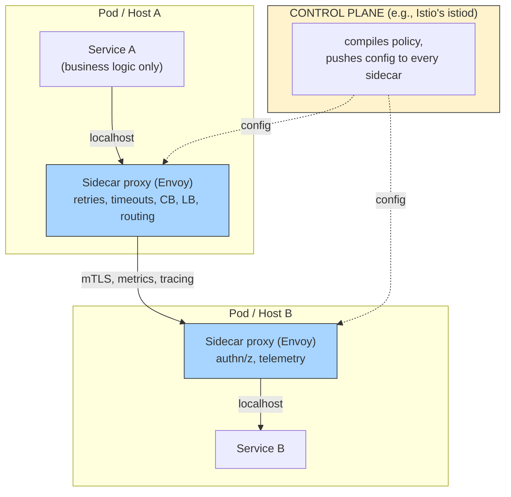
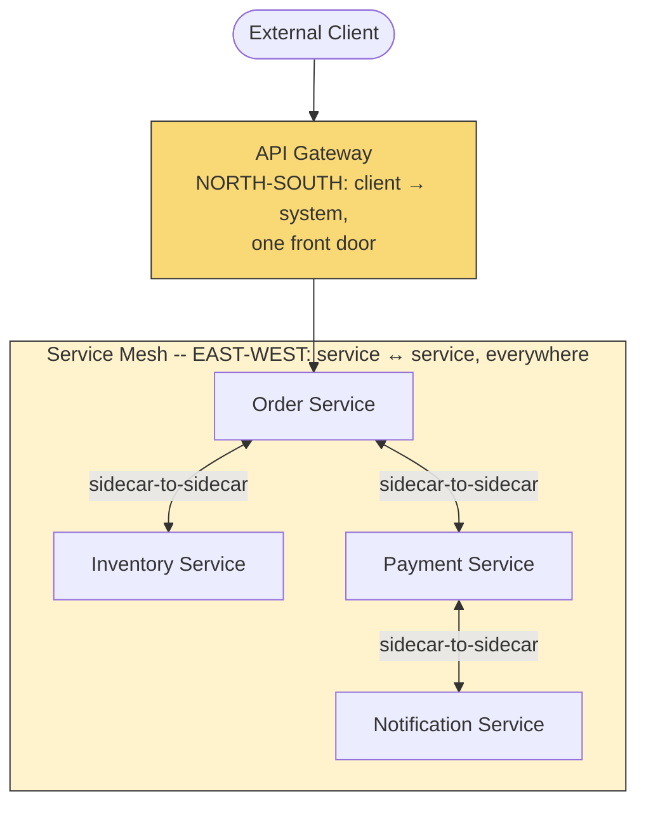

# Service Mesh & the Sidecar Pattern

> **The question this answers, precisely:** once you have dozens of services in multiple languages, how do you get retries, timeouts, circuit breaking, mutual TLS, and per-call observability on **every** service-to-service call **without** re-implementing them in every service's code? The answer — move that logic into infrastructure — is the service mesh, and interviewers use it to test whether you can weigh a real operational benefit against real added complexity.

---

## 1. The problem a mesh solves

Every pattern in [Resilience Patterns](../resilience-patterns/README.md), plus [service discovery](../service-discovery/README.md), plus TLS, plus metrics, is **cross-cutting**: every service needs it, and none of it is business logic. The library approach (Hystrix/Resilience4j in every service) has two costs a polyglot org feels immediately: (1) you maintain N implementations across languages, and (2) upgrading the behavior means redeploying the entire fleet. The mesh's move: **extract all of it into a proxy that travels with each service instance.**

## 2. The sidecar pattern (the data plane)

- A **sidecar proxy** (almost always **Envoy**) is deployed next to every service instance; traffic in and out is transparently routed through it. The service talks plain HTTP to `localhost`; the sidecar does discovery-aware load balancing, retries with budgets, timeouts, circuit breaking, **mTLS** encryption + workload identity, and emits uniform metrics/traces — identically for a Go, Java, or Python service, with **zero application code**.
- The **control plane** (e.g., Istio's `istiod`, or Linkerd's) is where operators declare policy ("orders may call payments; retry GETs twice with 100ms budget; canary 5% of traffic to v2"), which it compiles and pushes to all sidecars. **Data plane = the proxies moving bytes; control plane = the brain configuring them** — say those two sentences and you've defined a mesh.

## 3. What you get — and what it costs

**Buys:** uniform resilience and *consistent* observability (every hop emits the same metrics — the [golden signals](../../10-security-observability/observability/README.md) — and trace spans, solving instrumentation drift); **zero-trust security** via automatic mTLS with per-workload identity (every call encrypted and mutually authenticated inside the cluster — a compliance headline feature); and **traffic management** — percentage-based [canary releases](../deployment-patterns/README.md), header-based routing, fault injection for chaos testing.

**Costs (state these or sound like a vendor):**
- **Latency:** two extra proxy hops per call — small (fraction of a ms to low single-digit ms each) but real, and it compounds across deep call chains.
- **Resources:** a proxy per instance — memory/CPU multiplied by your instance count.
- **Operational complexity:** the mesh is now critical infrastructure with its own upgrades, failure modes, and steep learning curve; a misconfigured control plane can break *all* traffic at once. You've centralized risk in exchange for decentralizing effort.
- **Debugging indirection:** "is it the app or the sidecar?" becomes a standing question in incident reviews.

**When it's worth it:** many services × multiple languages × security/compliance requirements (mTLS everywhere) — the per-service library tax exceeds the mesh's platform tax. **When it isn't:** a handful of services in one language — a shared library or the [API gateway](../../02-building-blocks/api-gateway/README.md) covers you. And note the boundary: the **gateway handles north-south traffic** (client → system, one front door); the **mesh handles east-west** (service ↔ service, everywhere) — a favorite disambiguation question.

## 4. Real-world reference

**Istio + Envoy on Kubernetes** is the canonical stack (Envoy itself came out of Lyft, built precisely because polyglot resilience libraries didn't scale organizationally); **Linkerd** is the lighter, simpler alternative — and mentioning that trade-off (Istio's power vs Linkerd's operational simplicity) plus the newer **sidecar-less/ambient** direction (mesh features moving into per-node proxies or eBPF to cut the per-pod cost) signals current, not textbook, knowledge.

## 5. Common pitfalls

- Recommending a mesh for a 5-service system — the complexity tax dwarfs the benefit; this reads as resume-driven design.
- Conflating API gateway and service mesh — north-south vs east-west.
- Claiming the mesh is "free" — omit the double-proxy latency and the control-plane blast radius and the interviewer will supply them.
- Forgetting the mesh only covers *transport-level* resilience — it can retry a request, but only your application knows whether the operation is [idempotent](../../08-api-design/idempotency/README.md) and what the business fallback is. The mesh does not absolve app-level design.

## 6. 60-Second Interview Answer

> "A service mesh moves cross-cutting call concerns — retries, timeouts, circuit breaking, load balancing, mutual TLS, metrics, and tracing — out of application code and into a sidecar proxy, usually Envoy, deployed next to every service instance, with a control plane like Istio's pushing policy to all of them. The service talks to localhost; the sidecar handles discovery, resilience, encryption, and telemetry identically for every language, so a polyglot org writes and upgrades this logic once instead of once per stack, and gets zero-trust mTLS and uniform observability as a side effect. The costs are two proxy hops of latency per call, a proxy's worth of resources per instance, and a genuinely complex new piece of critical infrastructure whose misconfiguration can break everything at once — so I'd reach for it at the scale of many polyglot services with security requirements, not for a five-service system where a shared library suffices. And it's east-west traffic between services — distinct from the API gateway, which is the north-south front door — while app-level concerns like idempotency and business fallbacks still belong in the code."

**Related:** [Resilience Patterns](../resilience-patterns/README.md) · [Service Discovery](../service-discovery/README.md) · [API Gateway](../../02-building-blocks/api-gateway/README.md) · [Observability](../../10-security-observability/observability/README.md) · [Deployment Patterns](../deployment-patterns/README.md)
