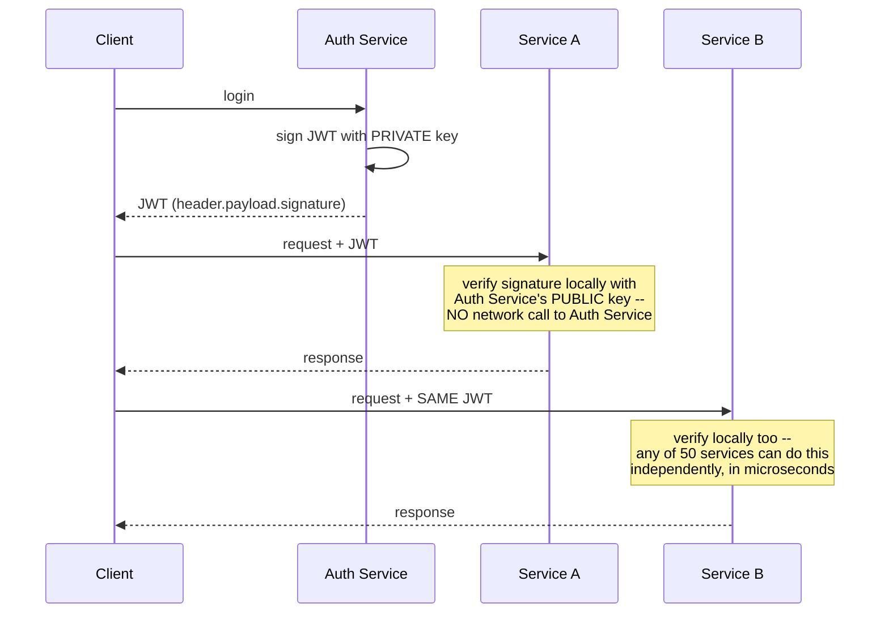
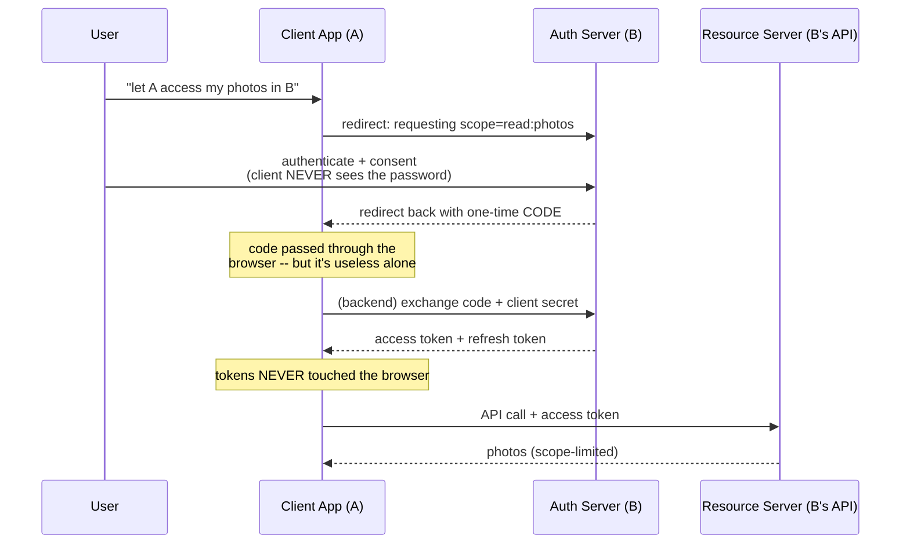
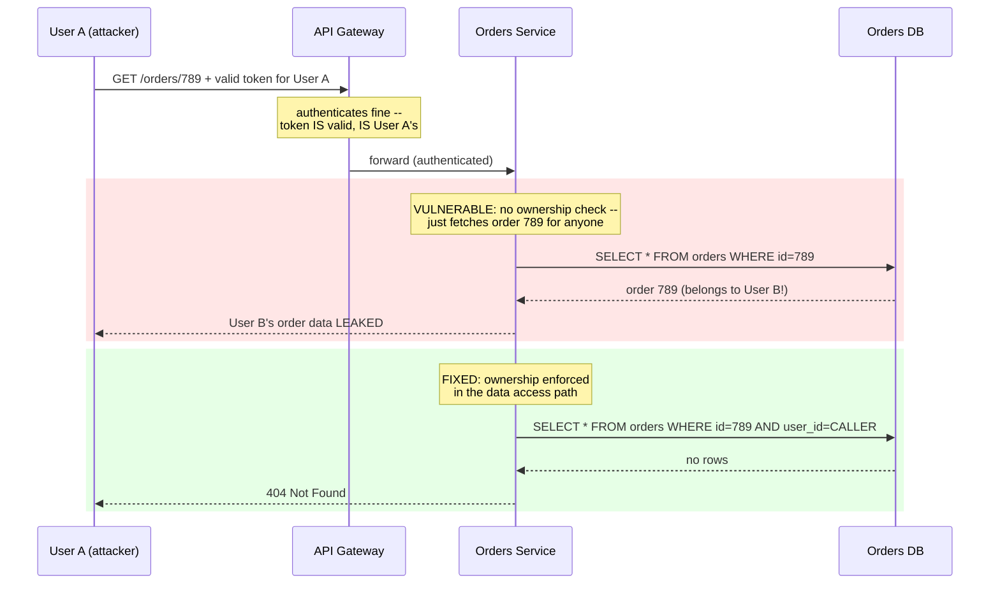

# Authentication & Authorization — Sessions, JWTs, OAuth 2.0, SSO

> **The question this answers, precisely:** how does a request prove *who* it's from (authentication), how does the system decide *what it may do* (authorization), and why did the industry converge on OAuth 2.0 + OIDC + token-based auth — with what trade-offs versus good old sessions? The stateful-vs-stateless token decision is a genuine system design trade-off, and "how do you revoke a JWT?" is one of the most reliable depth probes in security follow-ups.

---

## 1. Sessions vs tokens — the core architectural trade-off

**Server-side sessions (the classic):** on login, the server creates a session record (in Redis or a DB) and gives the browser an opaque session ID in an **HttpOnly, Secure cookie**. Every request looks up the session.

- **Pros:** revocation is trivial (delete the record — logout, ban, and password-change all work instantly); the session can hold server-side state; nothing sensitive lives on the client.
- **Cons:** every request pays a session-store lookup — the store becomes a shared, [highly-available](../../01-foundations/availability-reliability/README.md) dependency that every service in a distributed system must reach ([caching](../../02-building-blocks/caching/README.md)-shaped problem: Redis handles ~100k+ lookups/sec, so this is *scalable*, just not *free*).

**JWTs (stateless tokens):** on login, the auth service signs a JSON payload of **claims** — `sub` (user), `exp` (expiry), roles/scopes — producing `header.payload.signature`. Services verify the signature **locally with the auth service's public key** — *no lookup, no shared store*.

- **Pros:** perfect for microservices — any of 50 services validates any request in microseconds without calling anyone; claims carry identity + coarse permissions across service hops.

**Take this as the reference for why JWTs fit microservices specifically:** neither Service A nor Service B ever calls the Auth Service to check the token — signature verification with a public key is a **local, offline** computation, which is exactly what eliminates the shared-session-store dependency every request would otherwise pay for.

- **Cons — the revocation problem, mechanically:** the token is self-contained proof, so **it stays valid until `exp` no matter what** — logout, ban, and stolen-token response can't invalidate it without reintroducing state. And the standard resolution: **short-lived access tokens (5–15 min) + long-lived refresh tokens**. The refresh token *is* stateful (stored, revocable server-side); the access token is stateless. Revoking the refresh token caps the damage window at the access token's remaining minutes. You've traded "revocation latency ≤ access-token TTL" for "no per-request lookup" — **state that as the trade and you've answered the depth probe.** (Alternatives — token denylists checked per request — quietly reinvent the session store; fine to name as such.)
- Also name: JWTs are **signed, not encrypted** (anyone can read the payload — no secrets in claims); the historical `alg: none`/algorithm-confusion attacks (validate algorithm allowlists); clock skew on `exp`.

## 2. OAuth 2.0 — delegated authorization (not login!)

OAuth 2.0 answers: *how does a user grant app A limited access to their data in service B without giving A their B password?* Four roles: **resource owner** (user), **client** (app A), **authorization server** (B's auth), **resource server** (B's API).

**Authorization Code flow (the one to know):**

- **Why the code indirection exists** (a favorite follow-up): the browser redirect channel is leaky (history, referrers, logs) — so it only ever carries a short-lived, single-use code, useless without the client secret held server-side. For mobile/SPA clients that can't hold a secret, **PKCE** (proof-key: hash a random verifier into the initial request, present the verifier at exchange) closes the interception hole and is now baseline practice.
- **OIDC (OpenID Connect)** is the thin layer *on top* that makes it about login: adds an **ID token** (a JWT asserting "who authenticated, when, how") — OAuth answers *may A access B's data*; OIDC answers *who is this user*. "Login with Google" = OIDC. Conflating them is a well-known tell; distinguishing them crisply is cheap credibility.
- **SSO** generalizes this: one identity provider (Okta/AzureAD/Google Workspace), many applications trusting its assertions via OIDC (or SAML in older enterprises) — one login, centralized policy (MFA, offboarding — kill one account, lose all access: the enterprise security win).

## 3. Authorization — after "who," decide "may they"

- **RBAC** (roles → permissions; users → roles) covers most products and is where you should start; **ABAC** (policy over attributes: "author OR moderator, if document is in their org and not archived") when rules outgrow roles; **ReBAC** (relationship graphs — "viewer-of via group membership", Google Zanzibar/SpiceDB lineage) for Drive-style sharing at scale.

**The vulnerability that actually matters — object-level authorization (BOLA/IDOR):** `GET /orders/789` with a valid token for user A, where 789 belongs to user B — **authentication passed, authorization was never checked per-object**. This is the #1 API vulnerability class in practice ([OWASP API Top 10 #1](../security-essentials/README.md)). The fix is structural: ownership/permission checks in the data access path (`WHERE user_id = :caller` or a central policy check), never "the client only shows their own IDs."
- **Where checks live:** authN + coarse scope checks at the [API gateway](../../02-building-blocks/api-gateway/README.md); **fine-grained object-level authZ in the owning service** (only it knows the domain); service-to-service identity east-west via [mTLS from the mesh](../../07-microservices/service-mesh/README.md) — zero-trust: every hop authenticates, nothing is trusted for being "inside."

## 4. The rest of the identity toolbox (one line each)

**API keys** — long-lived bearer secrets identifying *programs*, not users; fine for server-to-server with [rate limiting](../../02-building-blocks/rate-limiting/README.md) per key, rotated and scoped. **mTLS** — both ends present certificates; workload identity inside clusters. **Password storage** — slow, salted hashes (bcrypt/scrypt/argon2), never fast hashes ([Security Essentials](../security-essentials/README.md)). **MFA** — mitigates credential theft; TOTP/WebAuthn > SMS.

## 5. Real-world reference

"Login with Google" exercises the full stack in one gesture: OIDC on OAuth 2.0 Authorization Code + PKCE, ID token (JWT) asserting identity, short-lived access token with scopes, refresh token rotation — and every large SaaS's enterprise tier is the same pattern pointed at Okta/AzureAD for SSO. For authorization at scale, Google's **Zanzibar** paper (the permission system behind Drive/Docs sharing) is the named reference for ReBAC.

## 6. Common pitfalls

- "We'll use JWTs" with no revocation story — the follow-up is guaranteed; short-lived access + revocable refresh is the expected answer.
- Calling OAuth an authentication protocol (it's delegated *authorization*; OIDC adds authentication).
- Secrets in JWT claims (signed ≠ encrypted); tokens in localStorage without weighing XSS (HttpOnly cookies + CSRF protection vs header tokens + XSS surface — name the trade rather than asserting a winner).
- Gateway-only authorization — BOLA/IDOR lives exactly there; object-level checks belong in the service.
- Designing auth for users but not for services — east-west identity (mTLS/service tokens) is half the surface in a microservice system.

## 7. 60-Second Interview Answer

> "Authentication establishes who; authorization decides what they may do — and the first architectural fork is sessions versus tokens. Server-side sessions in Redis are trivially revocable but cost every request a lookup against a shared store; JWTs verify locally with a public key — ideal across fifty microservices — but a self-contained token can't be revoked before expiry, so the standard design is short-lived access tokens, five to fifteen minutes, plus a stateful, revocable refresh token: revocation latency bounded by the access TTL in exchange for no per-request lookup. For third-party and login flows, OAuth 2.0's authorization-code flow with PKCE keeps passwords at the auth server and tokens out of the browser channel — and OIDC is the identity layer on top; OAuth is delegated authorization, OIDC is authentication, and SSO is OIDC pointed at one identity provider. Authorization-wise I start with RBAC, move to ABAC or relationship-based models à la Zanzibar when sharing semantics demand it — and the check that actually prevents the top real-world API vulnerability is object-level: coarse scopes at the gateway, but 'does this caller own order 789' enforced in the owning service's data path, with mTLS from the mesh handling service-to-service identity."

**Related:** [Security Essentials](../security-essentials/README.md) · [API Gateway](../../02-building-blocks/api-gateway/README.md) · [Service Mesh](../../07-microservices/service-mesh/README.md) · [REST Best Practices](../../08-api-design/rest-best-practices/README.md)
