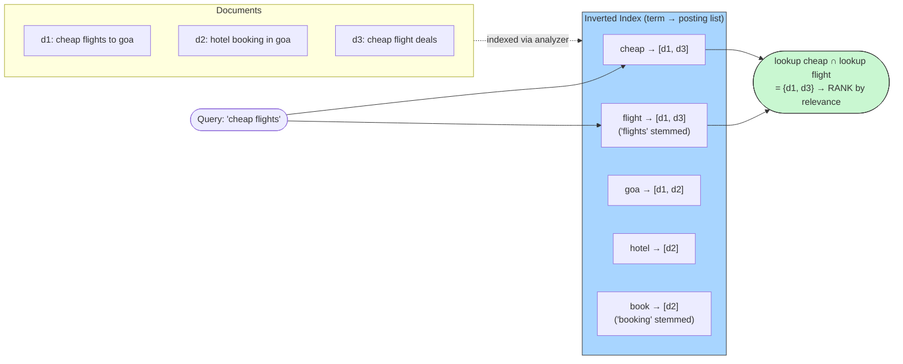

# Elasticsearch — Inverted Indexes & Full-Text Search

> **Mental model:** Elasticsearch is a distributed wrapper (sharding, replication, REST, aggregations) around **Lucene**, whose core data structure is the **inverted index**: instead of `document → words`, store `word → documents`. That inversion is why full-text search over millions of documents answers in milliseconds while `LIKE '%term%'` table-scans forever — and it's the answer to "how does search actually work?" in any [autocomplete](../../03-high-level-design/search-autocomplete/README.md)/search design.

---

## 1. The inverted index, mechanically



- **Analysis pipeline (where search quality lives):** text → tokenizer → filters (lowercase, stopwords, **stemming** "flights"→"flight", synonyms) → terms. The same pipeline runs at *index* time and *query* time — mismatched analyzers are the #1 "why doesn't my search find it" bug. Autocomplete uses **edge n-grams** ("goa" → "g","go","goa") — [precompute-on-write](../../09-interview-prep/tradeoff-cheatsheet.md) applied to prefixes.
- **Relevance:** BM25 (evolved TF-IDF) — a term scores higher appearing often in a *short* doc but rarely across the corpus. Modern stacks add vector/kNN search (semantic embeddings) beside keyword scoring — worth one sentence in interviews.
- **Segments — the LSM connection:** Lucene writes immutable **segments**, merged in the background — the [LSM-tree pattern](../../06-databases-deep-dive/b-trees-lsm-trees/README.md) again. Consequence: documents become searchable on **refresh** (default ~1s) — ES is **near-real-time**, a fact to state in any design using it.
- **Distribution:** an index = N primary shards (each a Lucene index) + replicas; a query **fans out to every shard and merges** ([scatter-gather sharding](../../02-building-blocks/databases/sharding/README.md)); deep pagination is capped (`max_result_window`=10k) with `search_after` as the [cursor fix](../../08-api-design/pagination-patterns/README.md). Shard count is fixed at creation — plan or reindex.
- **The consistency posture:** ES is a *search system*, not your system of record. Standard architecture: **source of truth in Postgres/etc. → [CDC/events](../../05-distributed-systems/event-driven-architecture/README.md) → ES**, accepting seconds of lag ([eventual consistency](../../01-foundations/consistency-models/README.md)) — never write to ES alone.

## 2. Installation

```bash
docker run -d --name es -p 9200:9200 -e discovery.type=single-node \
  -e xpack.security.enabled=false docker.elastic.co/elasticsearch/elasticsearch:8.13.0

curl -X POST localhost:9200/products/_doc -H 'Content-Type: application/json' \
  -d '{"name": "cheap flights to goa", "price": 4500}'
curl 'localhost:9200/products/_search?q=flight'          # stemming finds "flights"
# structured query DSL:
curl -X POST localhost:9200/products/_search -H 'Content-Type: application/json' -d '
  {"query": {"match": {"name": "cheap flight"}},
   "aggs": {"avg_price": {"avg": {"field": "price"}}}}'
```

## 3. The from-scratch implementation

[`MiniSearchEngine.java`](MiniSearchEngine.java) builds the whole pipeline: **analyzer** (tokenize, lowercase, stopwords, suffix-stemming), **inverted index with posting lists**, **boolean AND retrieval via posting-list intersection**, **TF-IDF ranking**, and **edge-n-gram autocomplete** — then indexes a corpus and runs ranked queries. After this file, "how does search work?" has a concrete answer in your own code.

## 4. Interview soundbites

- "An inverted index maps term → posting list of documents; a query is set-intersection plus BM25 ranking — that's why search is O(terms), not O(documents)."
- "Search quality is the analyzer: stemming, stopwords, synonyms — applied identically at index and query time."
- "ES is near-real-time (segment refresh ~1s) and eventually consistent with the source of truth — it's an index, never the system of record."
- "Autocomplete = edge n-grams precomputed at index time — pay storage on write to make prefix reads O(1)-ish."

**Related:** [Search Autocomplete](../../03-high-level-design/search-autocomplete/README.md) · [B-Trees vs LSM](../../06-databases-deep-dive/b-trees-lsm-trees/README.md) · [Pagination](../../08-api-design/pagination-patterns/README.md) · [Event-Driven Architecture](../../05-distributed-systems/event-driven-architecture/README.md)
