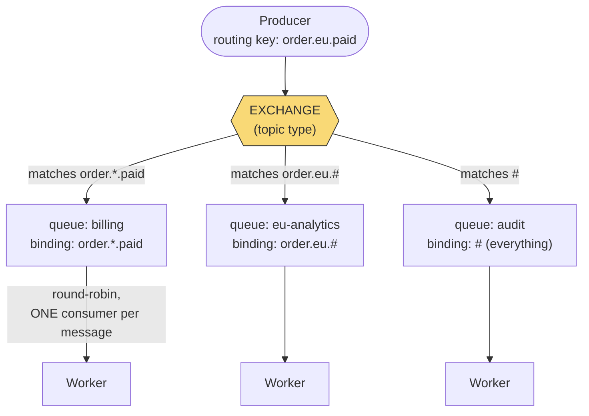

# RabbitMQ — The Smart Broker

> **Mental model:** RabbitMQ is the philosophical opposite of [Kafka](../kafka/README.md): a **smart broker, dumb consumer** design. The broker owns routing (exchanges → bindings → queues), per-message acknowledgement, redelivery, TTLs, priorities, and dead-lettering; messages are **deleted once acked**. It implements AMQP and excels at **task distribution** — work queues where each job goes to exactly one worker, with fine-grained delivery control.

---

## 1. The routing model (the part to know cold)

Producers never publish to queues — they publish to an **exchange** with a **routing key**; **bindings** decide which queue(s) get a copy:



**Take this as the reference for "smart broker, dumb consumer":** the producer publishes **once**, with no knowledge of who receives it — the exchange's bindings, configured entirely in the broker, decide that this one message fans out to all three queues (matching three different wildcard patterns), and each queue independently round-robins its copy to exactly one of its own workers. Compare this to Kafka's model ([Kafka §1](../kafka/README.md#1-architecture-in-the-order-interviews-probe-it)), where routing logic lives in the *consumer's* choice of topic/partition to read, not in broker-side configuration.

- **Exchange types:** `direct` (exact key match), `topic` (wildcards: `order.*.paid`, `order.eu.#`), `fanout` (broadcast to all bound queues), `headers` (match on headers). Routing logic lives *in the broker's config*, not in consumers — the opposite of Kafka's "everyone reads the log and filters."
- **Acknowledgement & redelivery:** consumer acks each message after processing (`ack`); a crash before ack ⇒ broker **requeues and redelivers** (at-least-once ⇒ [idempotent consumers](../../08-api-design/idempotency/README.md) again). `nack`/`reject` with `requeue=false` routes to a **dead-letter exchange (DLX)** — the [DLQ pattern](../../02-building-blocks/message-queues/README.md) as a first-class feature. Poison-message handling = retry count in headers + DLX after N attempts.
- **Prefetch (QoS):** `basicQos(10)` caps unacked messages per worker — the backpressure dial. Prefetch 1 = perfect fairness for slow, uneven tasks; higher = throughput for uniform fast tasks.
- **Durability triad** (all three or you lose messages on broker restart): durable exchange + durable queue + **persistent messages** (deliveryMode=2), plus publisher confirms for the producer side.
- **Ordering & scaling:** FIFO per queue *with one consumer*; competing consumers trade away strict ordering — if you need per-key ordering at scale, that's Kafka's partition model. Clustering mirrors queues (quorum queues use [Raft](../../05-distributed-systems/consensus-algorithms/raft/README.md)); throughput ceiling is lower than Kafka's log design — the honest trade.

## 2. When RabbitMQ over Kafka

Task/job queues (email sending, image resize, order processing) where each job runs once; complex routing by attributes; per-message TTL/priority/delay; RPC-over-messaging; modest scale with rich semantics and a great management UI. Prefer Kafka for streams, replay, event sourcing, extreme throughput. ([Full comparison](../../02-building-blocks/message-queues/README.md).)

## 3. Installation

```bash
# Docker with management UI
docker run -d --name rabbit -p 5672:5672 -p 15672:15672 rabbitmq:3-management
# UI: http://localhost:15672 (guest/guest) — queues, rates, manual publish: learn it, it's an interview asset

# Ubuntu
sudo apt install rabbitmq-server && sudo systemctl enable --now rabbitmq-server
sudo rabbitmq-plugins enable rabbitmq_management

# CLI essentials
rabbitmqctl list_queues name messages consumers
rabbitmqctl list_exchanges
```

Java client (Maven): `com.rabbitmq:amqp-client`. Core calls: `channel.exchangeDeclare`, `queueDeclare(durable=true)`, `queueBind`, `basicPublish(props: persistent)`, `basicConsume` + `basicAck(deliveryTag)`.

## 4. The from-scratch implementation

[`MiniRabbit.java`](MiniRabbit.java) implements the broker model: **exchanges (direct/topic/fanout) with wildcard binding match, queues with competing consumers, per-message ack with redelivery on failure, prefetch limiting, and a dead-letter exchange after max retries**. The demo shows a worker crashing mid-message and the broker redelivering to its peer — the semantics that make task queues reliable.

## 5. Interview soundbites

- "RabbitMQ is smart-broker: exchanges and bindings route in the broker; a message is consumed once and deleted on ack — Kafka inverts every one of those."
- "Reliability is the ack loop: no ack ⇒ redelivery; explicit reject ⇒ dead-letter exchange; so consumers must be idempotent."
- "Prefetch is the backpressure dial — QoS 1 for fairness on slow jobs, higher for throughput."
- "Durable queue + persistent message + publisher confirm — all three, or restart loses data."

**Related:** [Message Queues](../../02-building-blocks/message-queues/README.md) · [Kafka](../kafka/README.md) · [Idempotency](../../08-api-design/idempotency/README.md) · [Message Polling](../message-polling/README.md)
